# Inventory Check

- [Check Prerequisites](#check-prerequisites)
- [Performing Inventory Checks](#performing-inventory-checks)
-   [Accessing and Verifying Check Details](#accessing-and-verifying-check-details)
-   [Conducting the Check](#conducting-the-check)
-   [Submitting the Check](#submitting-the-check)
-   [Important Notes](#important-notes)
-   [Best Practices](#best-practices)

## Check Prerequisites

The Inventory check pages allow you to conduct apparatus and warehouse checks.

- Ensure appropriate permissions.
- Use a tablet with a stable internet connection.
- Clear browser cache if experiencing slowness.

> [!INFO]
> **Combining with Maintenance Checks**  
> Save time by enabling **Include Maintenance Check** at the top of the page to complete maintenance and inventory checks simultaneously.
> For details about maintenance checks, see [Maintenance Check](../initiating-checks/maintenance-check.md).

## Performing Inventory Checks

This section describes how to prepare and conduct inventory checks.

### Accessing and Verifying Check Details

1. From the **Inventory** list, locate your desired apparatus or warehouse.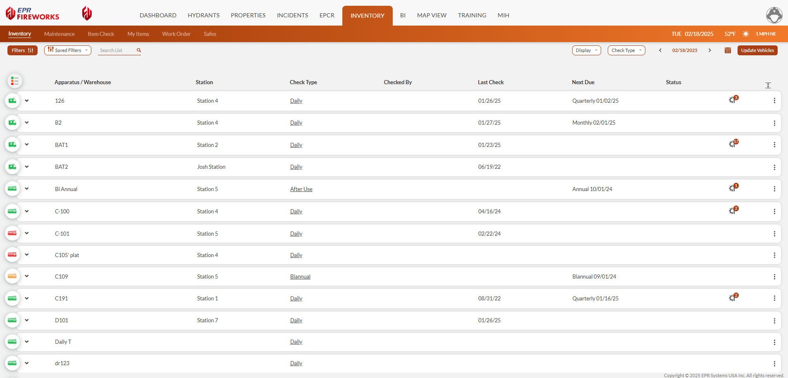
2. Expand the row and select the check type (daily, weekly, monthly).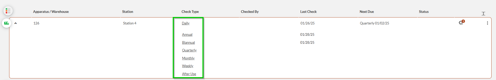
**Note**: Alternatively, you can select the check type from the Check Summary section within the check page.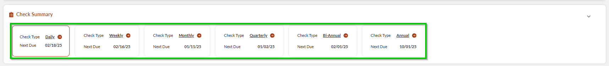
3. Review the apparatus/warehouse details section and add any necessary notes.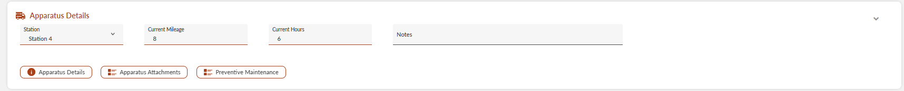
4. Verify the apparatus/warehouse station designation.

### Conducting the Check

1. Navigate through locations using the location tabs.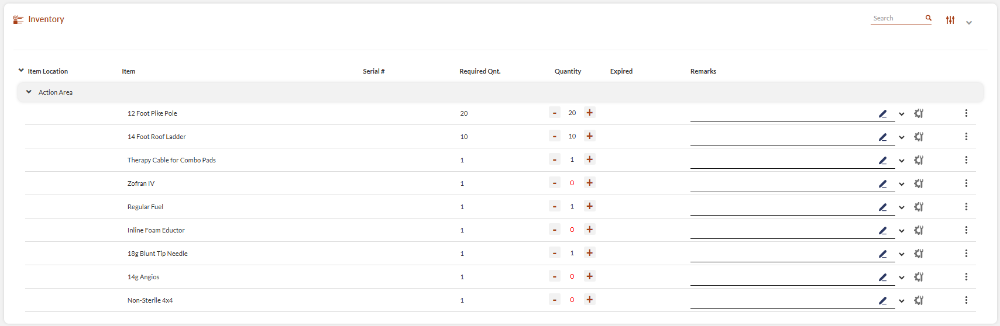
2. For each item, verify and update quantities:
-   Quantities meeting/exceeding minimum requirements appear in black.
-   Quantities below minimum requirements appear in red.
-   Missing items from previous checks show an exclamation mark to the left of the item.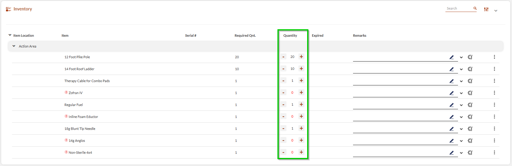
3. Record item conditions and updates:
1.   Use the pencil icon to add remarks. Select from preset remarks (if configured) or enter custom notes.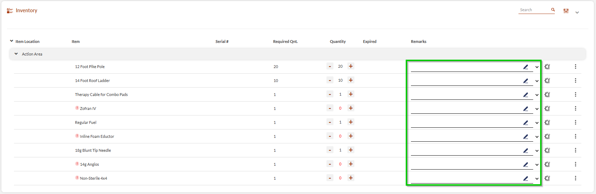
2.   Click the **Work Order** icon to open work order issues according to findings.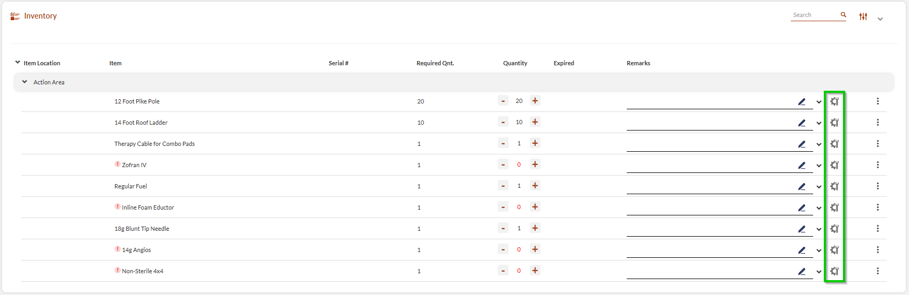
3.   Click the three-dots menu to the right of the item, and use the **Update Item in Location** pop-up to modify expiration dates.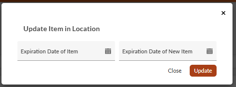
4.   Use the three-dots menu to add attachments as needed.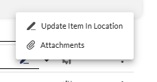

### Submitting the Check

1. Review all entries and notes.
2. Configure email notifications:
-   Enable **Send Email Upon Submitting**.
-   Add recipient email addresses or select mailing lists.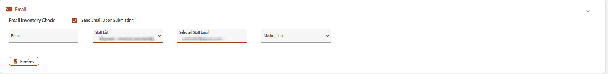
  **Note**: To view the report before emailing it, click **Preview** at the bottom of the section.
3. Click **Submit <Check Type> Inventory** (button name changes based on check type).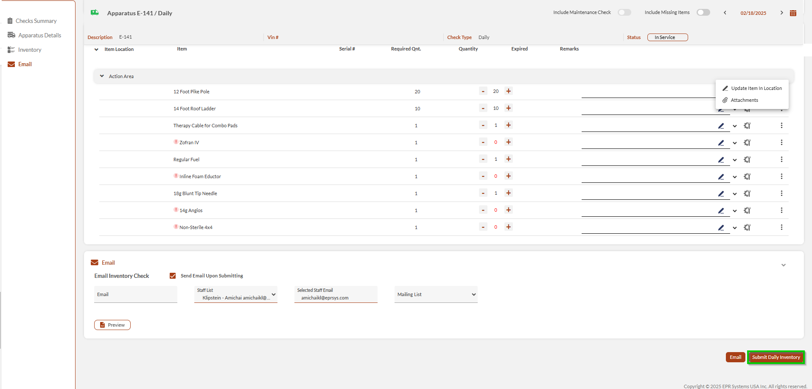
**Note**: To send the report without submitting it, click **Email**.

> [!NOTE]
> ### Important Notes
> - The system automatically tracks check dates and next due dates.
> - Previous check history is available in the check summary section.
> - Mileage and hours recorded in inventory sync with maintenance records.
> - Photos and attachments can be added at both check and item levels.
> - Internet speed may affect responsiveness when updating quantities on tablets.
> ### Best Practices
> - Complete all required fields before submission.
> - Document any discrepancies in the notes section.
> - Take photos of significant issues.
> - Update expiration dates during regular checks.
> - Use the filtering options to focus on problem areas.
> - Review completed checks to ensure accuracy.