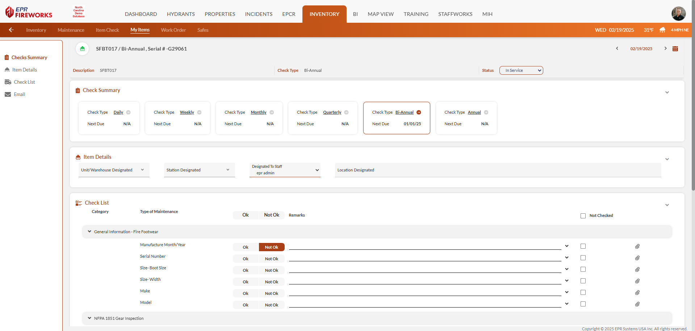
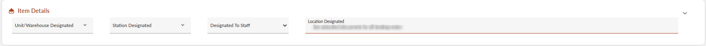
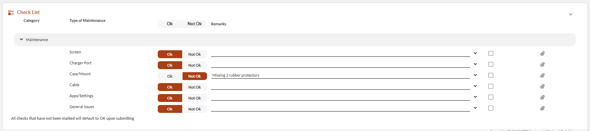
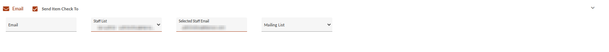
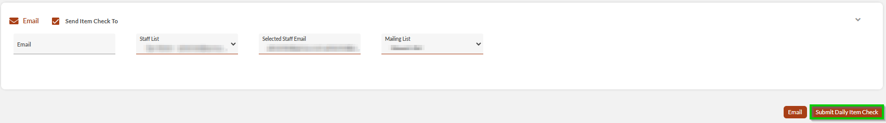

# Item Check/My Items

- [Overview](#overview)
- [Check Process](#check-process)
-   [Accessing and Verifying Check Details](#accessing-and-verifying-check-details)
-   [Check and Record Item Status](#check-and-record-item-status)
-   [Submitting the Check](#submitting-the-check)

## Overview

**Item Check** helps you track and document your equipment status. Before starting, ensure you have appropriate permissions, a stable internet connection, and familiarity with your item types and locations.

> [!INFO]
> **Note**: These procedures work for both **Item Check** and **My Items**. **Item Check** displays department equipment that needs tracking, while **My Items** shows your personal gear, making it easy to maintain both types of equipment using the same steps.
> 

## Check Process

### Accessing and Verifying Check Details

1. From the **Item Check** list, locate your desired item.
2. Use [filters](../../inventory-maintenance/navigating-inventory-maintenance/inventory-maintenance-list-display/inventory-maintenance-filters.md) to find your items.
3. Expand the row and select the check type.  
**Note**: Alternatively, you can select the check type from the Check Summary section within the check page.
4. In the **Item Details** section, verify item designations (unit/warehouse, station, staff, and location.

### Check and Record Item Status

1. Mark item condition, as follows:
-   OK
-   Not OK
-   Not Checked (checkbox on the right)
2. Add any required remarks.
3. For NFPA items (ladders, PPE, SCBA, hose, pumps) conduct required tests.

### Submitting the Check

1. Review all entries and notes.
2. Configure email notifications:
1.   Enable **Send Item Check To**.
2.   Add recipient email addresses or select mailing lists.
3. Click **Submit <Check Type> Item Check**(button name changes based on check type).  

**Note**: To send the report without submitting it, click **Email**.