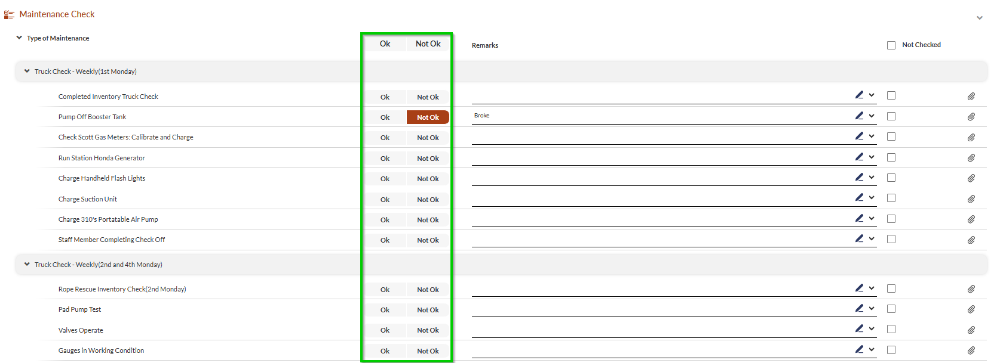
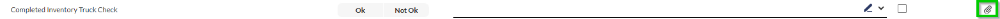
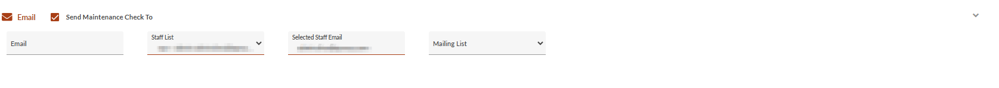
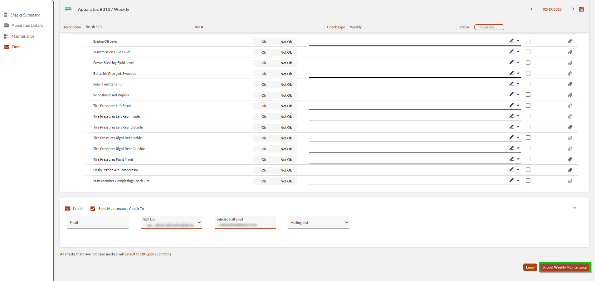

# Maintenance Check

- [Check Prerequisites](#check-prerequisites)
- [Performing Maintenance Checks](#performing-maintenance-checks)
-   [Accessing and Verifying Check Details](#accessing-and-verifying-check-details)
-   [Conducting the Check](#conducting-the-check)
-   [Submitting the Check](#submitting-the-check)
-   [Convert to Work Order](#convert-to-work-order)
-   [Important Notes](#important-notes)
-   [Best Practices](#best-practices)

## Check Prerequisites

The Inventory check pages allow you to conduct apparatus and warehouse checks.

- Ensure you have appropriate permissions.
- Use a tablet with a stable internet connection.
- Clear browser cache if experiencing slowness.

> [!INFO]
> **Combining with Inventory Checks**  
> Save time by enabling **Include Maintenance Check** at the top of the Inventory Check page to complete maintenance and inventory checks simultaneously.
> - For details about inventory checks, see [Inventory Check](../initiating-checks/inventory-check.md).
> - If you have activated this feature, skip to [Conducting the Check](#928747e7-c0a1-4ea1-8857-6548d6b580ca) below.

## Performing Maintenance Checks

This section describes how to prepare and conduct maintenance checks.

### Accessing and Verifying Check Details

1. From the **Maintenance** list, locate your desired apparatus or warehouse.
2. Expand the row and select the check type (daily, weekly, monthly).**Note**: Alternatively, you can select the check type from the **Check Summary** section within the check page.
3. Review the apparatus/warehouse details section and add any necessary notes.
4. Verify the apparatus/warehouse station designation.

### Conducting the Check

1. Select the type of maintenance check you are checking from the maintenance type tabs.
2. For each check item, mark according to the condition of the apparatus/warehouse:
-   OK
-   Not OK
-   Not Checked (checkbox on the right).
  **Note**: Selecting **OK/Not OK** at the top of the list will mark all checks in bulk.
3. Record apparatus/warehouse check condition:
1.   Use the pencil icon to add remarks. Select from preset remarks (if configured) or enter custom notes.
2.   Use the attachments icon to add attachments as needed.

### Submitting the Check

1. Review all entries and notes.
2. Configure email notifications:
1.   Enable **Send Maintenance Check To**.
2.   Add recipient email addresses or select mailing lists.
3. Click **Submit <Check Type> Maintenance** (button name changes based on check type).  
**Note**: To send the report without submitting it, click **Email**.

### Convert to Work Order

When you submit a maintenance check with issues marked as **NOT OK**, the system automatically opens the **New Work Order** window .

> [!INFO]
> **Note**: To submit the check without creating a work order, click **Continue Without Creating Work Order**.

To initiate a work order, follow the next steps:

1. Mark the issues for the work order.  
**Note**: To mark all issues, select the checkbox above the list.
2. Select the **Work Order Internal Status** from the dropdown list at the bottom of the window. If no status is selected, the status will default as **Open**.
3. Click **Create New Work Order**.

> [!NOTE]
> ### Important Notes
> - The system automatically tracks check dates and next due dates.
> - Previous check history is available in the check summary section.
> - Photos and attachments can be added at both check and item levels.
> - Internet speed may affect responsiveness when updating quantities on tablets.
> ### Best Practices
> - Complete all required fields before submission.
> - Document any discrepancies in the notes section.
> - Take photos of significant issues.
> - Update expiration dates during regular checks.
> - Use the filtering options to focus on problem areas.
> - Review completed checks to ensure accuracy.