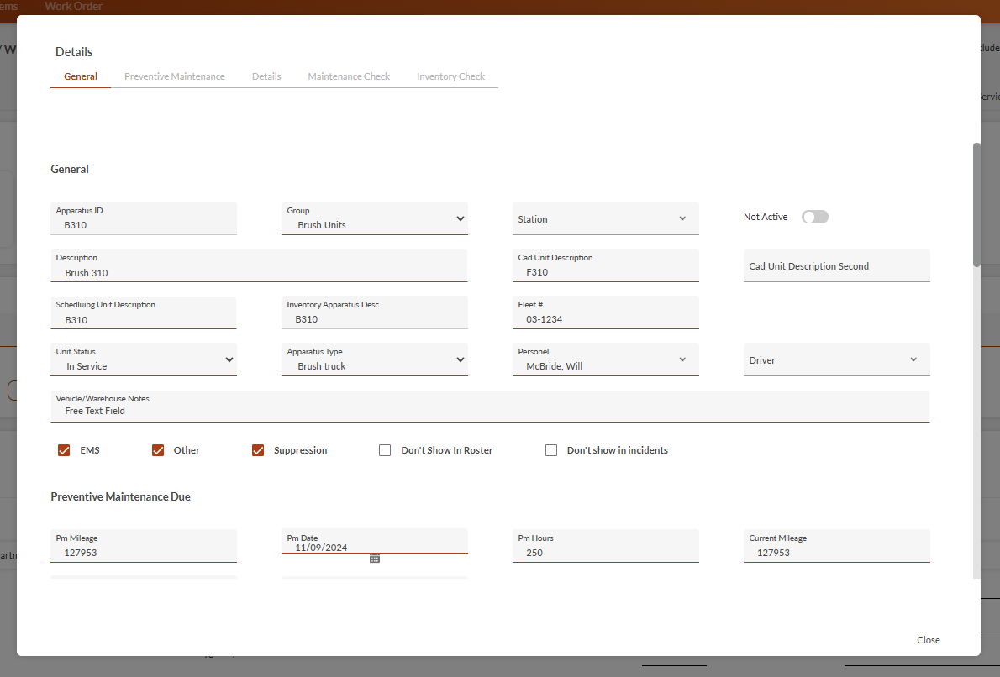
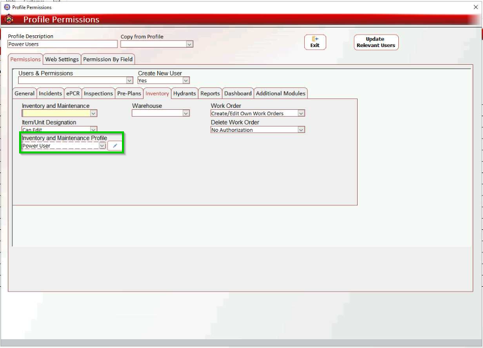

# Inventory & Maintenance

Welcome to the upgraded **Inventory & Maintenance** module! The new **Inventory & Maintenance** is optimized for tablet use, consistent with the other FireWorks modules. The new features will streamline your checks and work orders.

## Inventory & Maintenance User Guide

Select one of the sections below to get started.

- [Setting Up the Inventory (Admin Only)](./inventory-maintenance/setting-up-the-inventory-admin-only.md)
- [Navigating Inventory & Maintenance](./inventory-maintenance/navigating-inventory-maintenance.md)
- [Initiating Checks](./inventory-maintenance/initiating-checks.md)
- [Work Order](./inventory-maintenance/work-order.md)

> [!NOTE]
> ## **What’s New?**
> We streamlined all list, check, and work order pages. The following section consolidates the major changes, as follows:
> - [Setup and Configuration](#1ffc7e59-8429-450f-ab79-c285f307737a)
> - [List Displays](#bf1c0301-0b0d-4b50-ad44-8d238e4f92f7)
> - [Filters](#e682ff0d-b433-4123-b57b-7a71711f9f26)
> - [Inventory Checks](#5bb338aa-f0ae-40fc-8c3a-3e3057ab3cc7)
> ### Setup and Configuration NEW FEATURE
> You can now edit apparatus and warehouse details directly from the **Inventory** and **Maintenance** list and check pages (permissions required, previously available only in the **Admin Back-Office**).
> 
> In addition, we updated the user profile permission structure in the module. Configuration permissions are now available in **Inventory and Maintenance Profiles**.
> 
> [Learn more about Inventory setup.](./inventory-maintenance/setting-up-the-inventory-admin-only.md)
> ### Inventory & Maintenance List Displays
> - NEW FEATURE The **Update Vehicles/Items** feature is now available in all list displays (except **Work Order**). Previously only in the Admin Back-Office, this tool updates inventory/maintenance requirements and apparatus/item modifications. Use it before searching for newly assigned checks or new equipment.
> - NEW FEATURE You can now access Inventory, Maintenance, and Work Order issues directly from the list displays.
> - UPDATED FEATURE You can now create and view work orders directly from all list displays (previously available in **Maintenance** only).
> [Learn more about list display features.](./inventory-maintenance/navigating-inventory-maintenance/inventory-maintenance-list-display.md)
> ### Filters NEW FEATURE
> We changed the **Advanced Search** to **Filters**, making it easier to use and consistent with the other modules. The new filters include the **Saved Filters** feature, enabling you to create filter presets for quick search.
> 
> [Learn more about Inventory & Maintenance filters.](./inventory-maintenance/navigating-inventory-maintenance/inventory-maintenance-list-display/inventory-maintenance-filters.md)
> ### Inventory Checks
> - NEW FEATURE We added the **Include Maintenance Check** feature to **Inventory Checks**, enabling you to do inventory and maintenance checks simultaneously.
> - NEW FEATURE You can now filter missing and expired items within your inventory.
> - NEW FEATURE Items missing from previous inventory checks are now marked with an exclamation mark to the left of the item, making them easier to locate during the current check.
> - UPDATED FEATURE We moved the **Update Item in Location** feature to the three-dot menu on the right.
> [Learn more about the updated Inventory Check.](./inventory-maintenance/initiating-checks/inventory-check.md)