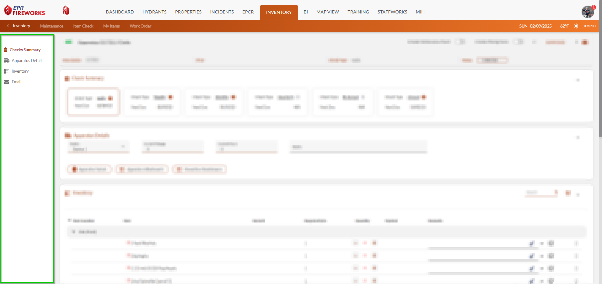
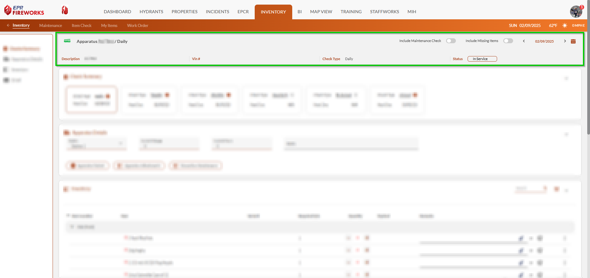
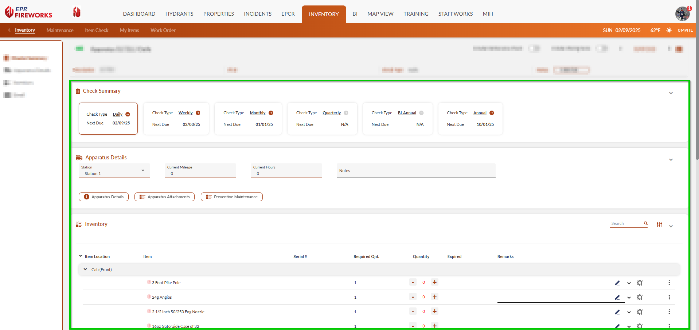

# Check Interface Guide

- [Interface Overview](#interface-overview)
- [Quick Access Menu](#quick-access-menu)
- [Key Information Bar](#key-information-bar)
- [Main Workspace](#main-workspace)

## Interface Overview

The **Inventory**, **Maintenance**, **Item Checks**, and **My Items** interfaces consolidate all check functions into an organized workspace. Understanding the check interface helps you navigate efficiently and complete checks accurately, saving time and ensuring all important information is properly documented.

The layout consists of a quick access menu, key information bar, and main workspace to manage item checks, inventory, and maintenance data efficiently.

> [!NOTE]
> **Note**: The screens in the **Inventory**, **Maintenance**, **Item Checks**, and **My Items** interfaces vary. Since the workflows are similar, we unified their interface guides.

## Quick Access Menu

Everything you need is on the left side:

- Checks Summary
- Apparatus/Warehouse/Item Details
- Inventory/Maintenance/Check List
- NFPA-related tests (**Item Checks** only)
- Email options

## Key Information Bar

At the top, you'll see the essential details at a glance:

- Apparatus/Warehouse/Item title
- Description
- Type of inspection
- Vehicle Identification Number (**Inventory** only)
- Check type
- Status
- Incorporate maintenance in inventory checks (**Inventory** only)
- Include missing items in the inventory check (**Inventory** only)

## Main Workspace

This is where you'll do most of your work. Here you can:

- Review and navigate to the various check types.
- Verify and update apparatus details (**Inventory** only)
- Document NFPA-related tests (**Item Checks** only)
- Conduct checks
- Email the report to staff members/mailing lists

