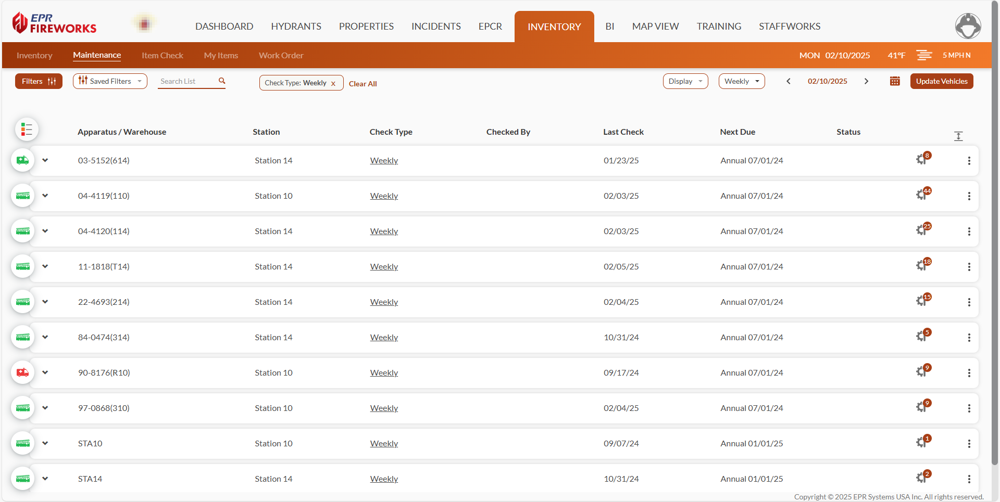
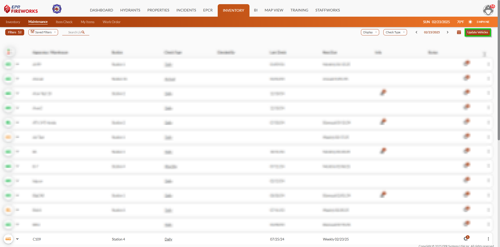
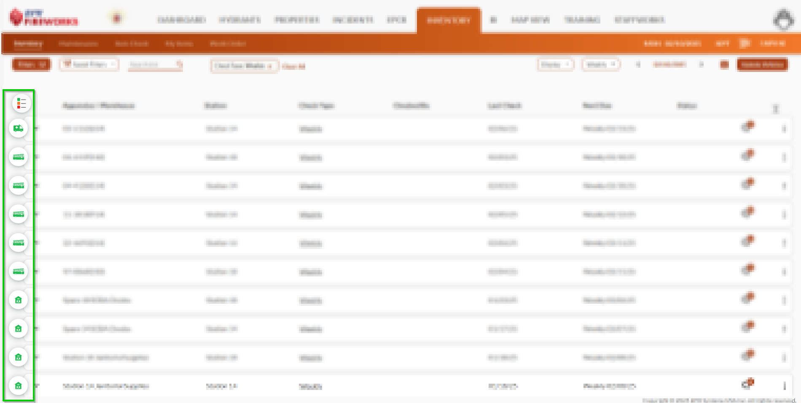
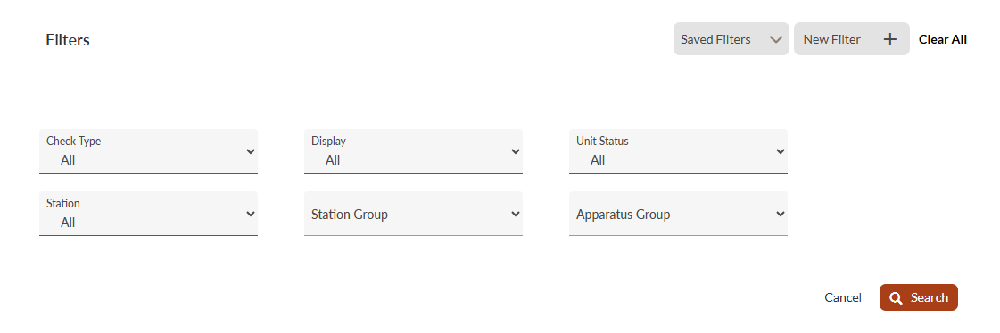
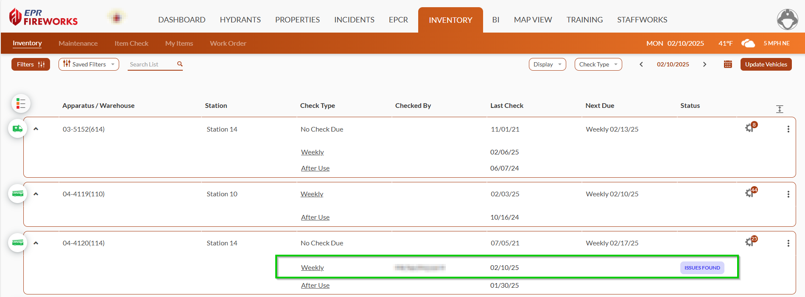
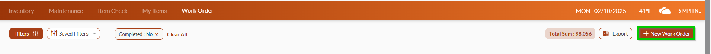
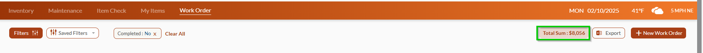

# Inventory & Maintenance List Display

- [Update Vehicles/Items NEW FEATURE](#update-vehiclesitems-new-feature)
- [Icons and Status Indicators](#icons-and-status-indicators)
- [Filters](#filters)
- [Row Expansion (Inventory and Maintenance Displays Only)](#row-expansion-inventory-and-maintenance-displays-only)
- [Work Order List Display Actions](#work-order-list-display-actions)

The list interface provides powerful tools for organizing and analyzing data efficiently. This guide covers these essential features:

- [Bulk synchronization of vehicle/item details](#4159e0b1-2760-4407-93a7-a4e5eed742db)
- [Color-coded icons for quick identification and status tracking](#7c37e67f-5548-4605-9614-f2eee20dde5f)
- [Customizable filters for quick searches](#49a63015-8c59-4bba-a6b5-237bd5afbf15)
- [Expandable rows for detailed views](#f69fe007-3d14-4a9b-9706-b5f2e038e190)
- [Unique Work Order list display features](#4e448473-6812-43a5-b456-818f5374327c)

## Update Vehicles/Items NEW FEATURE

The **Update Vehicles/Items** button refreshes your list to show recent changes. Use it when you can't find new equipment or checks that should be there.

> [!WARNING]
> This feature is not available in the **Work Order** list display.

## Icons and Status Indicators

Icons and their colors work together to show you important information at a glance. The icon's shape indicates the type of inventory, item, or work order, while its color indicates the status of the check or work order.

[Click here to learn more about icons and status indicators](./inventory-maintenance-list-display/status-indicators-and-icons.md).

## Filters

You can filter your inventory and maintenance records to check unit status, inspect equipment, track work orders, and more.

[Click here to learn more about Inventory & Maintenance filters](./inventory-maintenance-list-display/inventory-maintenance-filters.md).

## Row Expansion (Inventory and Maintenance Displays Only)

NEW FEATURE

The **Inventory** and **Maintenance** displays offer expandable rows for each unit, revealing detailed check information. Within these expanded views, you'll find check-specific links, inspector names, and current status.

## Work Order List Display Actions

The Work Order list display has the following unique features:

- **New Work Order**: you can create a new work order directly from the Work Order list display.
- **Total Sum** NEW FEATURE : The Work Order list includes the total sum of all work orders.