# Inventory & Maintenance Filters

NEW FEATURE

- [Overview](#overview)
- [Applying Filters](#applying-filters)
- [Saved Filters](#saved-filters)
- [Inventory & Maintenance Filter Key](#inventory-maintenance-filter-key)
-   [Inventory and Maintenance Filters](#inventory-and-maintenance-filters)
-   [Item Checks and My Items Filters](#item-checks-and-my-items-filters)
-   [Work Order Filters](#work-order-filters)
  
  -   [General](#general)
  
  -   [Work Order Details](#work-order-details)
  
  -   [Issue Details](#issue-details)

> [!INFO]
> **Important!** Filters replace **Advanced Search**.

## Overview

Filters help you search and group checks and work orders. This section describes how to use filters effectively.

Filters differ across various lists. Use the [key](#e5ef9792-77df-44b6-a13d-9e0e40099ca1) below for reference.

## Applying Filters

To search and filter checks and work orders, follow the next steps:

1. On the desired page, click **Filters** at the top.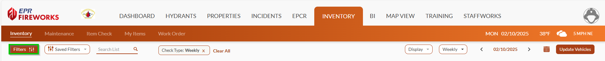
2. Define filters according to the key below.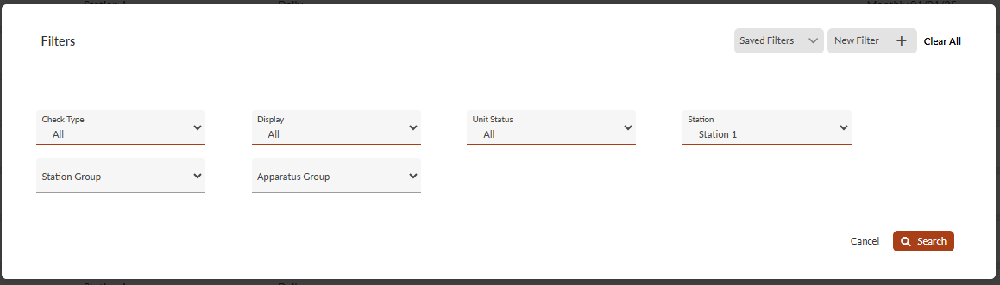
3. When done, click **Search**.

## Saved Filters

You can save frequently used filter and search queries for quick access by following these steps:

1. Define your filter and search queries using the [key](#e5ef9792-77df-44b6-a13d-9e0e40099ca1) below.
2. Give the new filter a name.
1.   Click **New Filter** at the top of the **Filters** window.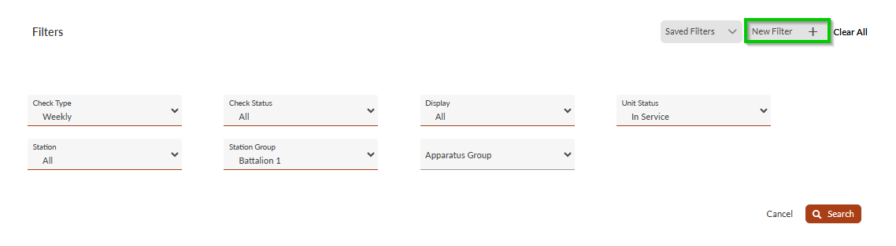
2.   Name the filter, and then click 
  .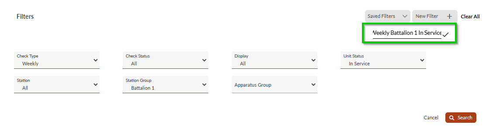
3. (Optional) To set it as the default filter, check the **Default** box. Default filters will load automatically when you open the page.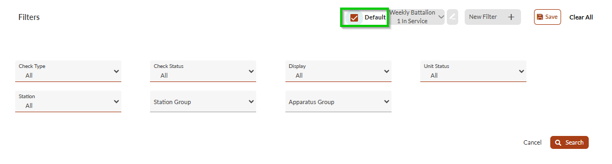
4. When done, click **Save**.

> [!NOTE]
> You can activate **Saved Filters** from the module pages, using the **Saved Filters** list to the right of the **Filters** button.
> 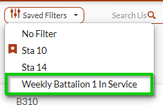
> Alternatively, you can access saved filters directly from the **Filters** window.
> 

## Inventory & Maintenance Filter Key

### Inventory and Maintenance Filters

The Inventory and Maintenance filters let you refine records according to check types, unit status, station locations, and organizational groups to track resources across your department.

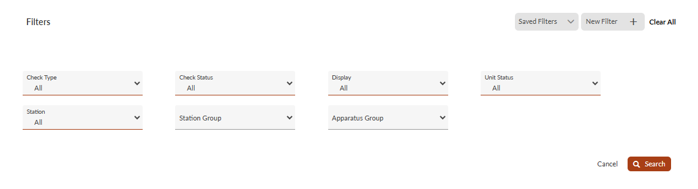

| **Filter** | **Description** | **Options/Comments** |
| --- | --- | --- |
| **Check Type** | Filter by check type. | - All - Daily - Weekly - Monthly - Quarterly - Annual - Bi-Annual - After Use |
| **Display** | Filter by Inventory type. | - All - Apparatuses - Warehouses |
| **Unit Status** | Filter by apparatus status. | - All - In Service - In Reserve - Out of Service |
| **Station** | Filter by station. | List of stations |
| **Station Group** | Filter by your department’s preset station groups. | Defined by department administrator |
| **Apparatus Group** | Filter by your department’s preset apparatus groups. |

### Item Checks and My Items Filters

The **Item Check** filters let you refine records through parameters such as check frequencies, inspection status, equipment classifications, item assignments, and service conditions to track departmental inventory and compliance requirements.

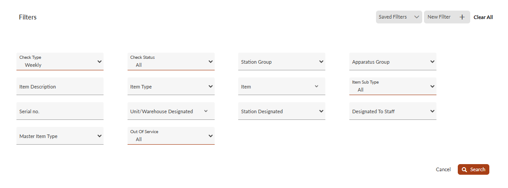

| **Filter** | **Description** | **Options/Comments** |
| --- | --- | --- |
| **Check Type** | Filter by check type. | - All - Daily - Weekly - Monthly - Quarterly - Annual - Bi-Annual - After Use |
| **Check Status** | Filter by check status. | - All - Not checked - Issues Not Found - Issues Found - Issues Not Found and Issues Found |
| **Station Group** | Filter by your department’s preset station groups. | Defined by department administrator |
| **Apparatus Group** | Filter by your department’s preset apparatus groups. | Defined by department administrator |
| **Item Description** | Search according to item description. | n/a |
| **Item Type** | Filter by item type. | List of item types as defined by your department |
| **Item** | Filter by item. | Defined by department administrator |
| **Item Sub Type** | filter by item sub-type category. | Defined by department administrator |
| **Serial no.** | Search for department items according to their serial number. | n/a |
| **Unit/Warehouse Designated** | Filter according to designated apparatus or warehouse. | List of apparatuses and warehouses |
| **Station Designated** | Filter according to designated station. | List of stations |
| **Designated to Staff** | Filter according to designated staff member | List of staff members |
| **Master Item Type** | Filter according to master item types. | List of master item types. |
| **Out Of Service** | Filter items according to service status | - All - In Service - Out of Service |

### Work Order Filters

#### General

The Work Order filters let you refine maintenance records through key parameters including internal status, work type, order numbers, and labor categories to track service requests across your department.

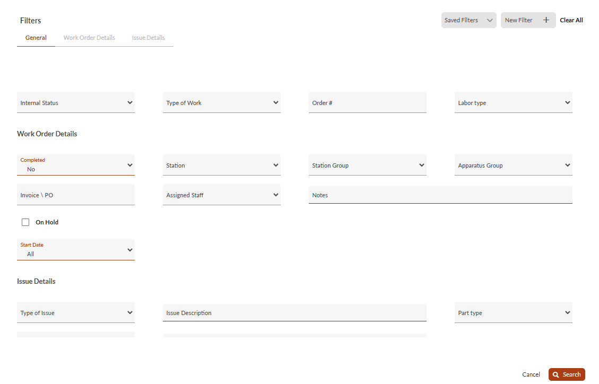

| **Filter** | **Description** | **Options/Comments** |
| --- | --- | --- |
| **Internal Status** | Filter according to the internal status of the work order. | List defined by department administrator |
| **Type of Work** | Filter by type of work | List defined by department administrator |
| **Order #** | Search according to order number. | n/a |
| **Labor type** | Filter by labor type. | List defined by department administrator |

#### Work Order Details

The Work Order filters let you refine records using key parameters, including completion status, location assignments, invoice details, staff assignments, and customizable date ranges, to manage work orders effectively.

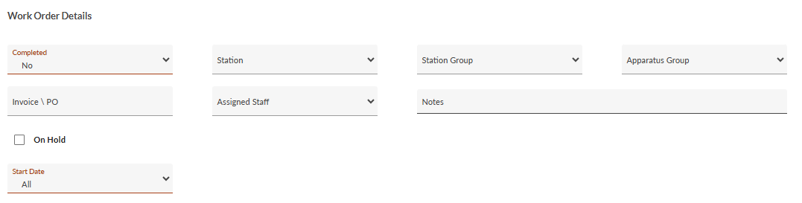

| **Filter** | **Description** | **Options/Comments** |
| --- | --- | --- |
| **Completed** | Filter according to work-order status. | - Yes - No |
| **Station** | Filter by station. | List of stations |
| **Station Group** | Filter by station group. | Defined by department administrator |
| **Apparatus Group** | Filter by apparatus group. | Defined by department administrator |
| **Invoice\\PO** | Search for work order according to invoice or PO number | n/a |
| **Assigned Staff** | Filter according to an assigned staff member | List of staff members |
| **Notes** | Search according to work order notes | n/a |
| **On Hold** | Display **On Hold** work orders | n/a |
| **Start Date** | Filter by a range of work order start dates | - All - This Week - This Month - This Year - Custom Date Range |

#### Issue Details

The Issue Details filters let you refine records through parameters such as issue types, affected parts, object categories, and component descriptions.

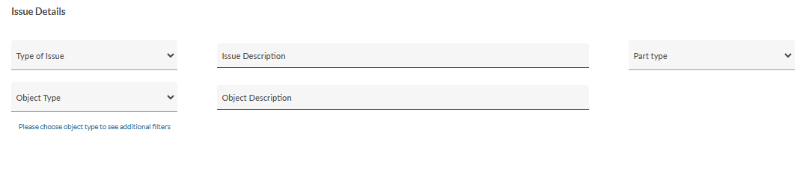

| **Filter** | **Description** | **Options/Comments** |
| --- | --- | --- |
| **Issue Description** | Search according to issue descriptions | n/a |
| **Type of Issue** | Filter by issue type | List defined by department administrator |
| **Part Type** | Filter by part type | List defined by department administrator |
| **Object Type** | Filter by the issue’s object type | - Apparatus/Warehouse - Hydrant - Item - Station |
| **Object Description** | Search according to object descriptions | n/a |