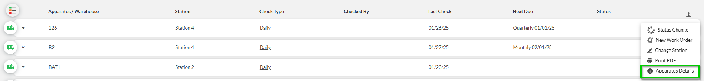
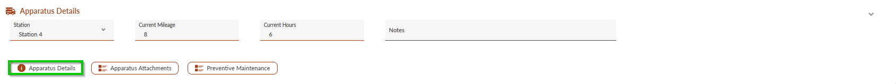
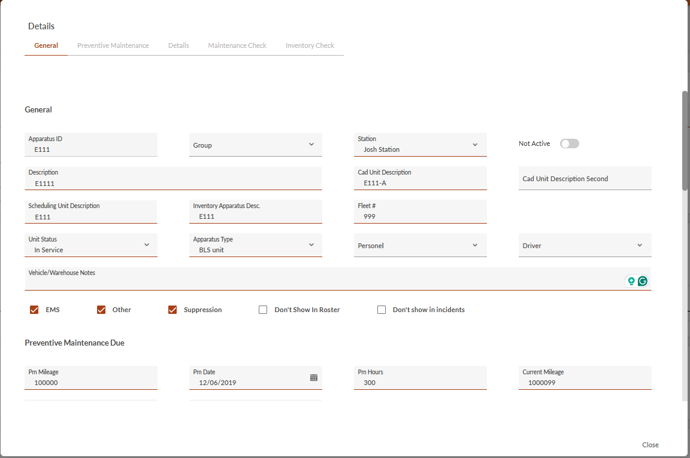
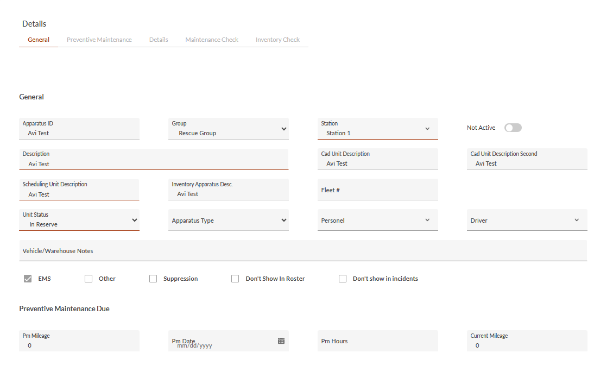
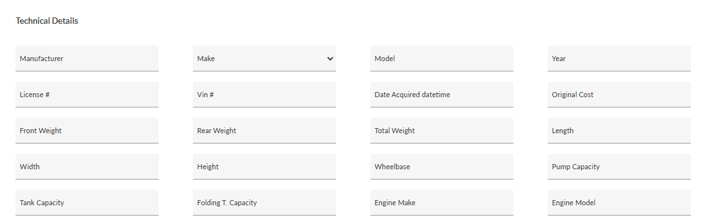
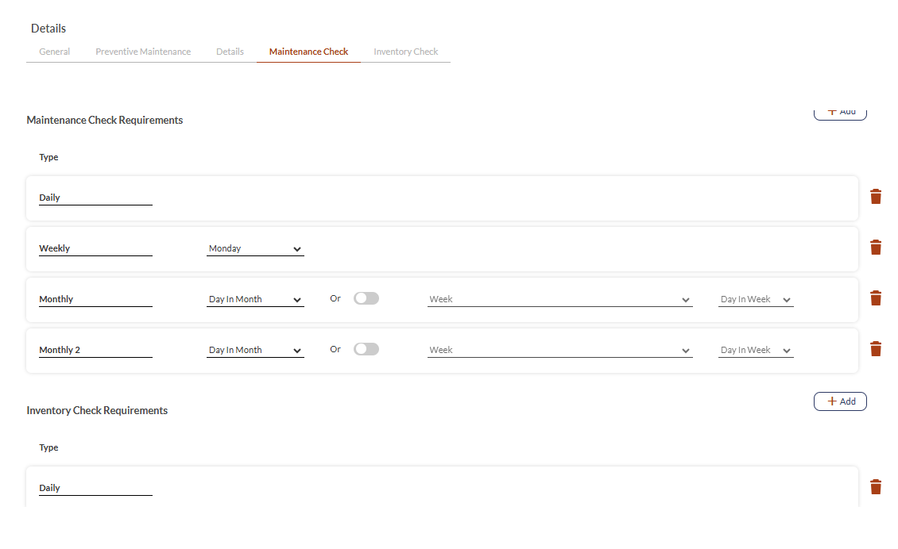

# Apparatus/Warehouse Details (Web App)

- [Overview](#overview)
- [Configuring Apparatuses/Warehouses on the Web App](#configuring-apparatuseswarehouses-on-the-web-app)
- [Apparatus/Warehouse Details Key](#apparatuswarehouse-details-key)
-   [General](#general)
-   [Preventative Maintenance (Apparatus Only)](#preventative-maintenance-apparatus-only)
-   [Technical Details (Apparatus Only)](#technical-details-apparatus-only)
-   [Maintenance/Inventory Check Requirements](#maintenanceinventory-check-requirements)

## Overview

You can now configure your inventory units (apparatuses and warehouses) directly from the web app.

> [!WARNING]
> To modify unit details, ensure you have the appropriate editing permissions.

## Configuring Apparatuses/Warehouses on the Web App

The following procedure describes how to edit apparatus and warehouse details on the web app.

1. In the **Inventory/Maintenance** lists, click the three dots to the right of the desired apparatus, and then select **Apparatus Details**.
**Note**: Alternatively, you can access **Apparatus Details** directly from the individual check/work order pages under **Apparatus/Warehouse** **Details**.
2. Review each field and add required information.
**Note**: See field descriptions [below] for guidance.
3. When done, click **Close**.

## Apparatus/Warehouse Details Key

### General

| **Field** | **Description** | **Options/Comments** |
| --- | --- | --- |
| Apparatus ID/Warehouse ID | Department apparatus/warehouse ID | n/a |
| Group (Apparatus Only) | Apparatus group | Select from list |
| Station | Designated station | Select from list |
| Not Active | Indicates if the apparatus is currently in use | Checkbox |
| Description | Apparatus/Warehouse description | n/a |
| CAD Unit Description (Apparatus Only) | CAD apparatus codes | n/a |
| CAD Unit Description Second (Apparatus Only) |
| Scheduling Unit Description (Apparatus Only) | Name or identifier used to track this apparatus in scheduling systems and duty rosters | n/a |
| Inventory Apparatus Desc. (Apparatus Only) | Name or identifier used to track this apparatus in the inventory | n/a |
| Fleet # (Apparatus Only) | Apparatus fleet number | n/a |
| Unit Status (Apparatus Only) | Indicates the operational state of the apparatus | - In Service - In Reserve - Out of Service |
| Apparatus Type (Apparatus Only) | Apparatus vehicle type | - Aircraft - Aircraft, fixed-wing tanker - Aircraft, other - ALS unit - ARFF (aircraft rescue & firefighting) - BLS unit - Boat, no pump - Breathing apparatus support - Brush truck - Chief officer car - Dozer or plow - Engine - Fire boat with pump - Ground Fire Suppression - Ground fire suppression, other - HazMat unit - Heavy Ground Equipment - Heavy ground equipment, other - Helicopter - Helitanker - High-angle rescue unit - Light and air unit - Marine Equipment - Marine equipment, other - Medical & Rescue Unit - Medical & rescue unit, other - Mobile command post - None - Other - Other apparatus/resource - Privately owned vehicle - Quint - Rescue unit - Support apparatus, other - Support Equipment - Tanker & pumper combination - Tanker or tender - Tractor - Truck or aerial - Type I hand crew - Type II hand crew - Undetermined - Urban search & rescue unit |
| Personnel (Apparatus Only) | Designated apparatus personnel | Select name from list |
| Driver (Apparatus Only) | Designated apparatus driver | Select name from list |
| Vehicle/Warehouse Notes (Apparatus Only) | Add notes concerning the vehicle/warehouse | n/a |
| EMS (Apparatus Only) | Indicates if the apparatus is an EMS vehicle | Checkbox |
| Other (Apparatus Only) | Indicates if the apparatus serves a different use | Checkbox |
| Suppression (Apparatus Only) | Indicates if the apparatus is a suppression vehicle | Checkbox |
| Don't Show In Roster (Apparatus Only) | Define if the apparatus will appear in the roster | Checkbox |
| Don't show in Incidents (Apparatus Only) | Define if the apparatus will appear in the **Incidents** module | Checkbox |

### Preventative Maintenance (Apparatus Only)

| **Field** | **Description** |
| --- | --- |
| PM Mileage | Number of miles between each PM check |
| PM Date | Due date for next PM check |
| PM Hours | Number of driving hours between PM checks |
| Current Mileage | Current Apparatus Mileage |
| Current Date | Current Date |
| Current Hours | Current number of driving hours on the apparatus |

### Technical Details (Apparatus Only)

| **Field** | **Description** |
| --- | --- |
| Manufacturer | Apparatus Manufacturer |
| Make |     |
| Model | Apparatus Model |
| Year | Manufacturing date/year |
| License # | Apparatus registration number |
| VIN # | Vehicle Identification Number (17-character identifier) |
| Date Acquired | Date when the department acquired the apparatus |
| Original Cost | Purchase price off the apparatus |
| Front Weight | Weight supported by front axle |
| Rear Weight | Weight supported by rear axle(s) |
| Total Weight | Combined weight of the entire apparatus |
| Length | Overall length of the apparatus |
| Width | Overall width of the apparatus |
| Height | Overall height of the apparatus |
| Wheelbase | Distance between front and rear axles |
| Pump Capacity | Water pumping rate (In GPM) |
| Tank Capacity | Water tank volume (In Gallons) |
| Folding T Capacity | Portable water tank capacity (In Gallons) |
| Engine Make | Manufacturer of the engine |
| Engine Model | Specific engine model |

### Maintenance/Inventory Check Requirements

These sections display all maintenance/inventory check cycle information. To add a new check cycle, click **Add** at the bottom of the desired section. Applicable to both apparatuses and warehouses.

| **Field** | **Description** | **Options/Comments** |
| --- | --- | --- |
| Type | Indicates the type of check | - Daily - Weekly - Monthly - Monthly 2 - Quarterly - Bi-Annual - Annual |
| <Day/Month>   **Or** <Week, Day in Week> (Monthly checks only) | Define when the check will occur. | **Note**: To schedule monthly checks for a specific day in a given week (like 3rd Tuesday or 4th Wednesday), enable the **Or** feature. |