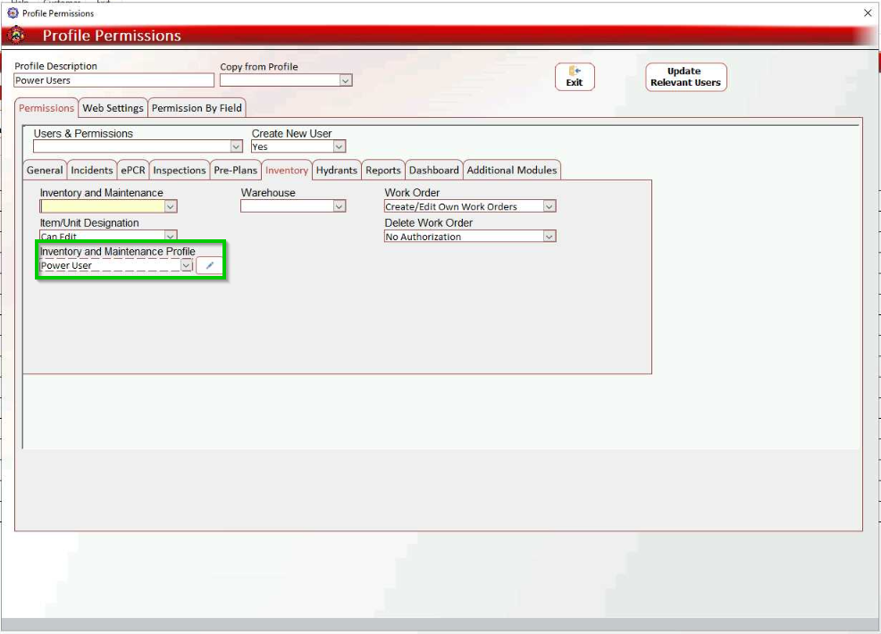
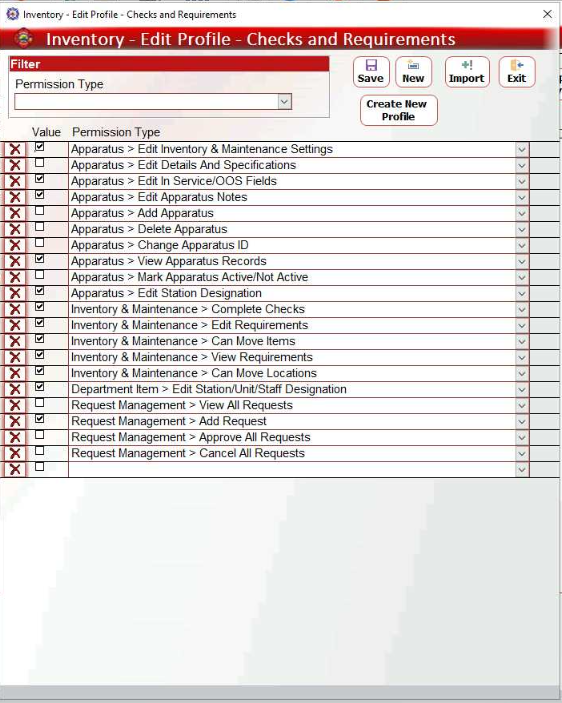

# Inventory & Maintenance Profiles (Back-Office)

- [Overview](#overview)
- [Configuring Inventory and Maintenance Profiles](#configuring-inventory-and-maintenance-profiles)
- [Inventory and Maintenance Permissions Key](#inventory-and-maintenance-permissions-key)

## Overview

Configure inventory and maintenance profiles to access and edit configuration pages such as **Inventory/Maintenance Requirements** and **Apparatuses** in the Admin Back-Office, and **Apparatus Details** and **Item Details** in the Web App.

## Configuring Inventory and Maintenance Profiles

This procedure explains how to set up **Inventory and Maintenance Profiles**. See the [Inventory and Maintenance Permission Key](#7dcc3622-5ac7-4655-8595-d0f242506713) below for details on each permission.

1. In the **Admin Back-Office**, navigate to **User Profiles (Management > Staff Settings > User Profiles)**.
2. Double-click the desired profile.
3. In the **Profile Permissions** window, go to **Inventory**.
4. Select a user profile from the **Inventory and Maintenance Profile** dropdown.
5. Double-click the desired user profile or click the pencil icon.
6. In the **Inventory - Edit Profile** pop-up, select permissions according to the [key](#7dcc3622-5ac7-4655-8595-d0f242506713) below. When done, click **Exit**.

## Inventory and Maintenance Permissions Key

This section explains the **Inventory and Maintenance Profile** permissions.

> [!INFO]
> **Note**:
> - Permissions designated as Web App apply to the **Apparatus Details** section within the Inventory and Maintenance tabs (unless specified otherwise), as explained in detail in the [following section](#).
> - The **Request Management** permissions section relates to features scheduled for future release. These permissions are not currently active in the system.

| **Permission** | **Designation** | **Description** |
| --- | --- | --- |
| Apparatus > Edit Inventory & Maintenance Settings | Web App | This permission lets you add, delete, and modify checks in the **Maintenance Check Requirements** and **Inventory Check Requirements** sections. |
| Apparatus > Edit Details And Specifications | Web App | This permission allows you to edit the [Technical Details](#) section. |
| Apparatus > Edit In Service/OOS Fields | Web App | This permission lets you edit the **Unit Status** field in **Apparatus Details** and the **Status** field in inventory/maintenance check headers. |
| Apparatus > Edit Apparatus Notes | Web App | This permission allows you to edit the **Vehicle/Warehouse Notes** field. |
| Apparatus > Add Apparatus | Admin Back-Office | This permission allows you to add new apparatuses to the **Apparatuses** page **(Management > Department Settings > Apparatuses)**. |
| Apparatus > Delete Apparatus | Admin Back-Office | This permission lets you delete apparatuses from the **Apparatuses** list **(Management > Department Settings > Apparatuses)**. |
| Apparatus > Change Apparatus ID | Admin Back-Office | This permission lets you edit the apparatus ID on the **Apparatuses** list **(Management > Department Settings > Apparatuses)**.  **Note**: This field cannot be edited in the **Apparatus Details** popup window. |
| Apparatus > View Apparatus Details | Web App | This permission activates the **Apparatus Details** button in **Inventory** and **Maintenance** check pages/lists, granting access to the **Apparatus Details** popup window.  **Important**: Without this permission, you cannot edit apparatus details or modify inventory and maintenance check requirements. |
| Apparatus > Mark Apparatus Active/Not Active | Web App | This permission activates the apparatus to active/not active. |
| Apparatus > Edit Station Designation | Web App | Edit the **Station** field. |
| Inventory & Maintenance > Complete Checks | Web App | This permission lets you submit inventory and maintenance checks. |
| Inventory & Maintenance > Edit Requirements | Admin Back-Office | This permission lets you edit the **Inventory Requirements** and **Maintenance Requirements** pages. |
| Inventory & Maintenance > Can Move Items | Admin Back-Office | This permission enables the **Move Items** feature in the **Inventory Requirements** page, letting you move items between inventory levels and between apparatuses and warehouses. |
| Inventory & Maintenance > View Requirements | Admin Back-Office | This permission grants view-only access to the **Inventory Requirements** and **Maintenance Requirements** pages. |
| Inventory & Maintenance > Can Move Locations | Admin Back-Office | **Note**: This permission enables the **Enable Moving/Copying Locations** feature in the **Inventory Requirements** page, letting you move locations along with their items within the apparatus. |
| Department Item > Edit Station/Unit/Staff Designation | Web App | This permission lets you edit the **Item Details** section in the **Items** **Check** page. |

Next: [Web App Apparatus/Warehouse Configuration (Apparatus Details)](../setting-up-the-inventory-admin-only/apparatuswarehouse-details-web-app.md)