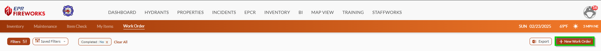
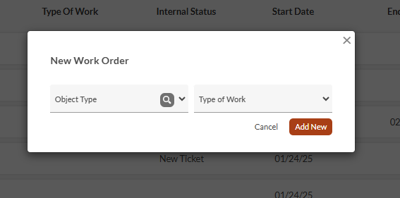
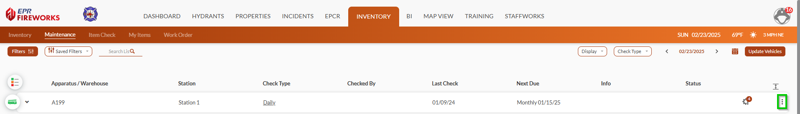
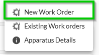
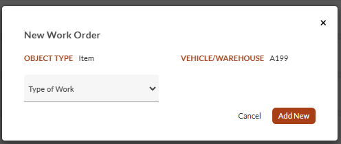
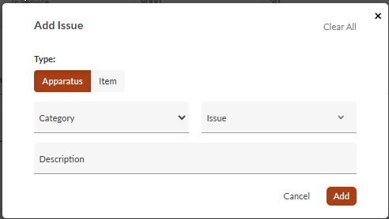

# Creating Work Orders

## Overview

Work orders help track repairs, maintenance tasks, and associated vehicle, station, and equipment costs. This guide covers creating work orders and setting up basic information.

## Check Prerequisites

Before creating a work order, verify the following:

- Ensure you have appropriate permissions to create and manage work orders.
- Gather relevant information about the issue or maintenance task.
- Have vendor information ready if external work is needed.

## Creating a Work Order

Work orders can be initiated from all list displays and during maintenance check submission. The following sections describe how to create work orders from the various displays.

> [!NOTE]
> To learn how to convert a maintenance check to a work order, see [Maintenance Check](https://eprsys-team-84.atlassian.net/wiki/spaces/EFQ/pages/89030657/Maintenance+Check#n_w_o).

### Work Order List Display

To add the work orders for the **Work Order** display, do as follows:

1. Click **New Work Order**.
2. In the **New Work Order** pop-up, complete as follows:
1.   Select the **Object Type**:
  
  -   Apparatus/Warehouse
  
  -   Hydrant
  
  -   Item
  
  -   Station
2.   Select the **Work Type** from the following options:
  
  -   Fuel
  
  -   Maintenance
  
  -   Parts replacement
  
  -   Repair
3.   Click **Add New**.

### Creating Work Orders from the Other List Displays

To create a work order for a specific apparatus, warehouse, or item, do as follows:

1. Locate the apparatus/warehouse/item in the list, and then click the three-dot menu on the right.
2. Select **New Work Order**.
3. In the pop-up window, select the **Work Type** from dropdown.
4. Click **Add New**.

## Prepare the Work Order

After creating a work order, you'll need to set up the basic information that defines what work needs to be done, who will do it, and when it started:

1. Enter the basic work order details:
1.   Set the **Internal Status** as required by your department.
2.   In the **Vendor** field, select a vendor from the list if external work is needed.
3.   Set the **Start Date** to record when work began (date and time).
2. Enter vehicle metrics if applicable:
1.   Review **Mileage During WO**.
2.   Check **Hours During WO**.
3.   Set **Down Time Hours**.
3. Review **Work Order** **History** and **Apparatus Details** using the buttons below this section.

## Adding Issues to the Work Order

Document all problems that need to be addressed by adding issues to your work order, either automatically from maintenance checks or manually.

1. Check if issues from the **Maintenance Check** have populated automatically.
2. If the list is empty, click **Add Issues Found** to import data from maintenance checks.
3. To add additional issues manually:
1.   Click **Manual Issue**.
2.   Complete all required fields in the form.
3.   Click **Add** to save the issue to your work order.

> [!NOTE]
> **Note**:
> - Work orders can only be created for department items with unique identifiers.
> - The system automatically pulls information from inventory and maintenance modules.

**Next**: [Documenting Work Orders](../work-order/documenting-work-orders.md)