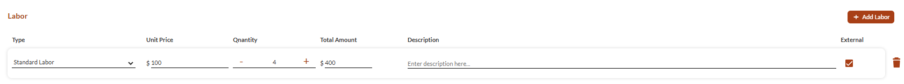
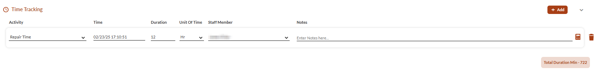
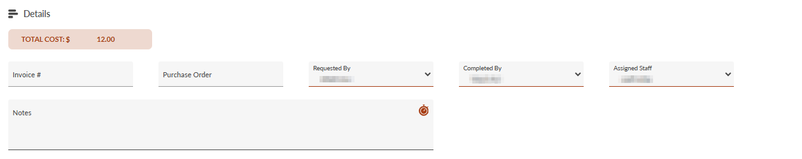
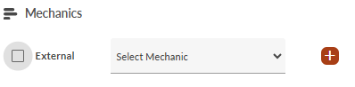
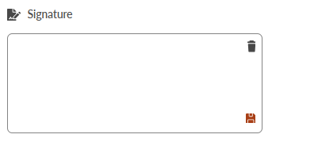

# Documenting Work Orders

- [Overview](#overview)
- [Documenting Work Orders](#documenting-work-orders)
-   [Track Costs](#track-costs)
-   [Record Time](#record-time)
-   [Submit Work Order](#submit-work-order)

## Overview

Track and document costs, labor, and progress for active work orders. This guide covers managing costs, time tracking, and completion procedures.

## Documenting Work Orders

1. [Track Costs](#0052840f-db94-4702-8ab8-5bd8ca6dd77f)
2. [Record Time](#8a6e0bc2-3de0-4cb9-a41d-453da6efc474)
3. [Sign and Submit](#9369dc22-1a71-4263-960a-4733bf7f5467)

### Track Costs

Enter all costs in the **Costs** and **Detailed Costs** sections, as follows:

1. Choose your cost view:
-   **Detailed** - List each part and job separately.
-   **Total** - Enter one final cost.
2. If you selected **Total**, complete the following fields:
-   **Labor Ext**: Enter the total external labor costs
-   **Part Ext**: Enter the total external parts costs
-   **Labor Int**: Enter the total internal labor costs
-   **Parts Int**: Enter the total internal parts costs.
3. For **Detailed** costs, complete the fields as follows:
1.   In **Parts**, complete as follows:
  
  -   **Part**: Select a part from the list.
  
  -   **Unit Price** Enter the price per unit.
  
  -   **Quantity**: Set quantity.
  
  -   **Description**: Add additional details.
  
  -   **External**: If the part is from an external vendor, mark it as **External**.
2.   In **Labor**, complete as follows:
  
  1.   **Type**: Select type of labor.
  
  2.   **Unit Price**: Enter hourly rate.
  
  3.   **Description**: Add additional details.
  
  4.   **External**: If the work was done by an external vendor, mark it as **External**.

### Record Time

Use the **Time and Activity Tracking** section to record the time spent on activities performed by staff members.

Complete the fields as follows:

1. **Activity**: Select the activity from the list.
2. **Time**: Add the date and time when the activity started.
3. **Duration/Unit**: Enter the time it took to complete the activity (hours/minutes). Select the appropriate time unit.  
**Note**: For real-time tracking, click 
 on the right.
4. **Staff**: Pick the staff member who did the work.
5. **Notes**: Add additional details.  

### Submit Work Order

After finishing the work, complete the **Work Summary** section before submitting the work order.

1. In **Details**, complete the following fields:
-   **Invoice**: Enter invoice number.
-   **Purchase Order**: If a part was purchased, add the order number.
-   **Requested By**: Select the staff member who requested the work order.
-   **Completed By**: Select the staff member who completed the work order.
-   **Assigned Staff**: If an additional staff member was assigned to the work order, select the staff member from the dropdown.
2. If you used mechanics, complete the **Mechanics** section, as follows:
1.   If the mechanic is an external vendor, mark **External**.
2.   Add the mechanic to the **Work Summary**:
  
  -   If the mechanic is a staff member, select the staff member from the dropdown.
  
  -   If the mechanic is external (as marked in the previous step), in the **External Mechanic** field, type the mechanic’s name. When finished, press **Enter**.
      
    **Note**: Use 
     on the right to add multiple mechanics to the work order. The list can include both external mechanics and staff members.
3. In the **Signature** field, sign off on work.
4. When done, click **Complete Work Order**.