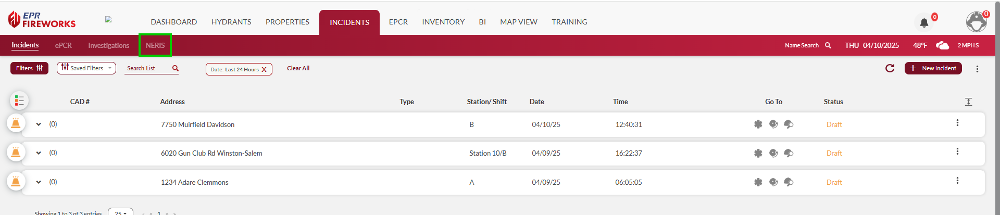
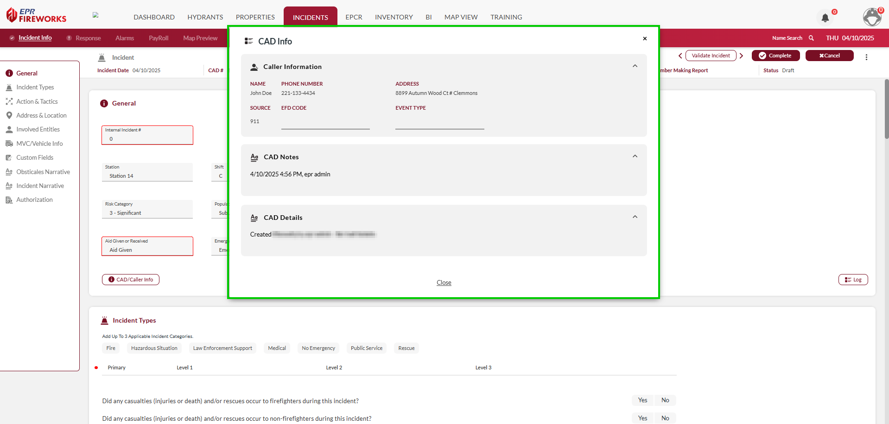
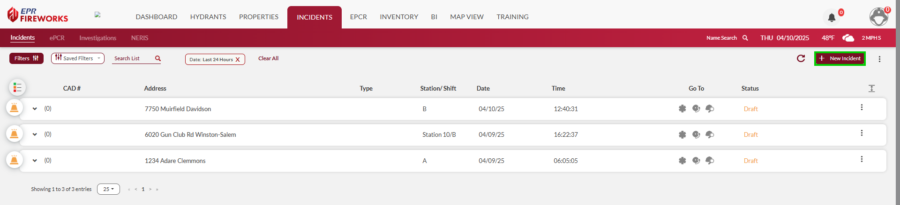
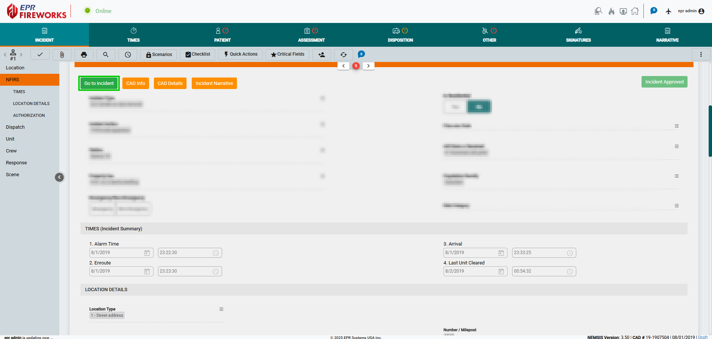

# Getting Started with the NERIS Module

> [!WARNING]
> ### **Disclaimer**
> NERIS is currently under development by the Fire Safety Research Institute (FSRI). This guide reflects the system as implemented in EPR FireWorks. Functionality may evolve as NERIS continues development toward full national implementation by January 2026.

## Overview

The NERIS module is part of EPR FireWorks Incidents. Until we complete the full transition to NERIS, the central Incidents module is NFIRS, while the NERIS tab appears on the right.

> [!NOTE]
> The Incident list includes all incidents, NERIS and NFIRS alike. Only incidents opened originally in NERIS will open in the NERIS format. Other incidents will open in the legacy NFIRS-Incident format.

## Creating NERIS Incidents

NERIS Incidents are created in three ways:

- **Populated automatically through the CAD system**: The CAD system automatically populates the NERIS incident list. The populated incident will appear with CAD number and details.
- **Manually from the NERIS list**: Create new incidents by clicking New Incident on the top-right corner.
- COMING SOON **Triggered by ePCR** : When creating an ePCR, the system will trigger a new row in the NERIS list. Details from the ePCR can be found in the [Medical](../neris/neris-incident-reporting/incident-documentation-requirements/medical.md) tab.