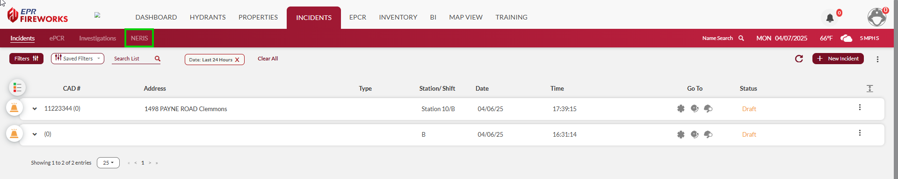
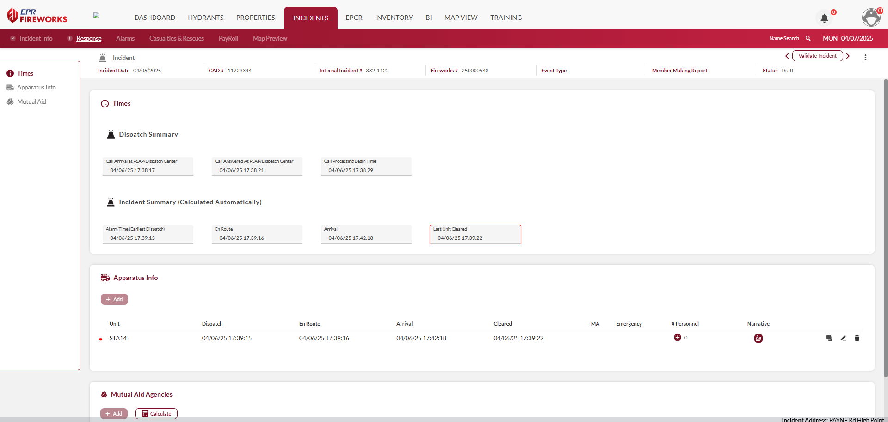
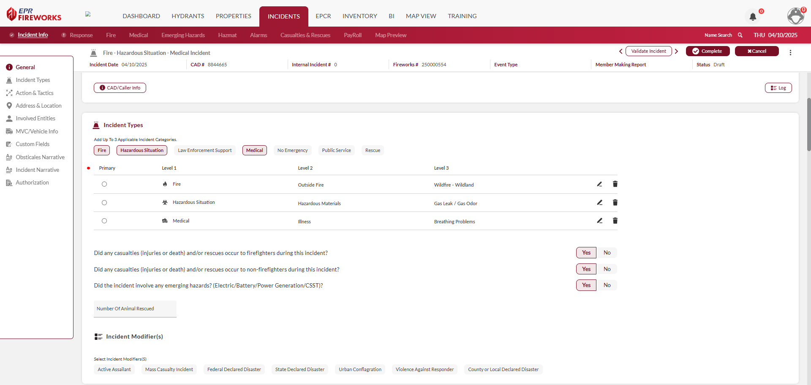
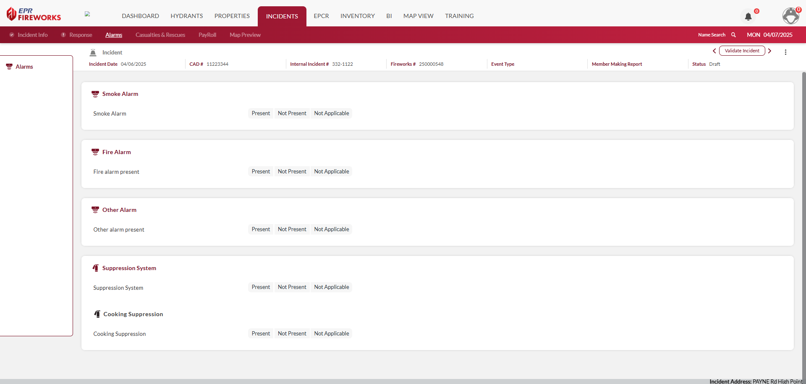
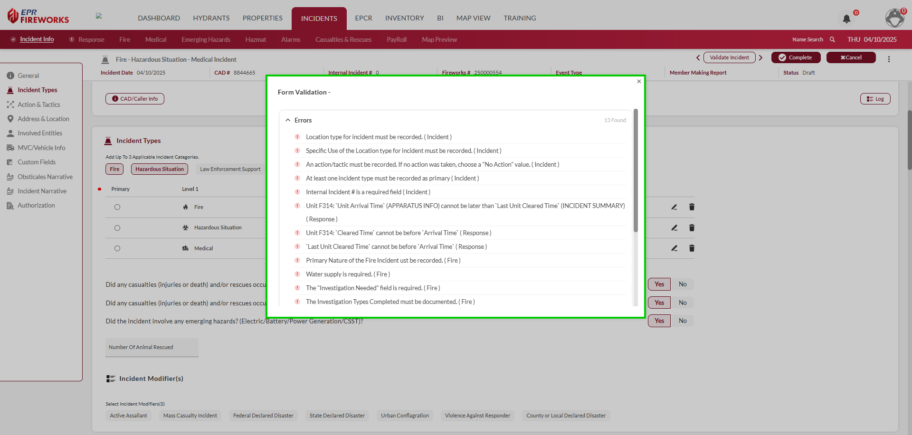
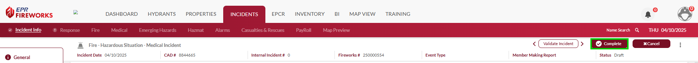
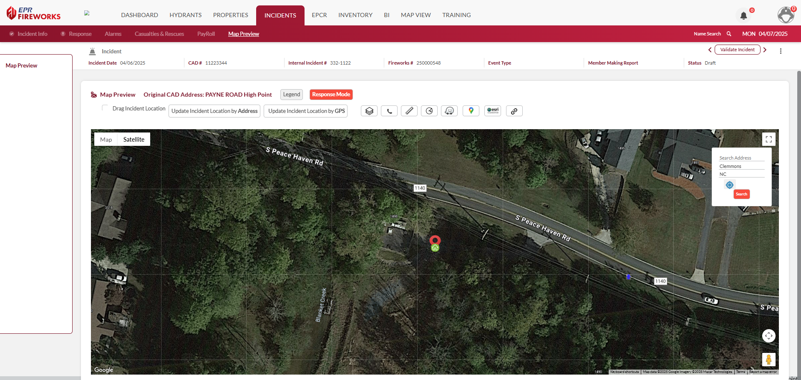

# NERIS Incident Reporting

- [Overview](#overview)
-   [Disclaimer](#disclaimer)
- [Completing the NERIS Incident Report](#completing-the-neris-incident-report)
- [Map Preview](#map-preview)
-   [NERIS Tabs](#neris-tabs)

## Overview

This document explains how to complete the NERIS report from a bird’s eye. The master-procedure and tab descriptions below will be explained in-depth in the following articles of this user guide

> [!WARNING]
> ### **Disclaimer**
> NERIS is currently under development by the Fire Safety Research Institute (FSRI). This guide reflects the system as implemented in EPR FireWorks. Functionality may evolve as NERIS continues development toward full national implementation by January 2026.

## Completing the NERIS Incident Report

To complete the NERIS report, complete the NERIS tabs as follows:

1. [Incident Info](./neris-incident-reporting/incident-info.md): Document incident details, actions and tactics taken, location, involved entities, narratives, and report authorization.
2. [Response](./neris-incident-reporting/response.md): Record incident times, apparatus, and crew details.
3. [Incident Documentation Requirements](./neris-incident-reporting/incident-documentation-requirements.md): Additional details regarding specific incident types
4. [Alarms](./neris-incident-reporting/alarms-risk-reduction.md): Record alarm and suppression system statuses.
5. [PayRoll](./neris-incident-reporting/payroll.md): Track payroll for participating crew members.
6. Validate the Report: When you finish documenting the incident, click **Validate Incident**. If there are any issues with the report, they will appear in the popup window in the center of the screen.
7. Fix issues. When done, Click **Complete** to submit the report.

> [!NOTE]
> The primary difference between NERIS and NFIRS is the **Incident** tab. Aside from the overall visual update in NERIS, the **Response**, **Casualties**, **Payroll**, and **Map Preview** tabs remain unchanged. The NFIRS Authorization tab has been merged into the Incident tab for a more streamlined experience.

## Map Preview

The **Map Preview** tab displays the incident location on your Google/ESRI map. In addition, the **Map Preview** section includes the **Response Mode** for on-scene action.

#### NERIS Tabs

- [Incident Info](./neris-incident-reporting/incident-info.md)
- [Response](./neris-incident-reporting/response.md)
- [Incident Documentation Requirements](./neris-incident-reporting/incident-documentation-requirements.md)
- [Alarms (Risk Reduction)](./neris-incident-reporting/alarms-risk-reduction.md)
- [Casualties & Rescues](./neris-incident-reporting/casualties-rescues.md)
- [PayRoll](./neris-incident-reporting/payroll.md)