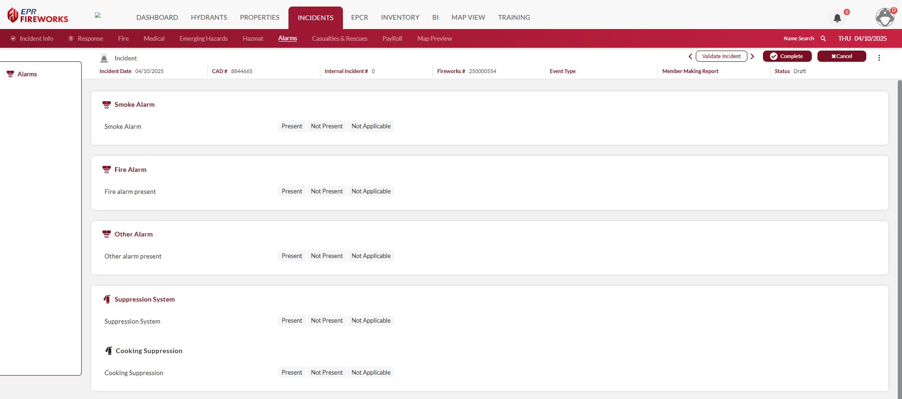
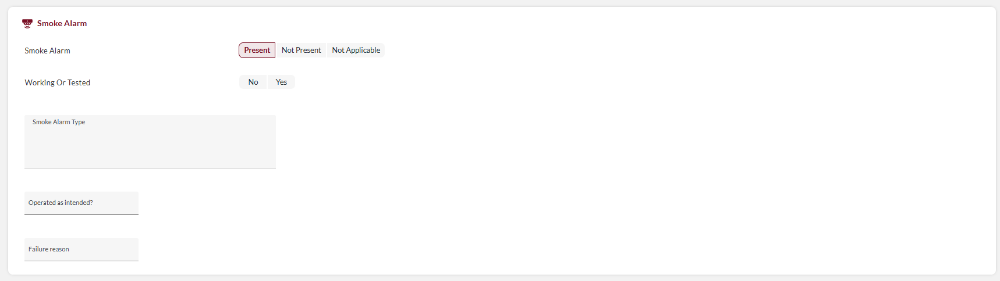
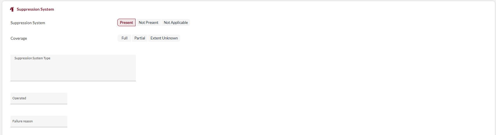
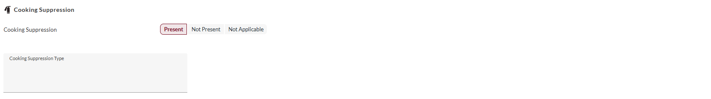

# Alarms (Risk Reduction)

# Documenting NERIS Alarms Module

## Overview

The Alarms tab in NERIS documents the presence and performance of fire safety systems at incident locations. This information is critical for risk reduction analysis, code enforcement, and tracking the effectiveness of built-in fire protection systems.

> [!WARNING]
> ### **Disclaimer**
> NERIS is currently under development by the Fire Safety Research Institute (FSRI). This guide reflects the system as implemented in EPR FireWorks. Functionality may evolve as NERIS continues development toward full national implementation by January 2026.

## Alarm System Documentation

The Alarms tab allows you to document various alarms and suppression systems.

For each system, indicate the following:

- **Present**: System was present at the incident location
- **Not Present**: System was not present at the incident location
- **Not Applicable**: System documentation is not relevant to this incident type

## Advanced Documentation (when "Present" is selected)

When you select **Present** for any system, additional fields appear to document. Complete the fields as follows:

### For Alarm Systems

1. Select the alarm system installed (you can select multiple answers).
2. Indicate whether the system operated during the incident.
3. Define reasons for system failure (if applicable)

### For Suppression Systems

1. Select the type of suppression system installed (you can select multiple answers).
2. Indicate whether the system operated during the incident.
3. Define reasons for system failure (if applicable).

### For Cooking Suppression

Select Cooking Suppression Type (you can select multiple answers).

## NERIS Risk Reduction (Alarm) Requirements

| Field Category | Documentation Requirements |
| --- | --- |
| **Smoke Alarm Presence** | Documentation of detection system installation |
| **Smoke Alarm Operation** | Performance evaluation of detection systems |
| **Fire Alarm Presence** | Documentation of alarm system installation |
| **Fire Suppression Presence** | Automatic suppression system installation |
| **Fire Suppression Effectiveness** | Performance assessment of suppression systems |