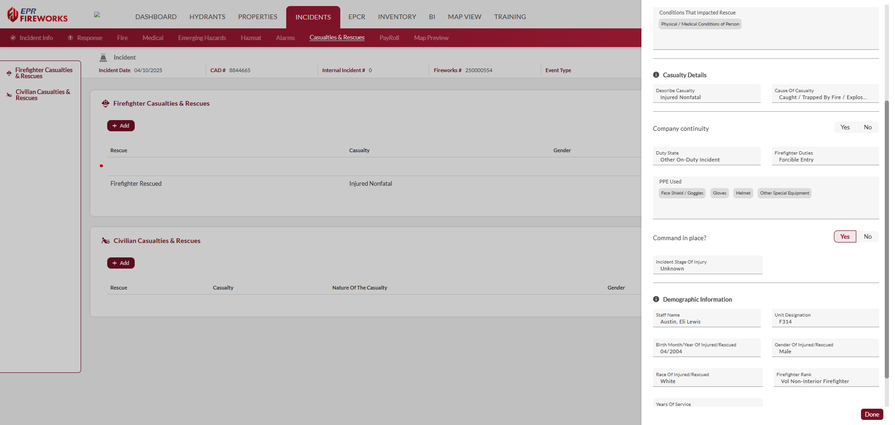

# Casualties & Rescues

# Overview

The **Casualties & Rescues** section documents injuries, fatalities, and rescues associated with an incident, ensuring comprehensive tracking of both firefighter and civilian impacts for NERIS reporting. This section is divided into two subsections: **Firefighter Casualties & Rescues** and **Civilian Casualties & Rescues**, each with a summary view to list entries. Clicking **Add** in either subsection opens the Casualty Details form, which captures detailed information about the casualty or rescue, including rescue circumstances, casualty specifics, and demographic data.

> [!WARNING]
> ### **Disclaimer**
> NERIS is currently under development by the Fire Safety Research Institute (FSRI). This guide reflects the system as implemented in EPR FireWorks. Functionality may evolve as NERIS continues development toward full national implementation by January 2026.

## Firefighter Casualties & Rescues

This section logs casualties and rescues involving firefighters, divided into the following subsections:

- [Rescue Details](#rescue)
- [Casualty Details](#casualty)
- [Demographic Information](#demog)

### Rescue Details

This subsection captures information about the rescue operation involving the firefighter.

| **Field** | **Description** |
| --- | --- |
| **Rescue Presence Known** | Indicates whether the presence of a person requiring rescue was known prior to the operation (e.g., Yes, No). |
| **Describe Rescue** | Details of the rescue operation, if applicable (e.g., type of rescue, conditions). |

### Casualty Details

This subsection documents specifics of the casualty event for the firefighter, including operational context and safety measures.

| **Field** | **Description** |
| --- | --- |
| **Describe Casualty** | Description of the casualty event (e.g., type of injury, circumstances). |
| **Company Continuity** | Indicates whether the firefighter’s company maintained operational continuity during the incident (e.g., Yes, No). |
| **Duty State** | The duty status of the firefighter at the time of the casualty (e.g., On Duty, Off Duty). |
| **Firefighter Duties** | Specific duties the firefighter was performing at the time of the casualty (e.g., Fire Suppression, Rescue). |
| **PPE Used** | Type of Personal Protective Equipment (PPE) used by the firefighter during the incident. |
| **Command in Place** | Indicates whether a command structure was in place at the time of the casualty (e.g., Yes, No). |
| **Incident Stage of Injury** | The stage of the incident during which the injury occurred (e.g., Initial Response, Firefighting). |

### Demographic Information

This subsection records demographic and professional details about the firefighter involved in the casualty or rescue.

| **Field** | **Description** |
| --- | --- |
| **Staff Name** | Name of the firefighter involved in the casualty or rescue. |
| **Unit Designation** | Unit identifier for the firefighter’s assigned vehicle, if applicable (e.g., RSQ10). |
| **Birth Month/Year of Injured/Rescued** | Birth month and year of the injured or rescued firefighter, used for demographic reporting. |
| **Gender of Injured/Rescued** | Gender of the injured or rescued firefighter (e.g., Male, Female). |
| **Race of Injured/Rescued** | Race of the injured or rescued firefighter, for demographic reporting. |
| **Firefighter Rank** | Rank of the firefighter at the time of the incident (e.g., Captain, Firefighter). |
| **Years of Service** | Number of years the firefighter has been in service. |
| **Job Classification of Firefighter** | Job classification of the firefighter (e.g., Career, Volunteer). |

## Civilian Casualties & Rescues

This subsection tracks casualties and rescues involving civilians, including the nature of the casualty to provide detailed incident insights for NERIS analytics.

| **Field** | **Description** |
| --- | --- |
| **Rescue** | Indicates whether a rescue operation was performed for the civilian (e.g., Yes, No). |
| **Casualty** | Indicates whether the civilian was a casualty (e.g., Yes, No). |
| **Nature of the Casualty** | Describes the type of casualty (e.g., Injury, Fatality). |
| **Gender** | Gender of the civilian involved (e.g., Male, Female). |
| **Birth Date** | Birth date of the civilian, used for demographic reporting. |