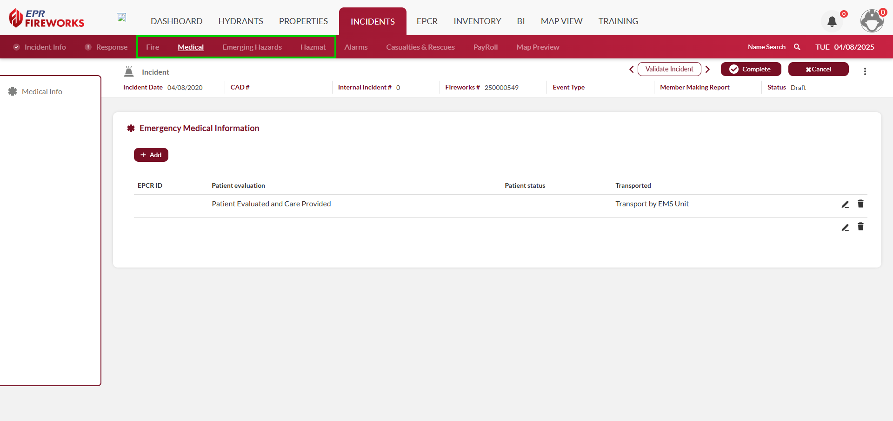

# Incident Documentation Requirements

## Overview

The system dynamically presents specialized data collection tabs based on incident classification. These tabs capture critical information specific to certain incident types.

The additional tabs will appear upon selection of the specific incident type to the right of the **Response** tab, and must be completed before submitting the NERIS report.

The incident types requiring additional information are as follows:

- [Fire](./incident-documentation-requirements/fire.md)
- [Medical](./incident-documentation-requirements/medical.md)
- [HazMat](./incident-documentation-requirements/hazmat-hazsit.md)
- [Emerging Hazards](./incident-documentation-requirements/emerging-hazards.md) (not an incident type, but opens a separate tab when marked)

> [!WARNING]
> ### **Disclaimer**
> NERIS is currently under development by the Fire Safety Research Institute (FSRI). This guide reflects the system as implemented in EPR FireWorks. Functionality may evolve as NERIS continues development toward full national implementation by January 2026.