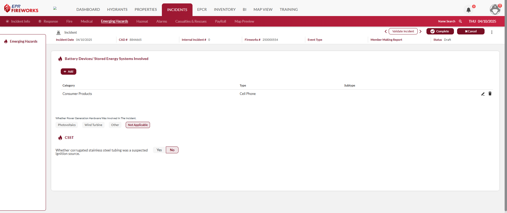

# Emerging Hazards

## Overview

The Emerging Hazards tab in NERIS captures information about modern technology hazards involved in incidents. This tab appears when you indicate in the [Incident Info](../../neris-incident-reporting/incident-info/incident-types.md) section that the incident involved batteries, alternative energy systems, or other emerging technologies.

> [!WARNING]
> ### **Disclaimer**
> NERIS is currently under development by the Fire Safety Research Institute (FSRI). This guide reflects the system as implemented in EPR FireWorks. Functionality may evolve as NERIS continues development toward full national implementation by January 2026.

## Adding Emerging Hazards to NERIS

To document Emerging Hazards, follow these steps

1. Click **Add**.
2. Select the Emerging Hazard category and type
3. If applicable, indicate whether the battery/ESS was the source or target.
4. Select the suppression approach (see table below for descriptions and available options)
5. Indicate whether there was a re-ignition.
6. Answer the following questions:
1.   Was power generation hardware involved in the incident?
2.   Was corrugated stainless steel tubing a suspected ignition source?

### Battery Devices/Stored Energy Systems Involved

| Field | Description |
| --- | --- |
| **Category** | Classification of energy storage system (Consumer Products, Electric Vehicle, E-Mobility, Energy Storage System) |
| **Type** | Specific type of electrification hazard |
| **Subtype** | Additional details about the technology involved |
| **Source/Target** | Whether the battery was the source of ignition or was impacted by fire |
| **Suppression Approach** | Methods used to extinguish battery fires |
| **Re-ignition** | Whether the battery reignited after initial extinguishment |

### Power Generation Hardware

| **Field** | **Description** |
| --- | --- |
| **Photovoltaics** | Solar panel involvement in the incident |
| **Wind Turbine** | Wind power system involvement |
| **Other** | Other alternative energy systems |
| **Not Applicable** | No power generation equipment involved |