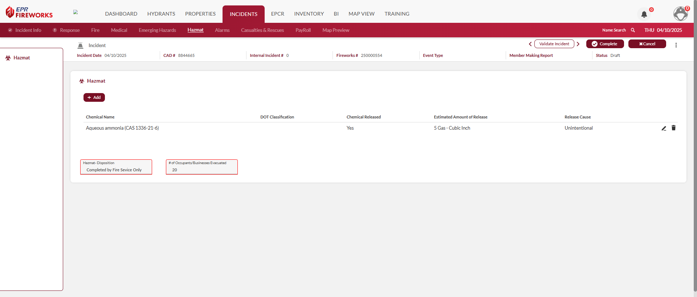
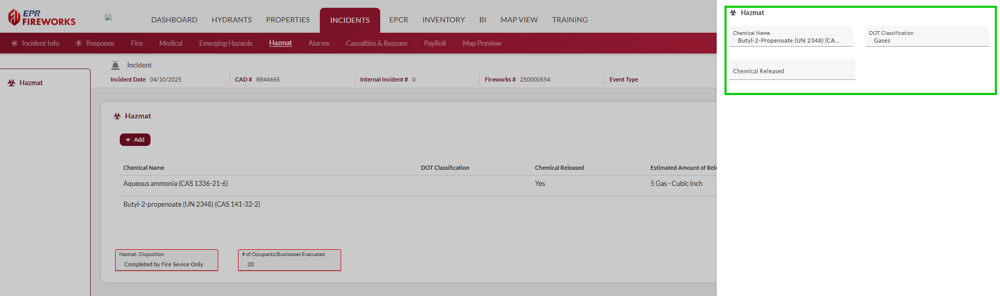
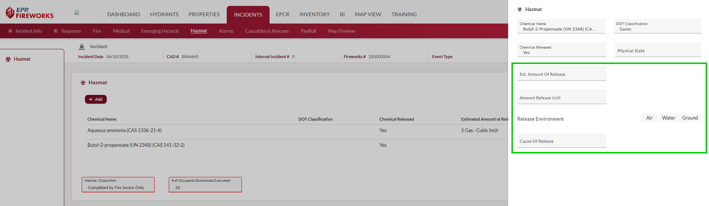

# HazMat (HazSit)

- [Overview](#overview)
-   [Disclaimer](#disclaimer)
- [Documenting Hazardous Situations](#documenting-hazardous-situations)
- [NERIS Field Key](#neris-field-key)

## Overview

The Hazmat (NERIS HazSit) tab in appears when documenting hazardous materials (HazMat) incidents, allowing you to record chemical types, DOT classifications, release information, and evacuation details. This specialized section captures critical data about the hazardous substances involved, their environmental impact, and the incident's final disposition.

> [!WARNING]
> ### **Disclaimer**
> NERIS is currently under development by the Fire Safety Research Institute (FSRI). This guide reflects the system as implemented in EPR FireWorks. Functionality may evolve as NERIS continues development toward full national implementation by January 2026.

## Documenting Hazardous Situations

The following procedure explains how to add Hazardous Material (HazMat) information to the NERIS report. This section appears only if the **HazMat** incident type was selected in the **Incident Type** section. Field descriptions are included in the table below.

1. Click **Add**.
2. Complete the following fields:
-   Chemical Name
-   DOT Classification
-   Chemical Released
3. If you selected **Yes** for chemical release, complete the following additional fields:
-   Physical State
-   Est. Amount of Release
-   Amount Released (Unit)
-   Release Environment
-   Cause of Release  
  
4. Click **Done**.
5. After adding all HAzMats related to the incident, complete the **Hazmat Disposition** and **\# of Occupants/Businesses Evacuated** fields.

## NERIS Field Key

| **Field** | **Description** |
| --- | --- |
| **Chemical Name** | Identification of specific hazardous substances |
| **DOT Classification** | DOT hazard classification of involved materials |
| **Chemical Released** | Containment status of hazardous materials (Yes/No) |
| **Physical State** | Physical form of material during release |
| **Est. Amount Released** | Number of units of HazMat released. |
| **Amount Released (Unit)** | Quantification of released materials (Est. Amount Released) |
| **Release Environment** | Where the chemical was released (Air/Water/Ground) |
| **Cause of Release** | Factors contributing to hazardous release |
| **HazMat Disposition** | Resolution of hazardous materials incident |
| **HazMat Evacuated** | Population protection measures implemented |