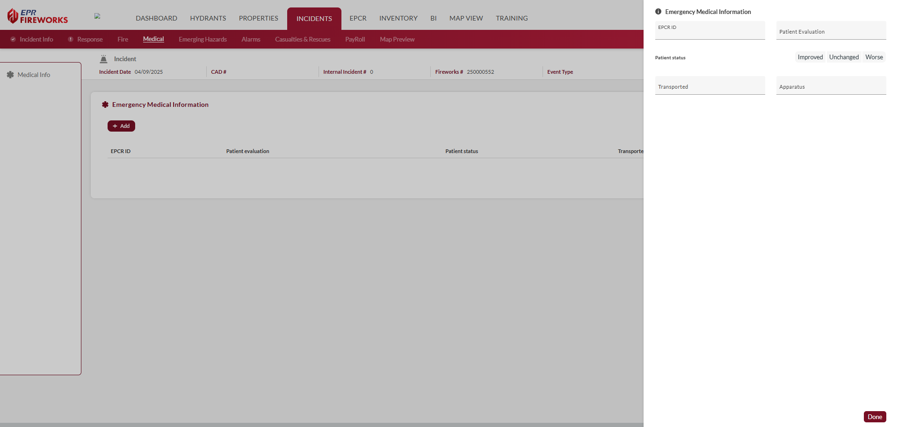
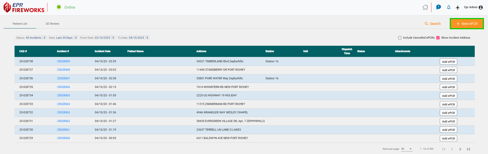
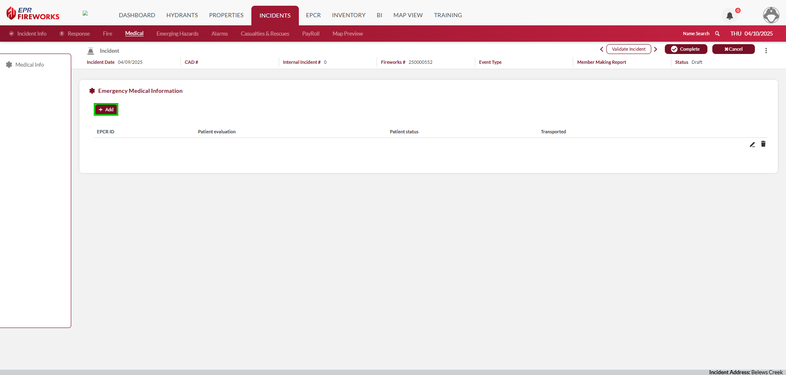
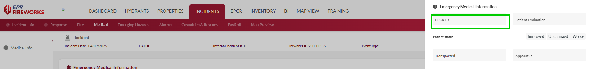

# Medical

- [Overview](#overview)
-   [Disclaimer](#disclaimer)
- [Completing the Medical tab](#completing-the-medical-tab)

## Overview

The Medical tab in NERIS is where you record emergency medical information provided during an incident. This module appears when you select a medical-related incident type or indicate that EMS services were provided during an incident response.

> [!INFO]
> Before getting started: In **Incident Info**, ensure to select **Medical** as the incident type.

> [!WARNING]
> ### Disclaimer
> The NERIS **Medical** tab does NOT replace electronic patient care reporting (ePCR) requirements. Complete patient documentation must still be entered in your agency's NEMSIS-compliant ePCR system as required by local protocols and state regulations.

## Completing the Medical tab

The Medical tab captures essential information about patient care and transport. To add medical information to the NERIS report, follow these steps:

1. In the **FireWorks ePCR** module (or any other integrated ePCR provider), create an ePCR.
2. In **NERIS > Medical**, click **Add**.
3. Select the ePCR ID from the dropdown.
4. Complete the fields as described in the table below.

| **Field** | **Description** | **Options** |
| --- | --- | --- |
| **Patient Evaluation** | Level of assessment and care provided to the patient | - Patient Evaluated And Care Provided - Patient Evaluated And Refused Care - Patient Evaluated, No Care Required - Patient Refused Evaluation/Care - Patient Support Services Provided - Patient Dead On Arrival |
| **Patient Status** | Condition change following treatment (Improved, Unchanged, Worse) | - Improved - Unchanged - Worse |
| **Transported** | Indicates whether the patient was transported to a medical facility | - Transport By EMS Unit - Transport By Other Agency - Patient Refused Transport - Non-Patient Transport (Not Otherwise Listed) - No Transport |
| **Apparatus** | Unit that provided medical care or transport | n/a |