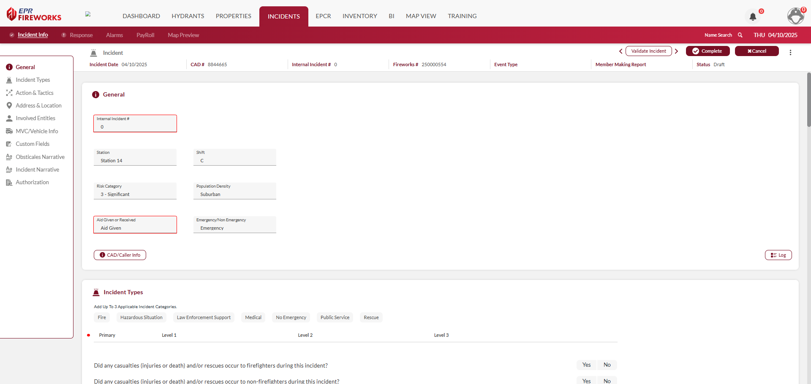

# Incident Info

> [!WARNING]
> ### **Disclaimer**
> NERIS is currently under development by the Fire Safety Research Institute (FSRI). This guide reflects the system as implemented in EPR FireWorks. Functionality may evolve as NERIS continues development toward full national implementation by January 2026.

## Recording Incident Info

The Incident info includes all the basic details of the incident, including signatures and authorization of the report:

- [Incident Types](./incident-info/incident-types.md)
- [Actions & Tactics](./incident-info/actions-tactics.md)
- [Address & Location](./incident-info/address-location.md)
- [Involved Entities, MVC/Vehicle Info, Custom Fields](./incident-info/involved-entities-mvcvehicle-info-custom-fields.md)
- [Narratives](./incident-info/narratives.md)
- [Authorization](./incident-info/authorization.md)

