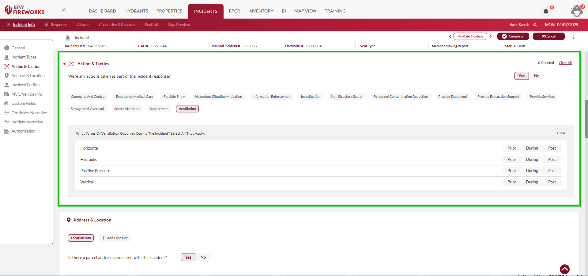
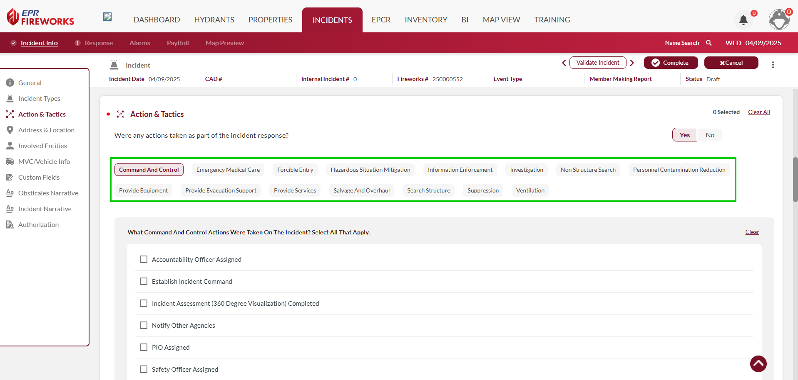
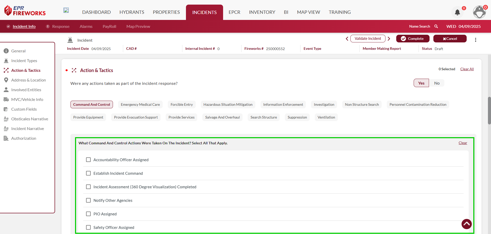

# Actions & Tactics

- [Overview](#overview)
-   [Disclaimer](#disclaimer)
- [Recording Actions and Tactics](#recording-actions-and-tactics)
- [Tactic Key](#tactic-key)
- [Action Key](#action-key)
-   [Command and Control](#command-and-control)
-   [Emergency Medical Care](#emergency-medical-care)
-   [Hazardous Situation Mitigation](#hazardous-situation-mitigation)
-   [Information Enforcement](#information-enforcement)
-   [Non Structure Search](#non-structure-search)
-   [Personnel Contamination Rules](#personnel-contamination-rules)
-   [Provide Equipment](#provide-equipment)
-   [Provide Evacuation Support](#provide-evacuation-support)
-   [Provide Services](#provide-services)
-   [Suppression](#suppression)

## Overview

The **Actions & Tactics** section records operational activities performed throughout the incident, serving as the incident checklist. This information is critical for analyzing response effectiveness and resource utilization. Each tactic includes multiple actions, as described in the tables below.

> [!WARNING]
> ### **Disclaimer**
> NERIS is currently under development by the Fire Safety Research Institute (FSRI). This guide reflects the system as implemented in EPR FireWorks. Functionality may evolve as NERIS continues development toward full national implementation by January 2026.

## Recording Actions and Tactics

1. Click the tactic.
2. Mark the actions taken during the incident.
3. Repeat steps 1-2 for all applicable tactics.

## Tactic Key

The following table explains the tactics which form the Action & Tactics section of the NERIS report.

| **Tactic** | **Operational Description** |
| --- | --- |
| **Command and Control** | Incident management structure and command functions |
| **Emergency Medical Care** | Patient assessment and treatment procedures |
| **Forcible Entry** | Techniques used to gain access to structures or vehicles |
| **Suppression** | Fire control and extinguishment methodologies |
| **Ventilation** | Smoke and heat removal operations |
| **Search Structure** | Interior building search protocols |
| **Non-Structure Search** | Exterior or specialized search techniques |
| **Salvage and Overhaul** | Property conservation and fire extension prevention |
| **Personnel Contamination Reduction** | Responder decontamination procedures |
| **Hazardous Situation Mitigation** | Control of chemical, biological, or radiological hazards |
| **Evacuation** | Civilian movement to areas of safety |
| **Equipment** | Specialized equipment deployment |
| **Services** | Support services and assistance provided |
| **Information** | Intelligence gathering and dissemination |
| **No Action** | Documentation when response actions weren't executed |

## Action Key

The following tactics require you to mark which action you took throughout the incident. The tables explain each action:

Here is the list in bullet format:

- [Command and Control](#com_con)
- [Emergency Medical Care](#emc)
- [Hazardous Situation Mitigation](#haz_sit)
- [Information Enforcement](#inf_enf)
- [Non Structure Search](#non_str)
- [Personnel Contamination Rules](#per_con)
- [Provide Equipment](#prv_equ)
- [Provide Evacuation Support](#prv_rvac)
- [Provide Services](#prv_ser)
- [Suppression Operations](#supp)

### Command and Control

| **Action** | **Operational Description** |
| --- | --- |
| **Accountability** | Personnel tracking and resource status systems |
| **Officer Assigned** | Deployment of command officers to functional areas |
| **Establish Incident Command** | Implementation of formal command structure |
| **Incident Assessment (360 Degree Visualization) Completed** | General incident management functions |
| **Notify Other Agencies** | Multi-agency coordination and communication |
| **PIO Assigned** | Public information management and media liaison |
| **Safety Officer Assigned** | Dedicated safety monitoring and intervention |

### Emergency Medical Care

| **Action** | **Operational Description** |
| --- | --- |
| **Patient Assessment** | Initial evaluation and triage of illness or injury severity |
| **Patient Referral** | Connection to appropriate medical resources without emergency transport |
| **Provide Advanced Life Support** | Paramedic-level interventions including medication administration and cardiac care |
| **Provide Basic Life Support** | EMT-level care including CPR, bandaging, and basic airway management |
| **Provide Transport** | Emergency conveyance of patients to appropriate medical facilities |

### Hazardous Situation Mitigation

| **Action** | **Operational Description** |
| --- | --- |
| **Atmospheric Monitoring (Exterior / Fenceline)** | Measurement of air quality and hazardous concentrations at incident perimeter boundaries |
| **Atmospheric Monitoring (Interior)** | Detection and measurement of dangerous gases or airborne contaminants within structures |
| **Decontamination** | Removal of hazardous materials from personnel, victims, and equipment |
| **Leak Stop** | Procedures to control or terminate the release of hazardous materials |
| **Remove Hazard** | Physical removal or neutralization of dangerous substances from the incident scene |
| **Spill Control** | Containment and management of liquid hazardous material releases |
| **Take Samples** | Collection of material specimens for identification and analysis |

### Information Enforcement

| **Action** | **Operational Description** |
| --- | --- |
| **Enforce Code Or Law** | Application of fire, building, or safety regulations at incident scenes |
| **Provide Public Information** | Dissemination of emergency-related details to community members and media |
| **Refer To Proper AHJ** | Direction of incident responsibility to appropriate Authority Having Jurisdiction |

### Non Structure Search

| **Action** | **Operational Description** |
| --- | --- |
| **Body Recovery** | Retrieval of deceased victims from incident scenes |
| **Search Area of Collapse** | Systematic examination of structural failure zones for trapped victims |
| **Search Underground Infrastructure (Cave / Mine)** | Operations to locate victims in subterranean spaces or confined below-grade areas |
| **Search Waterway** | Investigation of bodies of water for missing persons or evidence |
| **USAR K9 Search** | Deployment of specialized Urban Search and Rescue canine teams |
| **Wide Area / Outdoor Search** | Grid-based search operations covering large geographic areas |

### Personnel Contamination Rules

| **Action** | **Operational Description** |
| --- | --- |
| **Clean Cab Transport** | Movement of contaminated personnel using decontamination protocols for apparatus |
| **On-Scene Contamination Reduction** | Field-based procedures to minimize toxin exposure and cross-contamination |
| **PPE Washed Post-Incident** | Cleaning and decontamination of personal protective equipment after exposure |

### Provide Equipment

| **Action** | **Operational Description** |
| --- | --- |
| **Provide Drone / Video Equipment** | Deployment of aerial or remote imaging systems for situational awareness |
| **Provide Electrical Power** | Supply of emergency generators or power sources to incident scenes |
| **Provide Light** | Illumination of operational areas for nighttime or low-visibility operations |
| **Provide Special Equipment** | Delivery of specialized tools or apparatus based on incident needs |

### Provide Evacuation Support

| **Action** | **Operational Description** |
| --- | --- |
| **Connected Interior Spaces** | Protection of adjacent internal areas with direct access to incident location |
| **Large Area** | Management of hazards in extensive geographic or structural zones |
| **Nearby Buildings** | Protective measures for structures in proximity to incident location |
| **Remote Interior Spaces** | Hazard mitigation in difficult-to-access internal building areas |

### Provide Services

| **Action** | **Operational Description** |
| --- | --- |
| **Assist Animal** | Rescue or care of injured or trapped domestic or wild animals |
| **Assist Uninjured Person** | Aid to civilians not requiring medical attention |
| **Control Crowd** | Management of public gatherings at incident scenes |
| **Control Traffic** | Regulation of vehicular movement around emergency operations |
| **Damage Assessment** | Evaluation of structural integrity or property loss |
| **Provide Apparatus/Water** | Supply of firefighting equipment or water resources |
| **Remove Water** | Extraction of water from structures following suppression or flooding |
| **Restore/Reset Alarm System** | Return of detection systems to normal operational status |
| **Restore Sprinkler System** | Reactivation of automatic fire suppression after the incident |
| **Secure Property** | Protection of buildings or contents following incident operations |
| **Shut Down Alarm** | Deactivation of sounding alarm systems during operations |
| **Shut Down Sprinkler System** | Temporary cessation of sprinkler flow after fire control |

### Suppression

| **Action** | **Operational Description** |
| --- | --- |
| **Structural Fire Suppression** | Interior and exterior building fire attack   (Interior/Exterior/Interior and Exterior) |
| **Outside Fire Suppression** | Vegetation and outdoor fire attack |
| **Established Fire Lines** | Creation of containment boundaries |
| **Interior** | Offensive interior fire attack |
| **Exterior** | Defensive exterior operations |
| **Backburn** | Controlled burning to create firebreaks |
| **Interior and Exterior** | Coordinated attack from multiple positions |
| **Confinement** | Limiting fire spread within compartments |
| **Structure Protection** | Defending exposure buildings |
| **Fire Control/Extinguishment** | Final fire elimination operations |