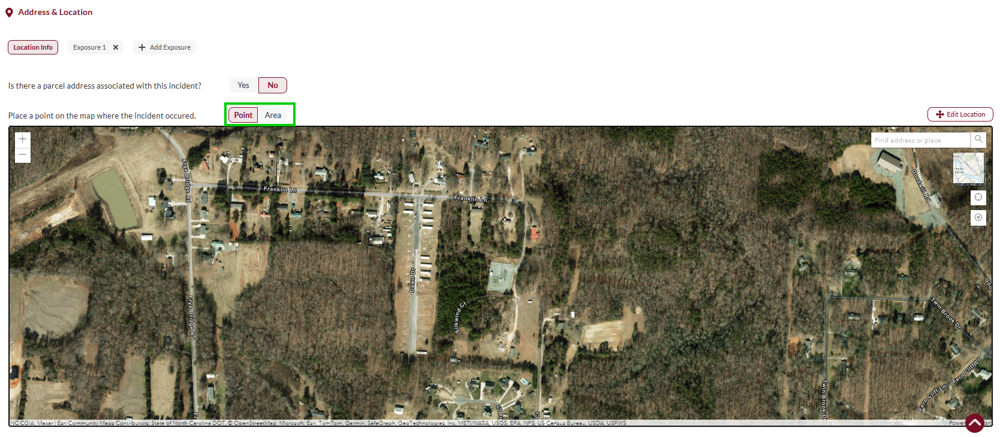
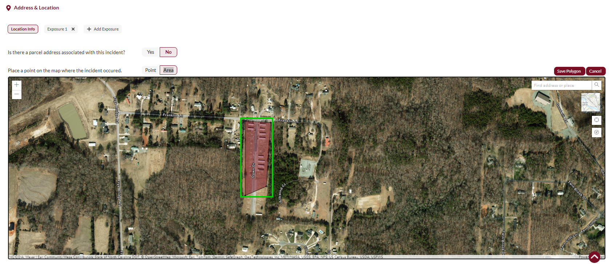
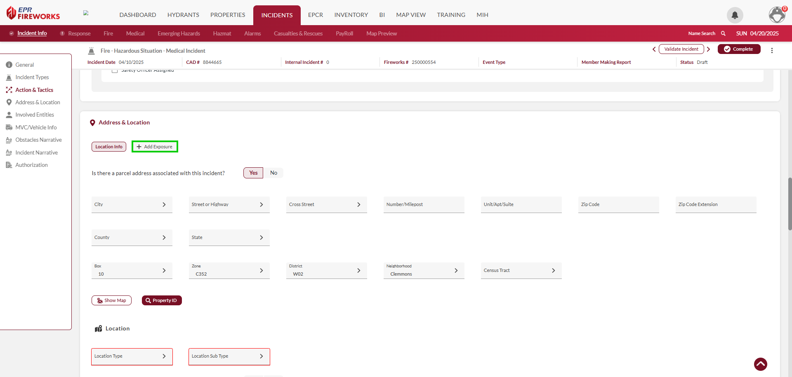
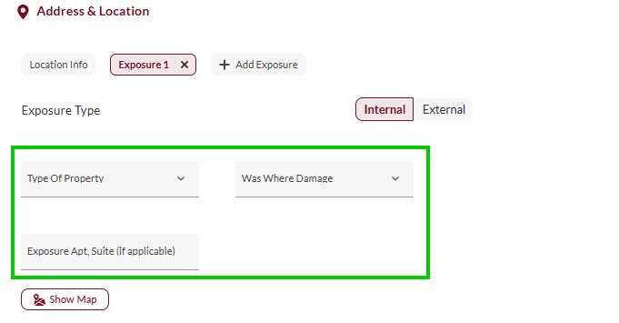
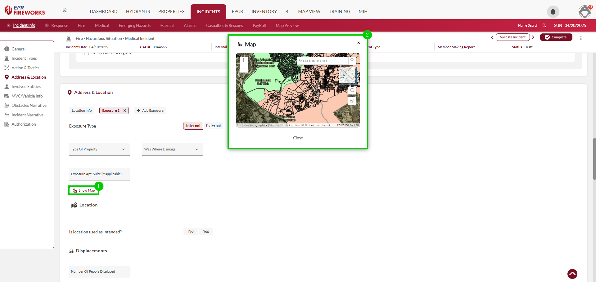
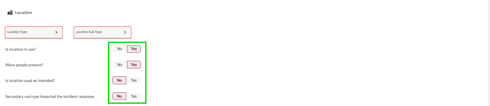
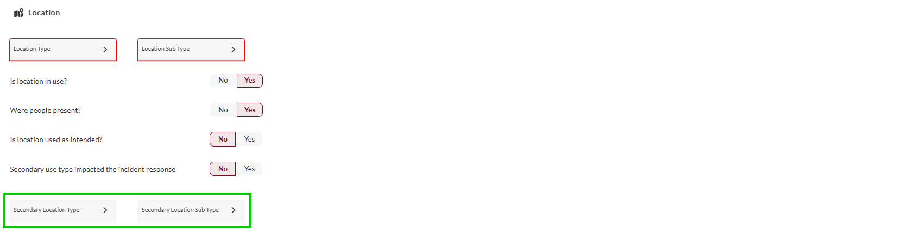
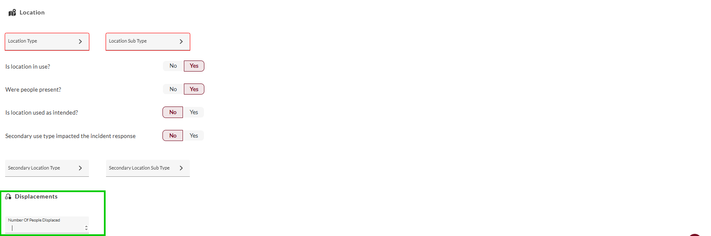

# Address & Location

- [Overview](#overview)
-   [Disclaimer](#disclaimer)
- [Completing Location Info](#completing-location-info)
- [Adding Exposures](#adding-exposures)
- [Selecting Location Type](#selecting-location-type)
- [Location Types](#location-types)

## Overview

The **Location** section captures comprehensive location data for accurate incident mapping and analysis. Locations in **NERIS** do not require an address. If the address is not available, you can add a polygon on a map defining the area of the incident.

> [!WARNING]
> ### **Disclaimer**
> NERIS is currently under development by the Fire Safety Research Institute (FSRI). This guide reflects the system as implemented in EPR FireWorks. Functionality may evolve as NERIS continues development toward full national implementation by January 2026.

To define location information, follow these steps:

1. Complete location info
2. Add exposures.
3. Select the location type and subtype.

## Completing Location Info

To define the incident address or polygon, follow these steps:

1. Determine whether the incident location is associated with a parcel address.
2. If you answered **Yes**, complete the location details below. If you answered **No**, skip this step.
3. If you marked **No**, do as follows. If you answered **Yes**, skip this step.
1.   Using the toggle bar, select **Pin** or **Area** for the type of location you are going to mark on the map.
2.   Mark the location on the map.
  
  1.   If you selected **Point**, click the location on the map.
  
  2.   If you selected **Area**., click the edges of the polygon you are marking up. When finished, click **Save Polygon**.

## Adding Exposures

**Exposures** in **NERIS** are defined as property or structures damaged or destroyed by the originating source of the hazard. An incident can include multiple exposures.

> [!TIP]
> **Example**: The structure fire spreads to vehicles in the parking lot. Each vehicle is regarded as an individual exposure.

To add exposures, follow these steps:

1. to the right of **Location Info**, click **Add Exposure**.
2. Define the Exposure Type (Internal/External).  

3. Complete the following exposure fields:
-   Type of Property
-   Was There Damage
-   Exposure Apt. Suite (if applicable)
4. Click **Show Map**. Mark the exposure on the map.
5. Repeat steps 1-4 for all exposures related to the incident.

## Selecting Location Type

1. Select the appropriate **Location Type** and **Subtype** for this incident. The location types and subtypes are described in the tables below.
2. Answer the following questions:
1.   Is the location in use?  
  If you answered **No**, select the reason for vacancy.
2.   Were people present?
3.   Is the location used as intended?  
  If you answered **No**, define whether the secondary use impacted the incident response.
3. Select a secondary location type and subtype (if applicable).
4. Record the number of people displaced by the incident (if applicable).

## Location Types

| **Classification** | **Description/Subtypes** |
| --- | --- |
| **Agriculture** | Farm buildings, silos, animal processing facilities, agricultural storage |
| **Assembly** | Gathering places including community centers, religious facilities, arenas |
| **Commercial** | Business establishments including offices, retail, restaurants, service locations |
| **Education** | Educational facilities including schools, universities, day care centers |
| **Government** | Public facilities including police stations, fire stations, jails, administration |
| **Industrial** | Manufacturing facilities, processing plants, refineries, factories |
| **Health Care** | Medical facilities including hospitals, clinics, nursing homes, assisted living |
| **Residential** | Housing units including single-family, multi-family, temporary lodging |
| **Utility & Miscellaneous** | Infrastructure facilities, transportation hubs, public works |
| **Storage** | Storage facilities including warehouses, self-storage, portable structures |
| **Roadway/Access** | General vehicle access ways and approaches |
| **Street** | Municipal roads, streets, and public thoroughfares |
| **Sidewalk** | Pedestrian walkways adjacent to roadways |
| **Highway/Interstate** | Major roadways, expressways, and limited access highways |
| **Bridge** | Elevated roadway structures crossing obstacles (water, land features) |
| **Tunnel** | Underground vehicular or pedestrian passages |
| **Parking Lot/Garage** | Surface and structure vehicle parking facilities |
| **Ground/Vacant Land** | Undeveloped land, empty lots, open spaces |
| **Camp Site** | Designated recreation camping and outdoor living areas |
| **Playground/Park/Rec Area** | Developed recreational outdoor public spaces |
| **Hiking Trail** | Designated walking paths and outdoor recreation trails |
| **Forest/Grass/Woodland** | Natural vegetated areas, both managed and unmanaged |
| **Water Proximity** | Coastal areas, beaches, docks, marinas, shorelines |
| **Open Water** | Bodies of water including lakes, rivers, ponds, streams |
| **Outdoor Industrial** | Outdoor work sites including mines, quarries, construction zones |