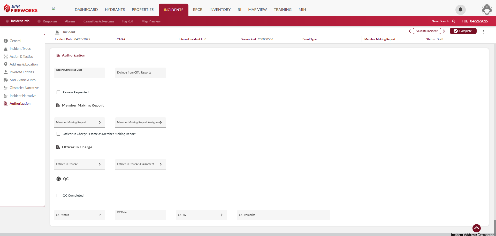

# Authorization

## Overview

The **Authorization** section of NERIS tracks incident report completion, review status, and quality control information. This section ensures proper documentation and reporting compliance. Complete according to the tables below.

> [!WARNING]
> ### **Disclaimer**
> NERIS is currently under development by the Fire Safety Research Institute (FSRI). This guide reflects the system as implemented in EPR FireWorks. Functionality may evolve as NERIS continues development toward full national implementation by January 2026.

## Authorization Fields

### Report Completion

| Field | Description |
| --- | --- |
| **Report Completed Date** | Date when the incident report was finalized |
| **Exclude from CFAI Reports** | Option to omit this incident from accreditation reporting |
| **Review Requested** | Checkbox to flag the report for supervisory review |

### Member Making Report

| Field | Description |
| --- | --- |
| **Member Making Report** | Personnel who authored the incident documentation |
| **Member Making Report Assignment** | Role/position of the report author during the incident |
| **Officer In Charge is same as Member Making Report** | Option to indicate the OIC also prepared the report |

### Officer In Charge

| Field | Description |
| --- | --- |
| **Officer In Charge** | Command officer responsible for the incident |
| **Officer In Charge Assignment** | Role/position of the officer during the incident |

### Quality Control

| Field | Description |
| --- | --- |
| **QC Completed** | Checkbox indicating quality review has been performed |
| **QC Status** | Current state of the quality review process |
| **QC Date** | Date when quality control review was conducted |
| **QC By** | Personnel who performed the quality review |
| **QC Remarks** | Comments or notes from the quality control reviewer |

## Completing the Authorization Section

1. Enter the Report Completed Date when documentation is finished
2. Select the Member Making Report
3. Identify the OIC (Officer-In-Charge)
4. Request review if needed
5. Complete quality control information after review

The Authorization section is required for finalizing NERIS incident documentation and ensuring proper approval workflows.