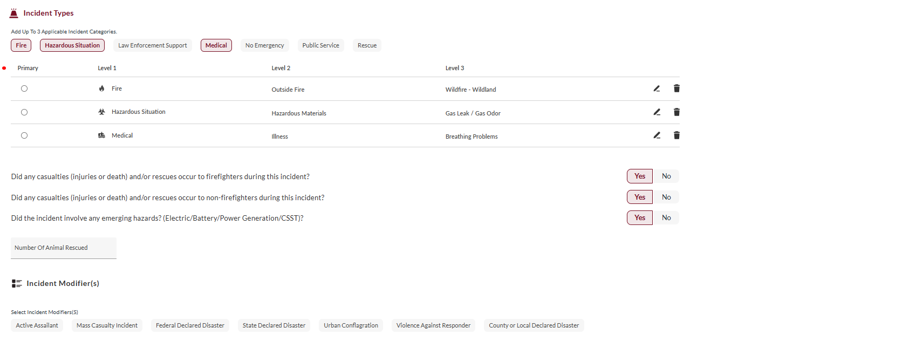
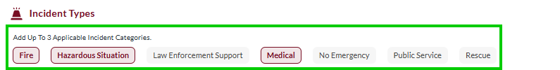
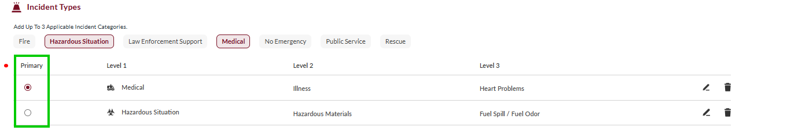
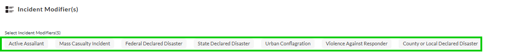

# Incident Types

- [Overview](#overview)
-   [Disclaimer](#disclaimer)
- [Defining the Incident Type](#defining-the-incident-type)
- [Incident Types](#incident-types)
- [Incident Categories and Subtypes](#incident-categories-and-subtypes)
-   [Fire](#fire)
-   [Hazardous Situation (HazSit/HazMat)](#hazardous-situation-hazsithazmat)
-   [Medical](#medical)
-   [No Emergency](#no-emergency)
-   [Public Service](#public-service)
-   [Rescue](#rescue)

## Overview

Incident classification is a critical component of NERIS reporting and determines which modules and fields will be displayed. NERIS allows the selection of up to three incident categories from the incident types and categories below.

> [!WARNING]
> ### **Disclaimer**
> NERIS is currently under development by the Fire Safety Research Institute (FSRI). This guide reflects the system as implemented in EPR FireWorks. Functionality may evolve as NERIS continues development toward full national implementation by January 2026.

## Defining the Incident Type

1. Click the desired incident type from the Subtypes. The incident types are listed in the [Incident Type](#) table below.
2. A sidebar with subtypes will open on the right. Select the subtype that best describes the incident.  
The subcategories are listed in the [Category and Subtypes](#cat_sub) tables below according to incident types.  
**Note:** Only one subcategory can be selected per incident type.
3. Using the **Primary** column to the left of the Incident Type table, mark the primary incident type. The incident type you mark will jump to the top of the table.
4. Answer the subsequent yes/no questions:
1.   Did any casualties (injuries or death) and/or rescues occur to firefighters during this incident?
2.   Did any casualties (injuries or death) and/or rescues occur to non-firefighters during this incident?
3.   Did the incident involve any emerging hazards? (Electric/Battery/Power Generation/CSST)?  
  **Note**:
  
  -   If the answer to questions (a) and (b) was **Yes**, complete the [Casualties & Rescues](../../neris-incident-reporting/casualties-rescues.md) tab (will open to the right).
  
  -   If the answer to question (c) is **Yes**, complete the [Emerging Hazards](../../neris-incident-reporting/incident-documentation-requirements/emerging-hazards.md) tab (will open on the right).
5. Add incident modifiers as needed to provide additional context or details from the following list:
-   Active Assailant
-   Mass Casualty Incident
-   Federal Declared Disaster
-   State Declared Disaster
-   Urban Conflagration
-   Violence Against Responder
-   County or Local Declared Disaster
6. When done, proceed to complete [Actions & Tactics](../incident-info/actions-tactics.md).

## Incident Types

| **Incident Type** | **Description** |
| --- | --- |
| **Fire** | All incidents involving combustion or burning materials |
| **Medical** | Incidents requiring emergency medical services |
| **Hazmat** | Hazardous materials incidents and investigations |
| **Rescue** | Incidents involving trapped or endangered persons |
| **Public Service** | Non-emergency assistance to the public |
| **No Emergency** | False alarms, canceled calls, good intent calls |
| **Law Enforcement Support** | Assistance provided to law enforcement agencies |

## Incident Categories and Subtypes

Certain incident types require additional subtype specification. After selecting an incident type from the

### Fire

| **Subcategory** | **Description** | **Subtypes** |
| --- | --- | --- |
| **Outside Fire** | Fires occurring outdoors (trash, vegetation, wildland) | - Construction Waste - Other Outside Fire - Outside Tank Fire - Trash / Rubbish Fire - Vegetation / Grass Fire - Wildfire - Wildland - Wildfire - Urban Interface - Utility Infrastructure Fire - Dumpster / Other Outdoor Container Fire |
| **Special Fire** | Explosions, ESS fires, infrastructure fires | - ESS Fire - Explosion - Infrastructure Fire (Tunnel, Bridge) |
| **Structure Fire** | Building fires, both confined and extended | - Structural Involvement - Room and Contents Fire - Confined Cooking / Appliance Fire - Chimney Fire |
| **Transportation Fire** | Vehicle, aircraft, boat, or train fires | - Aircraft Emergency - Vehicle Fire - Passenger - Vehicle Fire - Commercial - Vehicle Fire - RV - Vehicle Fire - Food Truck - Boat / Personal Watercraft / Barge Fire - Powered Mobility Device Fire - Train / Rail Fire |

### Hazardous Situation (HazSit/HazMat)

| **Subcategory** | **Description** | **Subtypes** |
| --- | --- | --- |
| **Hazard Non-Chemical** | Bomb threats, power lines, electrical hazards | - Bomb Threat / Bomb Response / Suspicious Package - Electrical Power Line Down / Arching / Malfunction - Electrical Hazard / Short Circuit |
| **Hazardous Materials** | Chemical spills, gas leaks, radiological incidents | - Fuel Spill / Fuel Odor - Gas Leak / Gas Odor - Carbon Monoxide Release - Biological Release / Incident - Radioactive Release / Incident - Hazardous Material Release (Chemical from Transportation) - Hazardous Material Release (Chemical from Fixed Facility) |
| **Investigation** | Smoke or odor investigations | - Smoke Investigation - Odor |
| **Overpressure** | Increase in pressure above normal atmospheric pressure | - Rupture Without Fire - No Rupture |

### Medical

| **Subcategory** | **Description** | **Subtypes** |
| --- | --- | --- |
| **Illness** | Non-traumatic medical conditions (cardiac, respiratory, stroke) | - Abdominal Pain / Problems - Back Pain (Non-Trauma) - Breathing Problems - Cardiac Arrest - Chest Pain (Non-Trauma) - Convulsions / Seizures - Diabetic Problems - Headache - Heart Problems - Pandemic / Epidemic / Outbreak - Pregnancy / Childbirth - Psychological Behavior Issues - Sick Case - Stroke / CVA - Unconscious Victim - Well Person Check - Unknown Problem - Nausea / Vomiting - Altered Mental Status - No Appropriate Choice - Allergic Reaction / Stings - Overdose / Poisoning |
| **Injury/Trauma** | Physical injuries from accidents, violence, or environmental causes | - Animal Bites - Assault - Burns / Explosion - Carbon Monoxide / Other Inhalation Injury - Choking - Drowning / Diving / SCUBA Accident - Fall - Heat / Cold Exposure - Motor Vehicle Collision - Industrial Accident / Inaccessible Incident / Other Entrapment (Non-Vehicle) - Gunshot Wound - Hemorrhage / Laceration - Stab / Penetrating Trauma - Other Traumatic Injury - Electrocution - Eye Trauma |
| **Other** | Medical alarms, standby requests, transfers, public health events | - Healthcare Professional Admission - Medical Alarm - Standby Request - Transfer / Interfacility - Airmedical Transport - Intercept Other Unit - Community Public Health |

### No Emergency

| **Subcategory** | **Description** | **Subtypes** |
| --- | --- | --- |
| **Cancelled** | Calls cancelled en route or on-scene | Cancelled |
| **False Alarm** | Intentional, malfunction, or accidental alarms | - Intentional False Alarm - Malfunctioning Alarm - Accidental Alarm - Other False Call - Bomb Scare |
| **Good Intent** | Calls with good intentions but no emergency found | - No Incident Found Upon Arrival / Location Error - Controlled Burning (Authorized) - Smoke From Nonhostile Source (Smoke Scare) - Investigate Hazardous Release (Nothing Found) |

### Public Service

| **Subcategory** | **Description** | **Subtypes** |
| --- | --- | --- |
| **Alarms (Non-Medical)** | Fire, gas, or CO alarm activations | - Fire / Smoke Alarm - Gas Alarm - CO Alarm - Other Alarm |
| **Citizen Assist** | Non-emergency assistance to civilians |     |
| **Disaster/Weather** | Weather-related responses, damage assessment |     |
| **Other** | Move-up, standby, and other miscellaneous services |     |

### Rescue

| **Subcategory** | **Description** |
| --- | --- |
| **Outside/Outdoor** | Rescues in outdoor environments (steep angle, confined space) |
| **Structure/Indoor** | Building collapse, elevator/escalator rescues |
| **Transportation (Land)** | Vehicle extrication, train/aviation incidents |
| **Water** | Water rescues in standing or swift water |