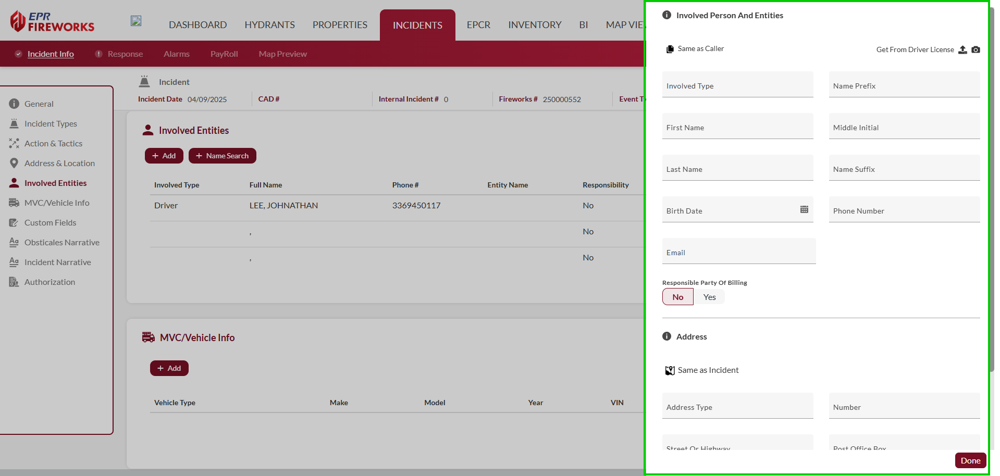
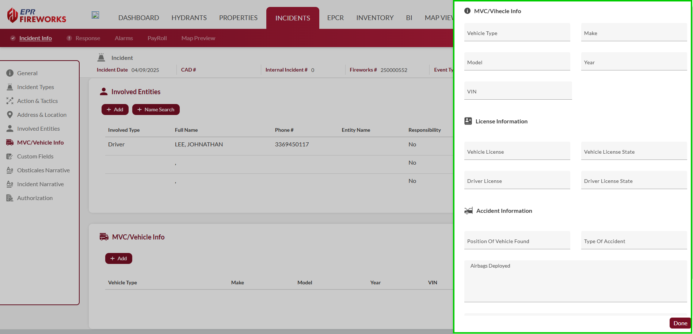

# Involved Entities, MVC/Vehicle Info, Custom Fields

- [Overview](#overview)
-   [Disclaimer](#disclaimer)
- [Documenting Involved Entities](#documenting-involved-entities)
-   [Adding Involved Entities](#adding-involved-entities)
- [MVC/Vehicle Info](#mvcvehicle-info)
-   [MVC/Vehicle Info Scenarios](#mvcvehicle-info-scenarios)
-   [Completing the MVC/Vehicle Info Section](#completing-the-mvcvehicle-info-section)
- [Custom Fields](#custom-fields)

## Overview

This guide covers the **Involved Entities**, **MVC/Vehicle Info**, and **Custom Fields** sections.

> [!WARNING]
> ### **Disclaimer**
> NERIS is currently under development by the Fire Safety Research Institute (FSRI). This guide reflects the system as implemented in EPR FireWorks. Functionality may evolve as NERIS continues development toward full national implementation by January 2026.

## Documenting Involved Entities

The Involved Entities section of NERIS allows you to record information about people and organizations associated with an incident. This includes patients, property owners, witnesses, responsible parties, and other individuals or entities connected to the emergency event.

### Adding Involved Entities

To add a new involved entity to the incident:

1. Click the **Add** button in the Involved Entities section  
**Note**: For rapid lookup of existing contacts, use the **Name Search** button
2. Complete the required fields in the entity form:
1.   In the **Person Involved Persons and Entities** section, record the individual's role and complete name details.
2.   In the **Address** section, enter the involved entity’s address details.

> [!INFO]
> **Note**:
> - If the involved entity was the original caller, click **Same as Caller**.
> - If the involved entity is the payer for the incident, in the **Party Responsible for Billing**, click **Yes**.
> - If the involved entity’s address is the same as the incident, click **Same as Incident**.

## MVC/Vehicle Info

The MVC/Vehicle Info section of NERIS allows you to record detailed information about vehicles involved in incidents. This documentation is particularly important for motor vehicle collisions, transportation fires, and extrication incidents.

### MVC/Vehicle Info Scenarios

Complete the MVC/Vehicle Info section for the following scenarios:

- Any incident involving vehicle collisions with injuries
- Extrication operations requiring specialized tools and techniques
- Vehicle fires requiring suppression operations
- Hazardous materials incidents involving transport vehicles
- Incidents requiring detailed documentation for insurance or legal purposes

### Completing the MVC/Vehicle Info Section

To add a vehicle to the MVC/Vehicle Info section, follow the next steps:

1. In the MVC/Vehicle Info section, click **Add**.
2. Complete the form:
1.   In the **MVC/Vehicle Info** section, complete the vehicle’s details.
2.   In the **License Information** section, complete the vehicle’s and driver’s license details.
3.   In the **Accident Information** section, record the details of the accident according to the table below.
4.   When finished, click **Done**.

| **Field** | **Description** |
| --- | --- |
| **Position Of Vehicle Found** | Document the vehicle's orientation and location when responders arrived |
| **Type Of Accident** | Select the classification that best describes the collision |
| **Airbags Deployed** | Indicate which (if any) airbags were activated during the collision |

## Custom Fields

Some fire departments may add additional fields for better understanding and tracking of the incident. Complete these fields according to your fire department’s reequirements