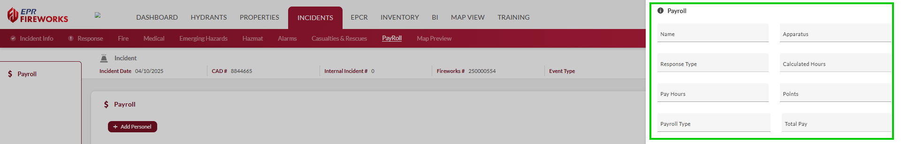

# PayRoll

- [Overview](#overview)
- [Adding Personnel Records](#adding-personnel-records)
- [NERIS Payroll Data Field Requirements](#neris-payroll-data-field-requirements)
- [Payroll Management Tools](#payroll-management-tools)

## Overview

The **Payroll** tab logs personnel involved in an incident, capturing their response details and compensation metrics to support payroll processing and NERIS reporting. This tab is designed to document compensation details for responders involved in an incident. The Payroll tab enables users to track personnel assignments, response types, hours worked, and associated pay, ensuring accurate financial reporting and compliance with departmental payroll policies..

> [!NOTE]
> Only responders assigned to apparatuses can be added to the **PayRoll** tab.
> [See the Response tab for further details.](../neris-incident-reporting/response.md)

## Adding Personnel Records

To add personnel time to an incident, follow these steps:

1. Click the **Add Personnel** button.
2. Complete the required fields in the form (fields described in the table below).
3. Click **Done** to save the record.

## NERIS Payroll Data Field Requirements

The Payroll section tracks the following information:

| **Field** | **Description** |
| --- | --- |
| **Name** | Personnel identifier of the responding staff member |
| **Apparatus** | Unit or vehicle assignment during the incident |
| **Response Type** | Classification of response activity (regular, overtime, callback) |
| **Calculated Hours** | System-computed time based on unit response records |
| **Pay Hours** | Actual compensable hours for the incident |
| **Points** | Merit or special operation points awarded (if applicable) |
| **Payroll Type** | Compensation category (regular, overtime, volunteer) |
| **Total Pay** | Calculated compensation amount based on hours and rate |

## Payroll Management Tools

The Payroll module includes these management functions:

- **Refresh Personnel & Hours**: Updates the display with the latest data from unit response records
- **Bulk Update**: Allows simultaneous editing of multiple personnel records