# Response

- [Overview](#overview)
-   [Disclaimer](#disclaimer)
- [Times](#times)
-   [Dispatch Summary](#dispatch-summary)
-   [Incident Summary](#incident-summary)
- [Apparatus Info](#apparatus-info)
-   [Apparatus Info](#apparatus-info)
- [REHAB](#rehab)
-   [Adding REHAB Checks](#adding-rehab-checks)
-   [REHAB Check Details Key](#rehab-check-details-key)

## Overview

The **Response** tab is where you record incident times, apparatus and crew details, and track REHAB status. The response tab includes the following sections:

- [Times](#times)
- [Apparatus Info](#apparatus)
- [REHAB](#rehab)

> [!WARNING]
> ### **Disclaimer**
> NERIS is currently under development by the Fire Safety Research Institute (FSRI). This guide reflects the system as implemented in EPR FireWorks. Functionality may evolve as NERIS continues development toward full national implementation by January 2026.

## Times

The Times section captures essential timestamps during an emergency response, forming the foundation for NERIS incident reporting and analytics. Timestamps are organized into two subsections: Dispatch Summary and Incident Summary, ensuring a comprehensive timeline of response activities. These fields are typically imported from a Computer-Aided Dispatch (CAD) system or entered manually.

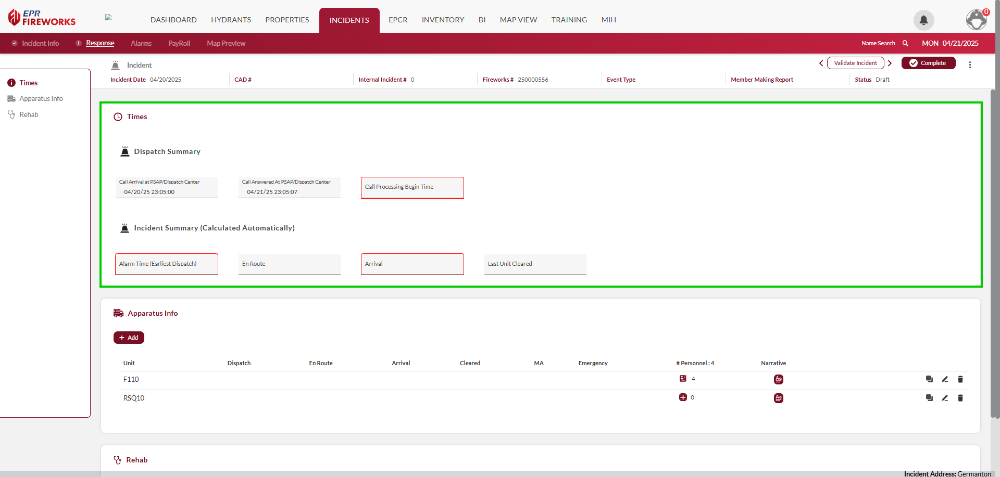

#### Dispatch Summary

This subsection logs critical dispatch-related timestamps, which are vital for documenting response efficiency.

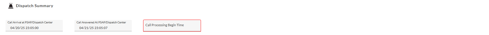

| **Field** | **Description** |
| --- | --- |
| **Call Arrival at PSAP/Dispatch Center** | Time when the initial emergency call reaches the Public Safety Answering Point (PSAP) or dispatch center. |
| **Call Answered At PSAP/Dispatch Center** | Time when a dispatcher answers the emergency call at the PSAP or dispatch center. |
| **Call Processing Begin Time** | Time when call information is processed for dispatch to response units. |

#### Incident Summary

The Incident Summary provides metrics automatically calculated based on unit timestamps, offering an overview of the incident timeline.

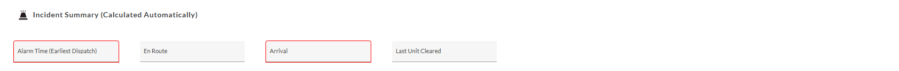

| **Field** |     |
| --- | --- |
| **Alarm Time (Earliest Dispatch)** | Time when the first unit is dispatched to the incident. |
| **En Route** | Time when the first unit begins traveling to the scene. |
| **Arrival** | Time when the first unit arrives on scene. |
| **Last Unit Cleared** | Time when the final unit leaves the scene. |

## Apparatus Info

### Apparatus Info

The **Apparatus** Info section captures details about response vehicles and their crews, enabling accurate tracking of resources deployed during an incident. This section supports resource allocation analysis and ensures compliance with NERIS reporting standards by logging unit activities and personnel assignments. Selecting a unit (e.g., RSQ10) opens a detailed view with timestamps, identifiers, and response details, which may indicate Mutual Aid if the unit is from another department. The summary view includes the # of Personnel field, with detailed personnel assignments available in the [Personnel subsection](#personnel) below.

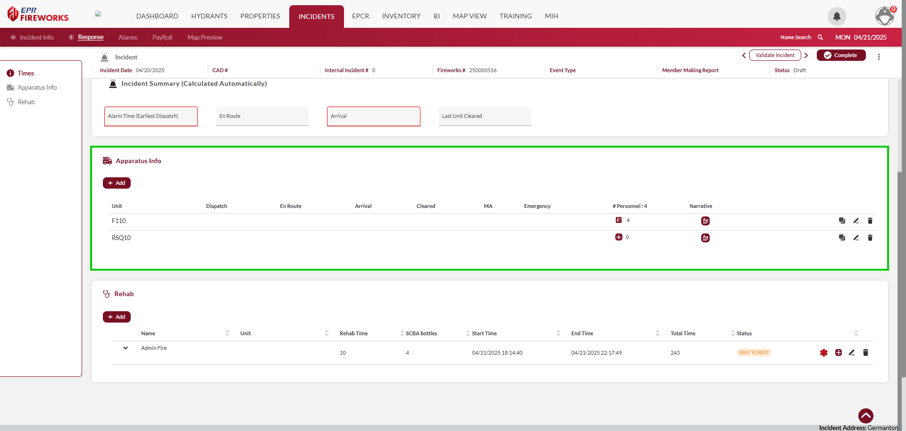

To add an apparatus to the incident, do as follows:

1. In the **Apparatus Info** section, click **Add**.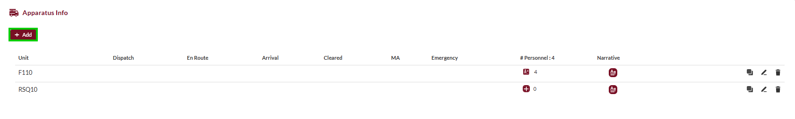
2. The **Unit** sidebar will open on the right. Select the Apparatus ID from the list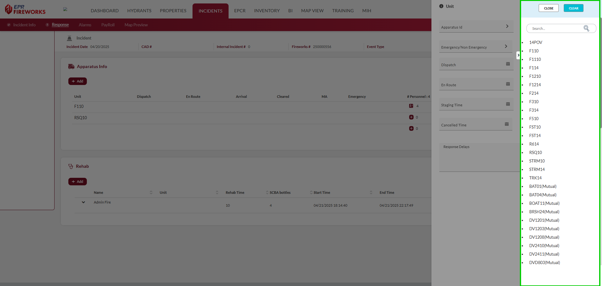
3. Complete the fields according to the table below.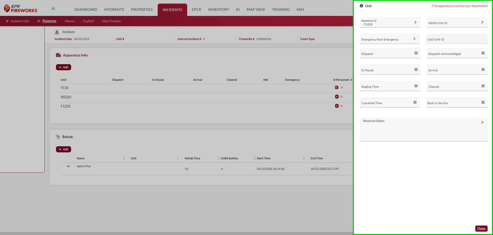
4. When finished, click **Done**. The apparatus details will appear in the **Apparatus Info** table.
5. Enter the apparatus narrative:
1.   In the apparatus row, under **Narrative**, click the icon.
2.   Add additional details in the **Apparatus Narrative**.  
  **Note**:
  
  -   You can generate a narrative from the apparatus details by clicking **Generate**.
  
  -   To add timestamps to the narrative, click **Add Time Stamp**.

| **Field** | **Description** |
| --- | --- |
| **Apparatus ID** | Unique identifier for the response vehicle, assigned by the system (e.g., RSQ10). |
| **NERIS Unit ID** | Unique identifier assigned by NERIS for national reporting and interoperability. |
| **Emergency/Non-Emergency** | Indicates whether the unit is responding in Emergency mode (e.g., with lights and sirens) or Non-Emergency mode. |
| **CAD Unit ID** | Identifier assigned by the Computer-Aided Dispatch (CAD) system for integration purposes. |
| **Dispatch** | Time when the unit is dispatched to the incident. |
| **Dispatch Acknowledged** | Time when the unit acknowledges the dispatch, confirming receipt of the call. |
| **En Route** | Time when the unit begins traveling to the scene. |
| **Arrival** | Time when the unit arrives on scene. |
| **Staging Time** | Time when the unit is staged, awaiting further instructions before proceeding to the scene. |
| **Cleared** | Time when the unit is cleared from the scene. |
| **Cancelled Time** | Time when the unit’s response is cancelled, if applicable. |
| **Back in Service** | Time when the unit is back in service and available for another call. |
| **Response Delays** | Factors causing delays in the unit’s response. |

The Personnel icon in the apparatus row displays the number of responders assigned to a given apparatus. Clicking the icon opens a sidebar on the rig that providesng detailed information for each responder. This includes individual roles, response types, and activity timestamps, ensuring precise documentation of crew involvement during the incident.

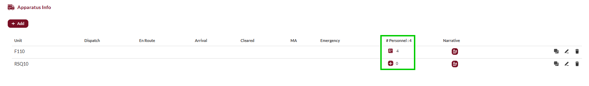

> [!NOTE]
> Only responders properly assigned to apparatuses are eligible for Payroll.
> [See the Payroll tab for further information.](../neris-incident-reporting/payroll.md)

To add personnel to an apparatus, do as follows:

1. In the apparatus row, under personnel, click **+**. The personnel sidebar will open on the right.
2. For each responder, complete the fields according to the table below.
3. When finished, click **Done**.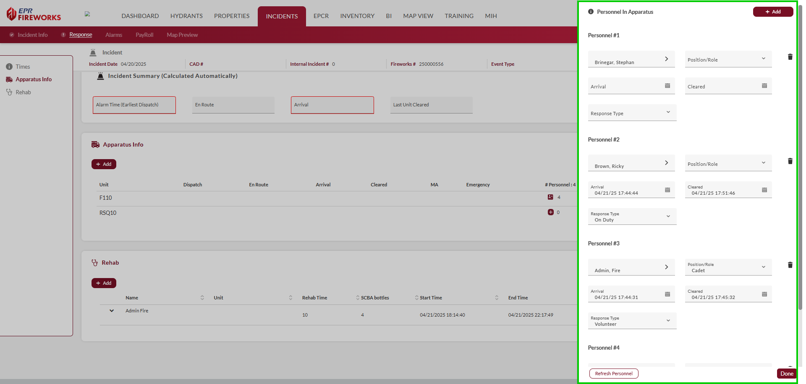

| **Field** | **Description** |
| --- | --- |
| **Name** | Name of the responder assigned to the unit. |
| **Position/Role** | The responder’s role or position during the incident (e.g., Firefighter, Paramedic). |
| **Arrival** | Time when the responder arrived on scene with the unit. |
| **Cleared** | Time when the responder is cleared from the scene. |
| **Response Type** | Type of response for the responder (e.g., Emergency, Non-Emergency). |

## REHAB

The **REHAB** section monitors responders' rehabilitation status, ensuring their health and safety during prolonged incidents in compliance with NFPA 1584 standards. This section logs responder details, rehabilitation duration, and equipment usage in a summary view. After clicking **\+ Add**, a detailed form (REHAB Check Details) allows for additional data entry, including vital signs and check status.

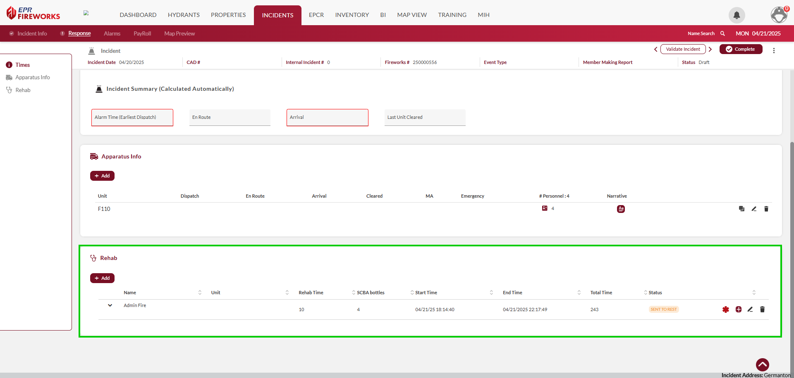

### Adding REHAB Checks

For each responder undergoing REHAB, complete the check details as follows:

1. Click **\+ Add**. The REHAB Check Details form will open to the right.
2. In the **Check Details** sidebar, complete the fields as follows (see the tables [below](#rehab_check) for field descriptions):
1.   Enter basic details: Name, Unit, # of SCBA Bottles , Provider, and Check Time.
2.   Record vital signs if applicable (e.g., BP, HR, RR, SpCO, SpO2, Temp, Skin).
3.   Add additional observations in the **Narrative** field.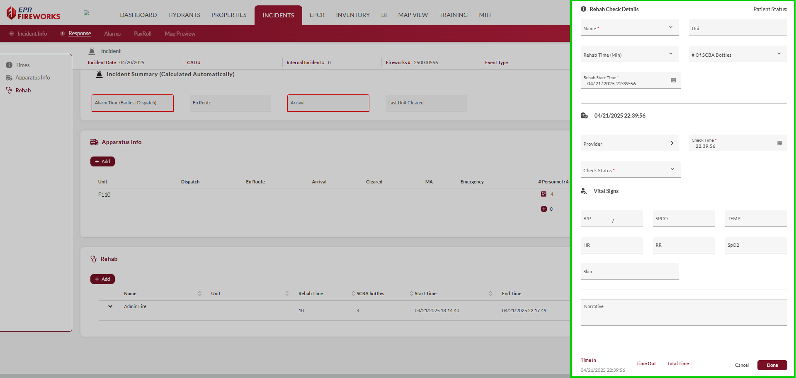
3. When finished, click **Done**. The REHAB row will update with Name, Unit, Rehab Time (Min), # of SCBA Bottles, Rehab Start Time, and End Time (from Time Out).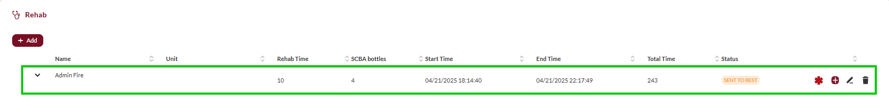

### REHAB Check Details Key

| **Field** | **Description** |
| --- | --- |
| **Name** | Name of the responder |
| **Unit** | Unit identifier for the responder’s assigned vehicle |
| **Rehab Time (Min)** | Total duration of the rehabilitation period, displayed in minutes |
| **\# of SCBA Bottles** | Number of Self-Contained Breathing Apparatus (SCBA) bottles used by the responder. |
| **Rehab Start Time** | Time when the responder enters rehabilitation |
| **Provider** | Name or identifier of the medical provider conducting the rehab check |
| **Check Time** | Time when the rehab check is performed |
| **Check Status** | Status of the rehab check (e.g., Cleared, Sent to Rest, Transported) |
| **BP** | Blood pressure of the responder (systolic/diastolic) |
| **SpCO** | Carbon monoxide level in the responder’s blood (percentage) |
| **Temp** | Temperature of the responder |
| **HR** | Heart rate of the responder (beats per minute) |
| **RR** | Respiratory rate of the responder (breaths per minute) |
| **SpO2** | Oxygen saturation level in the responder’s blood (percentage) |
| **Skin** | Condition of the responder’s skin (e.g., Normal, Pale, Sweaty) |