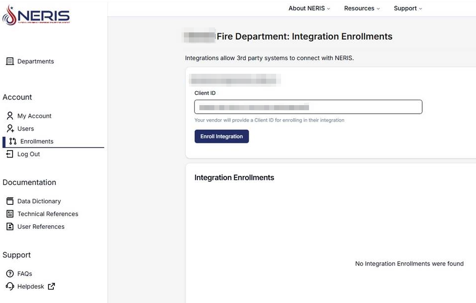
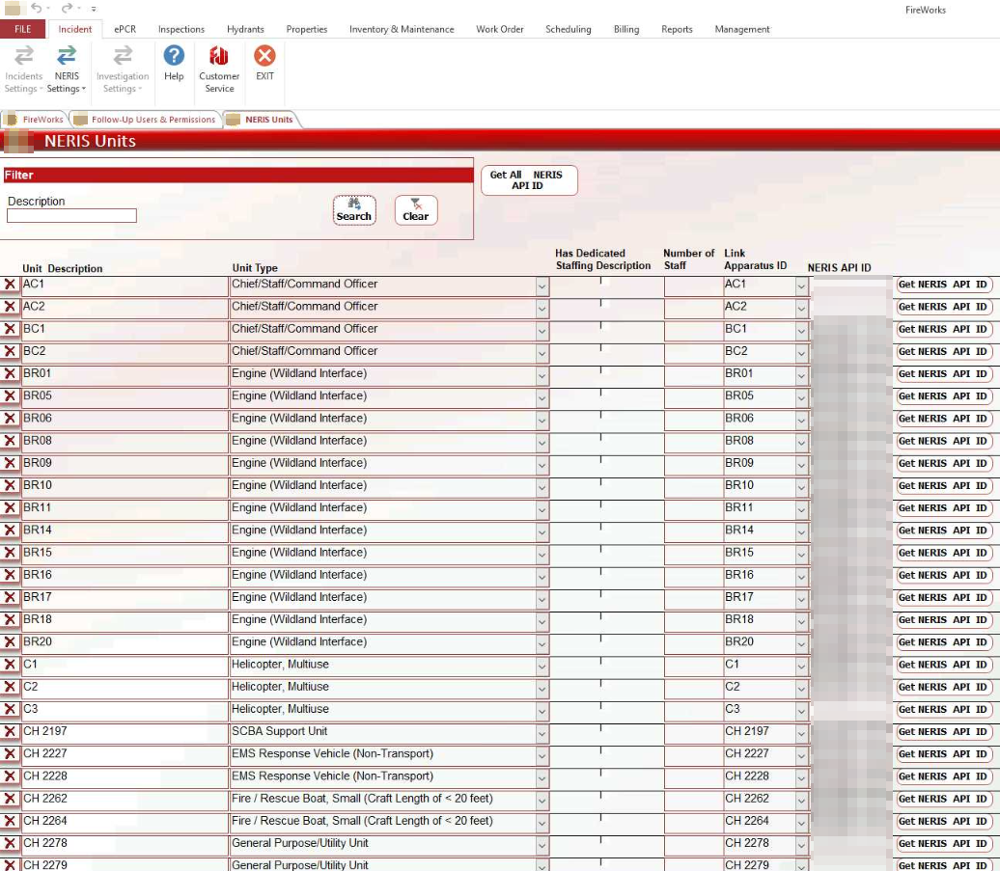

# NERIS Setup and Configuration

## NERIS Module Setup Overview

Welcome to the NERIS integration user guide! This guide describes connecting and configuring the NERIS system with EPR FireWorks. The configuration process includes two stages:

1. [NERIS integration](./neris-setup-and-configuration/neris-platform-integration.md): Connect your NERIS account with EPR FireWorks via a unique client ID.
2. [FireWorks Administrative Back-Office setup](./neris-setup-and-configuration/neris-administrative-back-office-configuration.md): Verify NERIS connection and set NERIS settings for web application use.