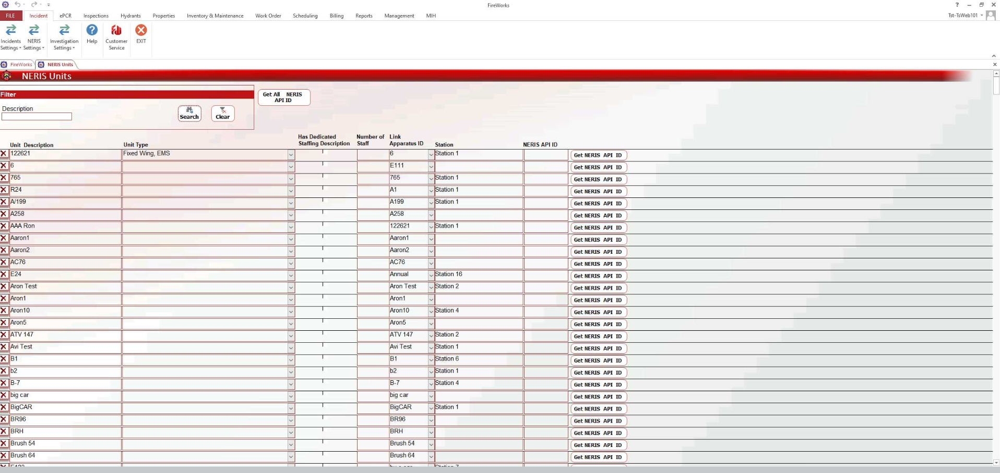

# NERIS Administrative Back-Office Configuration

- [Overview](#overview)
-   [Disclaimer](#disclaimer)

## Overview

This guide describes how to configure the FireWorks Admin Back-Office for NERIS use. The Admin Back-Office consists of NERIS-specific user profiles, lists, custom fields, incident types, units, and validation rules, all optimized for use with NERIS.

To set up NERIS in the back-office, you will need to configure the following Back-Office modules:

- [Configure the Management module for NERIS](./neris-administrative-back-office-configuration/neris-management-module-setup.md), verifying the NERIS<>FireWorks connection and creating NERIS-specific incident profiles.
- [Configure NERIS Settings in the Incidents module](./neris-administrative-back-office-configuration/incident-module-neris-settings.md), including connecting units and defining NERIS incident types
- [Customize NERIS lists and fields](./neris-administrative-back-office-configuration/neris-customization.md), hiding unnecessary values from the sidebars and adding fields for additional data collection.

> [!WARNING]
> ### **Disclaimer**
> NERIS is currently under development by the Fire Safety Research Institute (FSRI). This guide reflects the system as implemented in EPR FireWorks. Functionality may evolve as NERIS continues development toward full national implementation by January 2026.