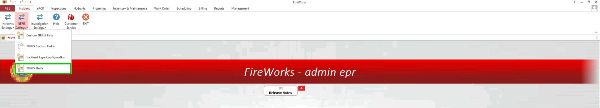
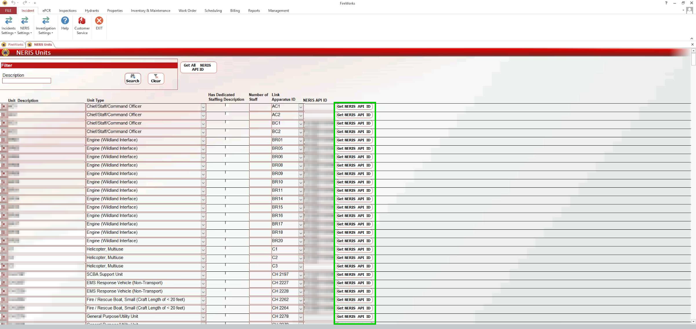
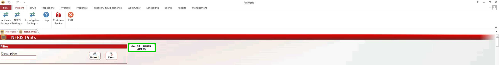
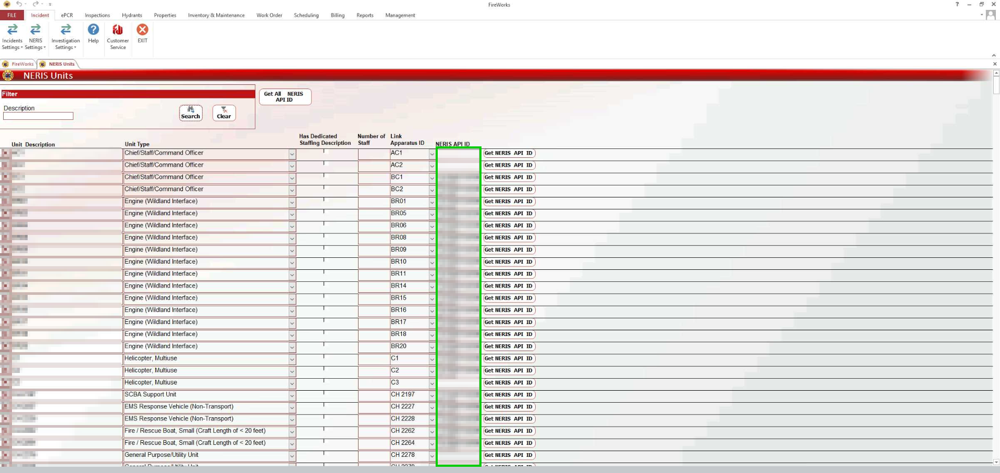
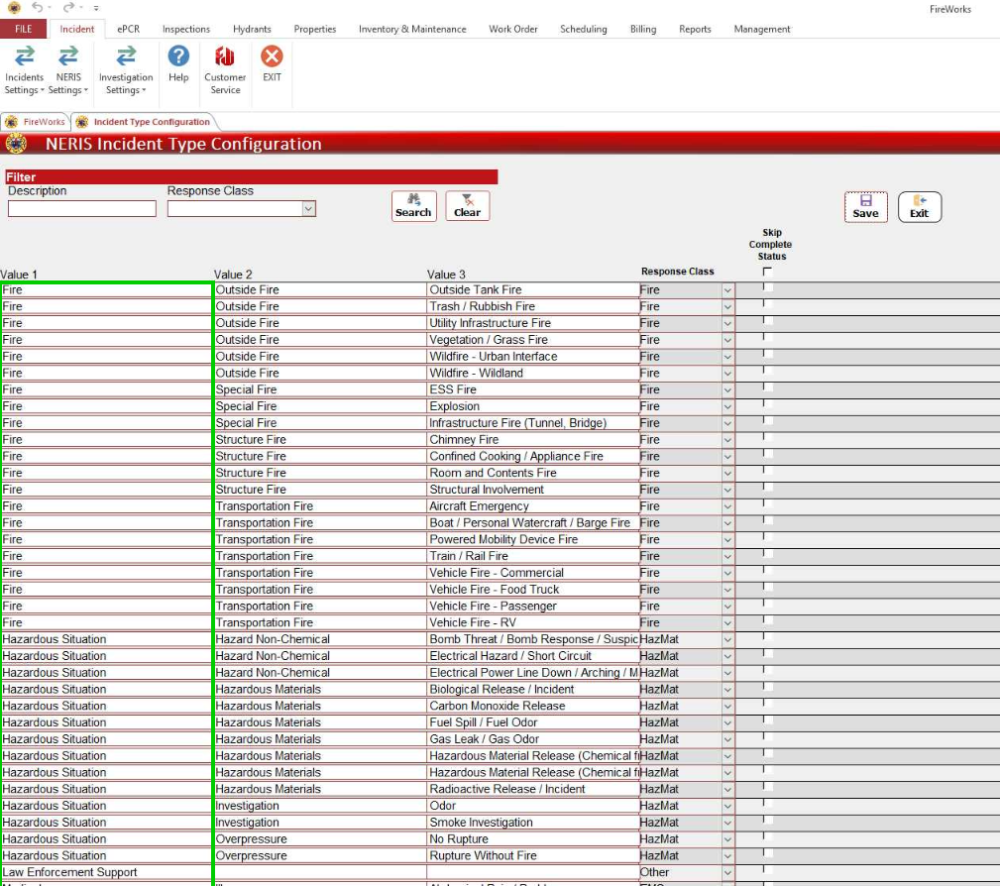
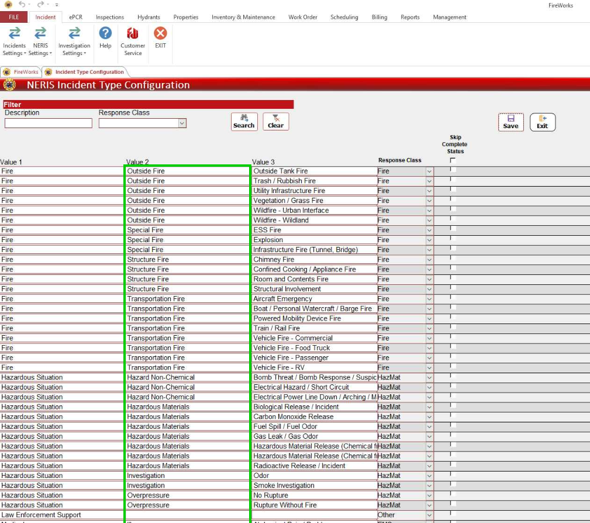
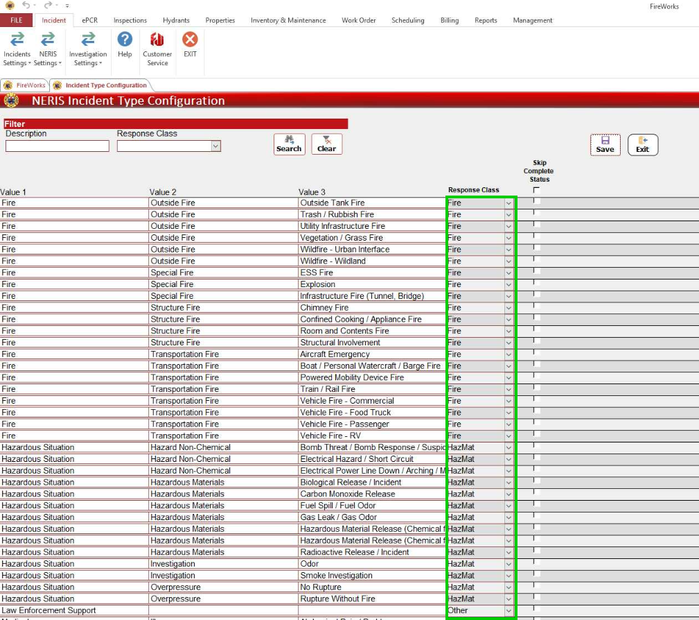

# Incident Module: NERIS Settings

- [Overview](#overview)
- [Connecting Units](#connecting-units)
- [Reviewing NERIS Incident Types](#reviewing-neris-incident-types)
-   [Incident type modification](#incident-type-modification)
-   [Additional Actions](#additional-actions)

## Overview

This guide outlines the setup process for the NERIS Incident module's administrative back-office configuration. Follow these steps to configure the NERIS Incident module:

1. [Connect your units to NERIS](#03182cd8-b12d-482c-85d9-7a5610af9ef3).
2. [Review NERIS Incident Types](#5cc0520d-7a71-4837-965d-881956f3f9c8).

## Connecting Units

This section explains how to connect your apparatuses to NERIS. This step is essential, as only units registered in NERIS can be included in NERIS reports:

1. In **Incidents**, navigate to **NERIS Settings** > **Units**.
2. For each unit, click **Get NERIS API ID**.
**Note**: To register all units in bulk, click **Get All NERIS API ID**.
If the unit is registered with NERIS, an API code will appear in the NERIS API ID Column.
3. When done, click **Exit**.

## Reviewing NERIS Incident Types

### Incident type modification

The NERIS Incident Type table is populated according to NERIS standards and documentation. Each NERIS Incident Type is structured according to three values. All values can be modified according to your department’s requirements:

- **Value 1**: Prmary incident category (e.g Fire)
- **Value 2**: Incident subcategory (e.g structure fire)
- **Value 3**: Specific Incident Type (e.g Room and Contents Fire)

### Additional Actions

- **Response Class**: Set individual incident types to specific Response Classes for accreditation reports.
- **Skip Complete Status**: Define which incident types do not require to be marked as completed, pending approval.