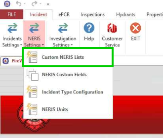
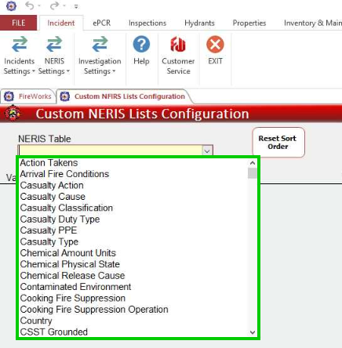
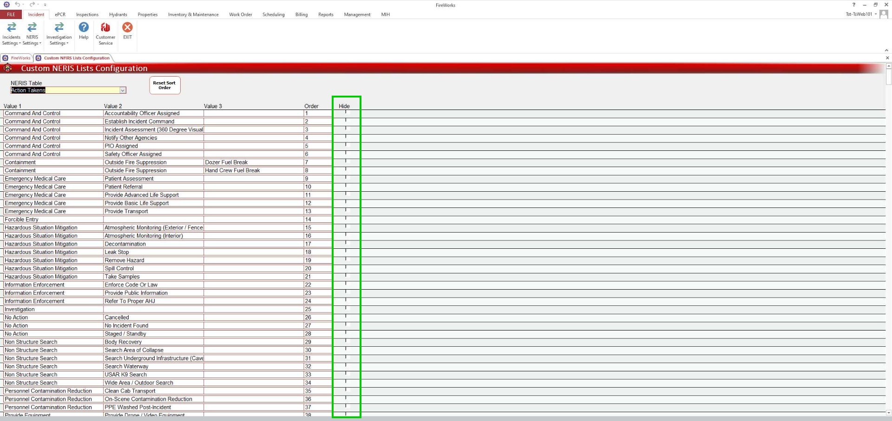
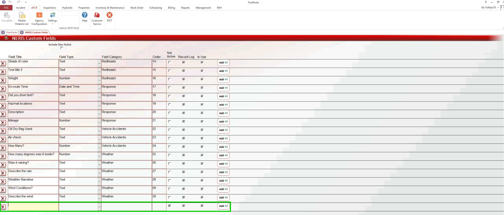

# NERIS Customization

## Overview

Add custom fields and sidebar menus to meet your department’s requirements and needs.

### Customizing Sidebars (Lists)

Using the **Custom NERIS Lists** table, you can hide values from the sidebars, removing clutter for departments that don't respond to certain incidents. For example, non-transport EMS agencies can hide transport-related actions in the **Actions Taken** table.

To customize lists, follow these steps:

1. Navigate to **NERIS Settings > Custom NERIS Lists**.
2. Select the sidebar list from the dropdown menu in the **Custom NERIS Lists** table.
3. Uncheck the boxes next to values you want to hide.
4. To modify additional lists, select another sidebar list from the dropdown and repeat the process.
5. Click **Exit** when finished to save your changes.

## Custom Fields

Using the **Custom Fields** table, you can add fields to the [Incident Info](../../../neris/neris-incident-reporting/incident-info/involved-entities-mvcvehicle-info-custom-fields.md) section for additional data collection. Moreover, you can set custom fields to log activity.

To add custom fields, follow these steps:

1. Navigate to **NERIS Settings > NERIS Custom Fields**.
2. In the empty row, give the field a name, and then select the field type from the dropdown.