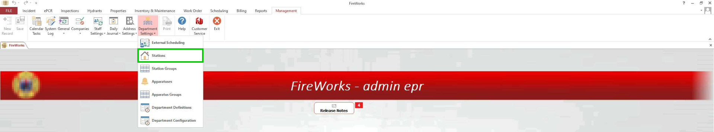
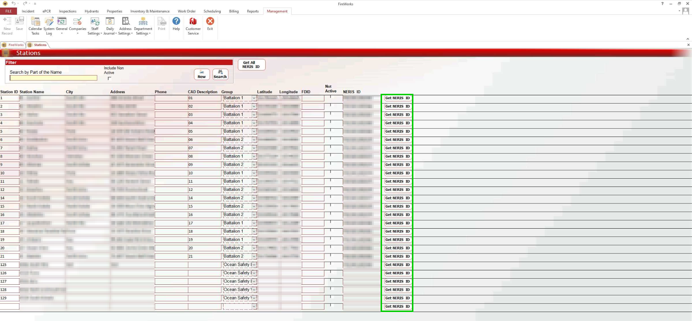
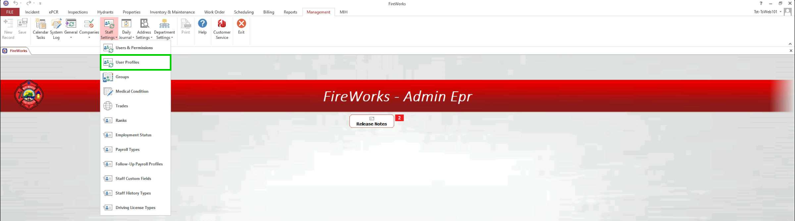
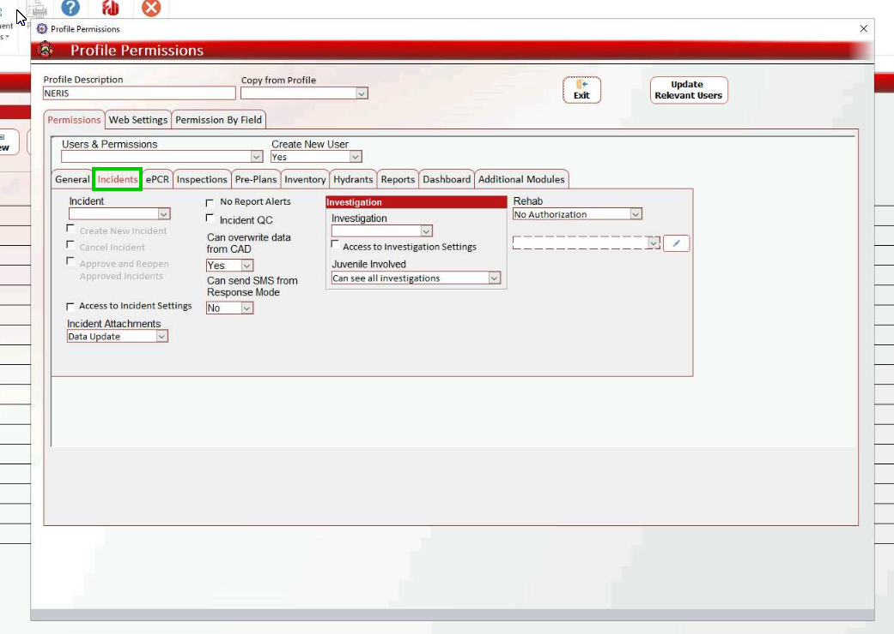
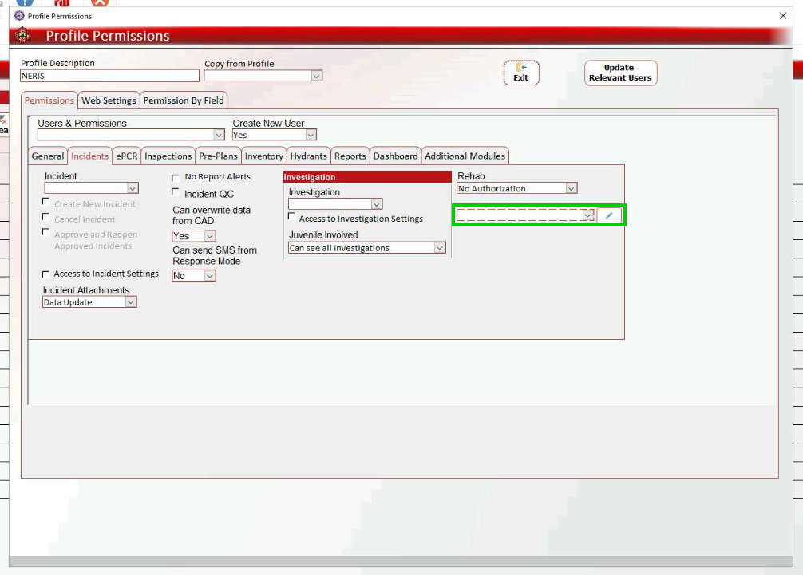
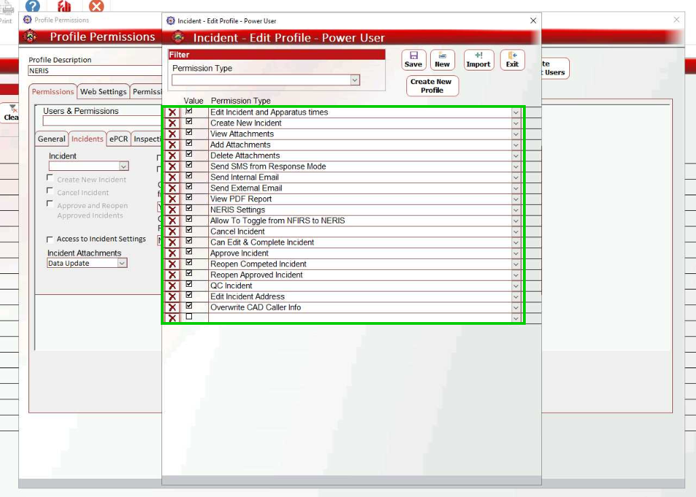

# NERIS Management Module Setup

- [Overview](#overview)
- [NERIS Prerequisites](#neris-prerequisites)
- [Connecting NERIS](#connecting-neris)
- [Defining NERIS User Profiles](#defining-neris-user-profiles)

## Overview

This guide describes the configuration of the Management module for NERIS. To configure the Management module for NERIS, you must perform the following steps:

1. Connect NERIS through station IDs.
2. Create NERIS Incident Profiles to manage user access.

> [!NOTE]
> ## NERIS Prerequisites
> Before getting started, ensure the following:
> - You successfully entered the client ID on the NERIS website.
> - The FireWorks team has enabled NERIS tabs and parameters for your department.

## Connecting NERIS

Before setting up NERIS, you need to connect FireWorks with the [FSRI NERIS](https://neris.fsri.org/) platform. When integrated correctly, your NERIS-registered stations will generate unique NERIS IDs in FireWorks. Follow the steps below to verify the NERIS connection:

1. In the Back-Office, navigate to **Management** \> **Department Settings** \> **Stations**.
2. For each station registered with NERIS, click **Get NERIS ID** on the right. If the connection with NERIS was successful, the station’s **NERIS ID** will appear in the **NERIS ID** column to the left of the **Click NERIS ID** button.

## Defining NERIS User Profiles

After connecting NERIS with FireWorks, you will need to create permission profiles for NERIS users. These permission profiles define which users can perform certain actions within the NERIS module. To set up NERIS user profiles do as follows:

1. In **Management**, navigate to **Staff Settings** \> **User Profiles**.
2. Create a new user profile or double-click an existing profile.
3. Select the **Incidents** tab.
4. Double-click the empty field on the right.
5. Click **New** or double-click an existing Incident user profile.
6. Using the checkboxes on the left, select the applicable permissions for this user profile.
7. When done, click exit on all windows.