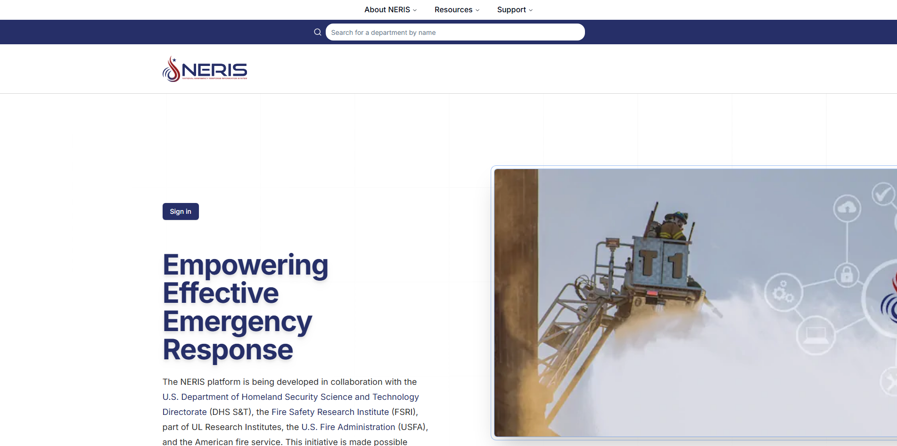
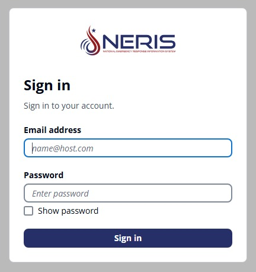
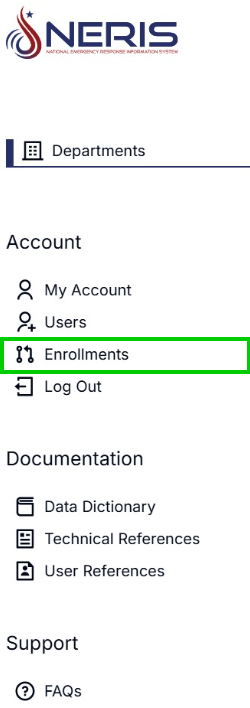
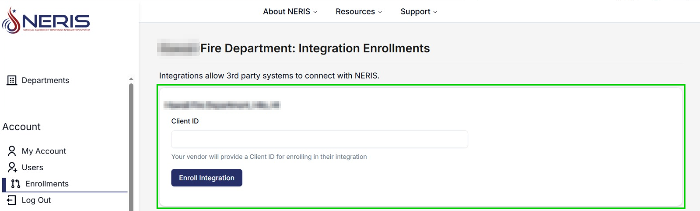
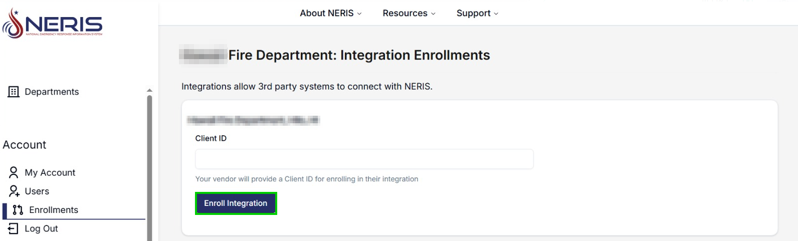
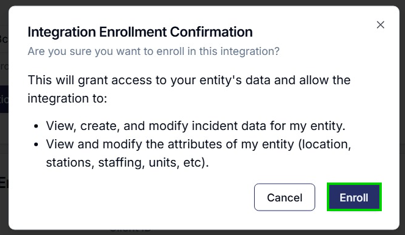

# NERIS Platform Integration

- [Overview](#overview)
- [Setting up your NERIS account](#setting-up-your-neris-account)

## Overview

This guide describes how to connect your FSRI NERIS account with FireWorks. Before getting started, ensure the following prerequisites:

- **NERIS account**: Ensure your fire department is registered with FSRI and has a live NERIS account. Refer to NERIS documentation for further details.
- **Client ID**: The FireWorks team provides a unique client ID to integrate NERIS with FireWorks. If you do not have a client ID, contact **Support** at [support@eprsys.com](mailto:support@eprsys.com).

## Setting up your NERIS account

Before using the FireWorks NERIS interfaces, you must create a NERIS account:

1. In your web browser, go to [https://neris.fsri.org/](https://neris.fsri.org/) , and then click **Sign In**.
2. Enter your email address and password.
3. In your NERIS account, click **Enrollment**.
4. In the **Client ID** section, paste your client ID as provided by FireWorks.
5. Click **Enroll Integration.**
6. A pop-up confirmation message will appear. Click **Enroll**.