# CommunityWorks (Properties Module Web App Guide)

- [Welcome to CommunityWorks!](#welcome-to-communityworks)
- [Messages](#messages)
- [Inspections (CW Inspections)](#inspections-cw-inspections)
- [Permits](#permits)

## Welcome to CommunityWorks!

CommunityWorks (CW) is a platform designed to connect your fire department directly with the community it serves. With CommunityWorks, you can engage with community members, schedule inspections upon request, and manage permit approvals efficiently.

> [!INFO]
> **Note**: Unless specified otherwise, all mentions of **CommunityWorks** in this guide refer to **CommunityWorks** within **FireWorks**.

To access CommunityWorks in FireWorks, click **Properties**, and then click on CommunityWorks. By default, the CommunityWorks page will open in **Inspections**.

> [!NOTE]
> This guide is for the FireWorks web application only. For the designated CommunityWorks website (<*xxxx>*.epr.community) guides, use the following links:
> - For the administrative guide, see [Admin guide](../../epr-fireworks-user-guide/communityworks/communityworks-administrator-website.md)
> - For the community-targeted guide, see [Navigating CommunityWorks](../../epr-fireworks-user-guide/communityworks/navigating-communityworks.md)

## Messages

**CommunityWorks** enables communication between customers and the fire department. In **Messages**, you can view all customer messages through the **CommunityWorks** website.

By default, **CommunityWorks** opens in **Messages**.

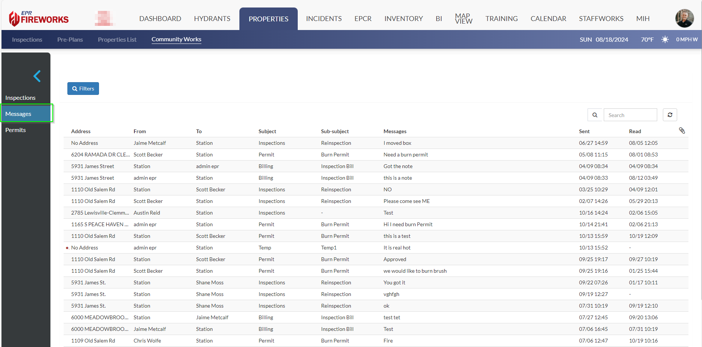

### Managing messages

The following procedure describes how to view and reply to messages:

1. To view a message, click on the row of the message you want to view. A dialog box will open with the message content and details. Message details include the subject, sub-subject, address, the dates of sending and reading, and the current status of the message (read or unread).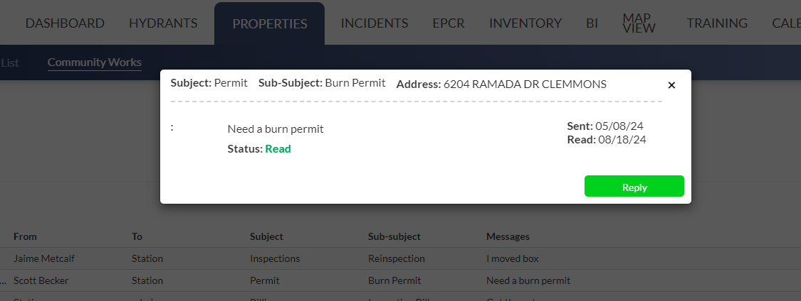
2. To reply to a customer, in the message dialog box, click **Reply**. A second dialog box will open. Enter your message.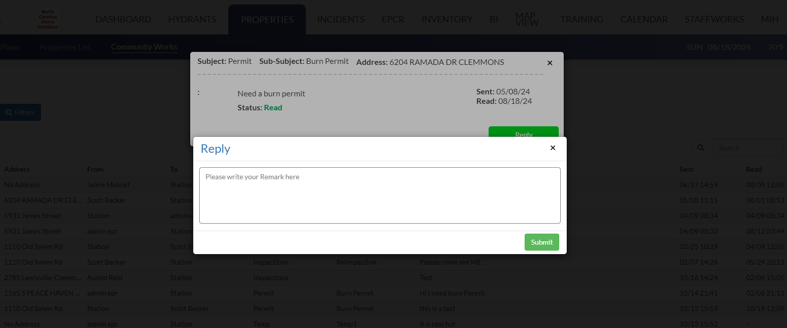
3. When finished, click **Submit**.

## Inspections (CW Inspections)

> [!NOTE]
> This section covers CW Inspections on FireWorks and Back-Office only. Before reading this section, ensure you have thoroughly reviewed Inspections.

The CW Inspections section consolidates all new Inspection requests and updates. All Inspection requests are separated into two categories: **New** and **In Progress**. These tabs appear on the **CommunityWorks** navigation bar under **Inspections**. In **New**, you can view all unapproved requests for new inspections. In **In Progress**, you can view all running inspections.

In this section, we will explain the following:

- Managing [new](#) and [in-progress](#) inspections.
- Managing Inspection types (Back-Office).

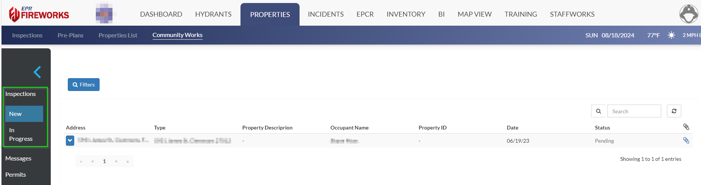

### New inspection requests

New requests for inspections come in from property owners through the CommunityWorks website. The following procedure describes how to view and approve new requests:

1. In CommunityWorks, go to Inspections. By default, CW Inspections opens in **New**.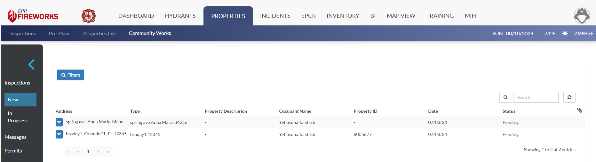
2. In the list, click the request you want to view. The inspection details will appear under the request.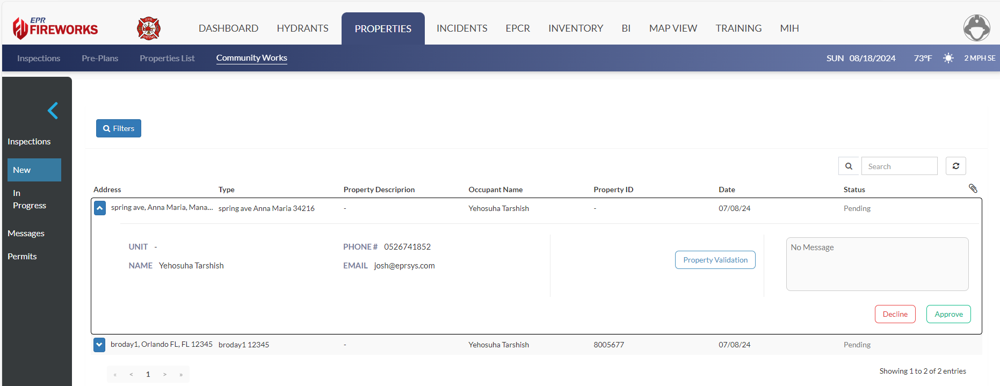
3. Under Property ID, select a property from the list, and then click **Approve**. This automatically creates a new inspection in the general Inspections page.
4. The inspection page will open in a new tab. Review the details of the inspection and edit where necessary.
5. When finished, click **Save**.

### In Progress inspections

The **In progress** category consolidates all the unfinished inspections still awaiting violation fixes, rescheduled appointments, and more. **In progress** inspections are divided into two sections as follows:

- **Unread**: unviewed updates to inspection violations.
- **All the rest**: pending inspections still awaiting updates.

### Creating new inspection types

All inspections are categorized according to **Inspection Types**. **Inspection Types** are a required field whenever requesting a new inspection. Inspection-type management is done through the Back-Office.

## Permits

This procedure describes how to manage permit requests. To request a permit, see the [CommunityWorks community guide](../../epr-fireworks-user-guide/communityworks/navigating-communityworks.md).

1. In **CommunityWorks**, click **Permits**. A list of all permits will appear.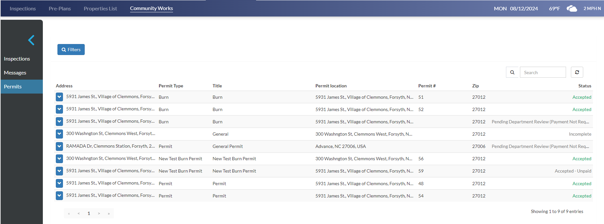
Each permit includes the following information:
-   **Address**: Address of the applicant requesting a permit.
-   **Permit Type**: Permit type according to your Permit List, as described above
-   **Title**: Permit definition.
-   **Permit location**: Address of the location requested in the permit
-   **Permit number**: Permit serial number
-   **Zip**: Permit Location zip code
-   **Status**: Current status of the permit.
2. Click on a permit where the status is **Incomplete** or **Pending**.
3. Review the request. If you decide to approve the request, click **Approve**.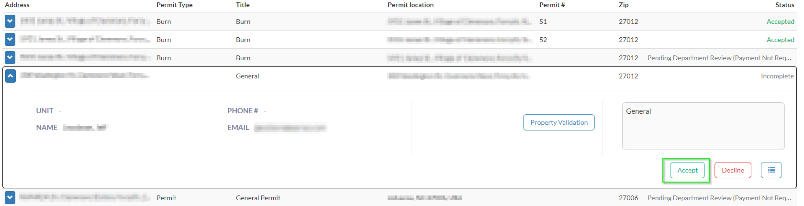
The request status will change to **Approved**.

> [!NOTE]
> ### Property Validation
> You can merge **CommunityWorks** properties with properties for your **Properties List** using **Property Validation**.
> To merge properties, follow the next steps:
> 1. In the inspection or permit request, click **Property Validation**.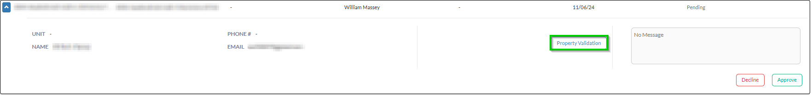
> 2. Select your property from the list.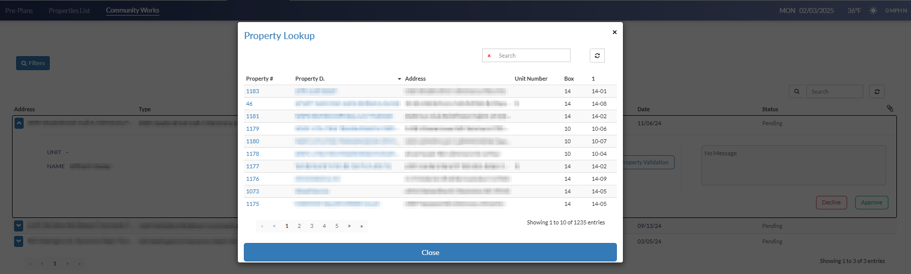
> The selected property will appear in the request’s **Property** field.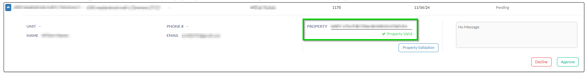
> 3. Approve the request. The new property will appear in the **Properties List** and/or **Inspections List** in the following format: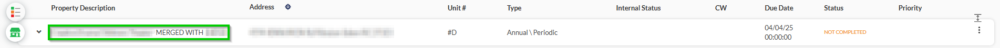