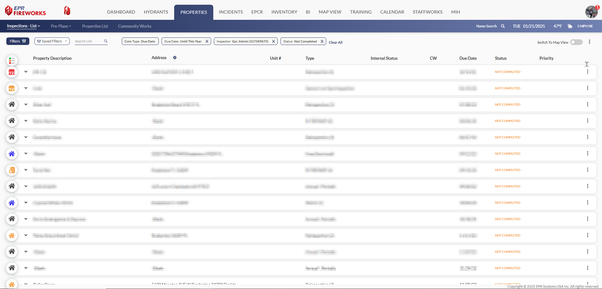
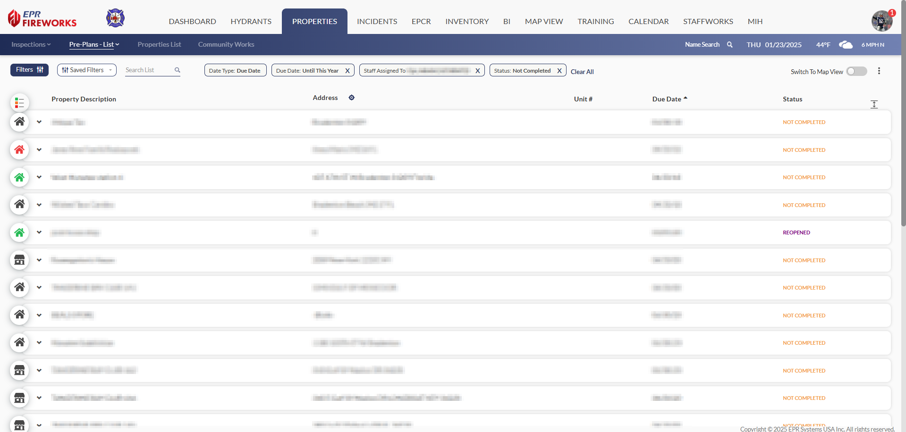
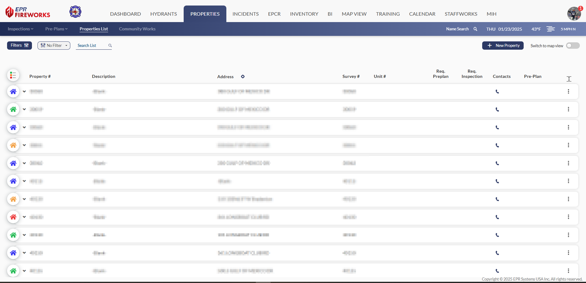
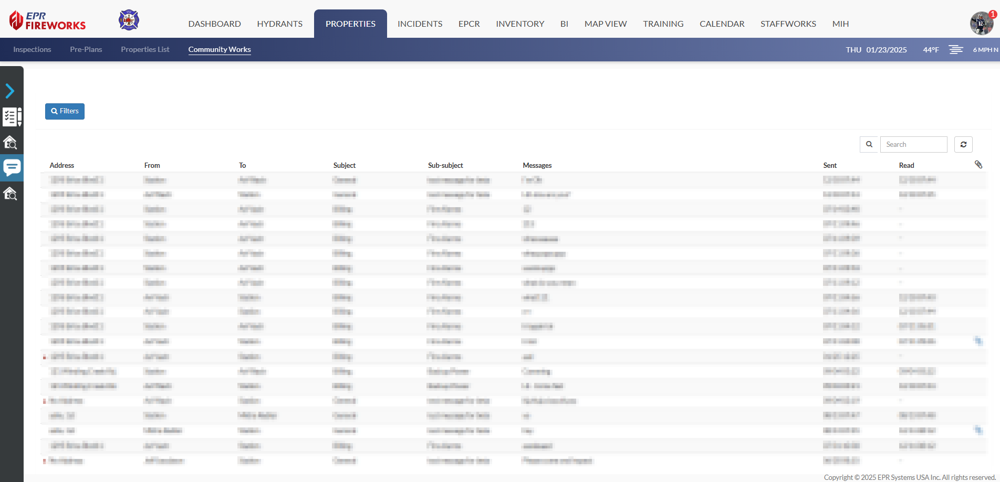

# Getting Started with FireWorks Properties

- [In this Guide](#in-this-guide)
- [Introduction](#introduction)
- [Inspections](#inspections)
-   [Key functions](#key-functions)
- [Pre-Plans](#pre-plans)
-   [Key functions](#key-functions)
- [Properties List](#properties-list)
-   [Key functions](#key-functions)
- [CommunityWorks](#communityworks)
-   [Key functions](#key-functions)

## In this Guide

- [Properties List Displays](./getting-started-with-fireworks-properties/properties-list-displays.md)
- [Assignments: Overview](./getting-started-with-fireworks-properties/assignments-overview.md)
- [Properties Module Filters](./getting-started-with-fireworks-properties/properties-module-filters.md)
- [Switching to Map View](./getting-started-with-fireworks-properties/switching-to-map-view.md)
- [Creating Inspections and Pre-Plans](./getting-started-with-fireworks-properties/creating-inspections-and-pre-plans.md)

## Introduction

The Properties module allows you to manage property-related activities across four key areas:

- [Inspections](#2e3d0f07-2ab8-4dd4-82be-16503062d740): Schedule, track, and assign inspections.
- [Pre-Plans](#80ba5268-42b4-42e5-b704-a9c8ce57ce5b): Assign and conduct pre-plan surveys.
- [Properties List](#a86418f1-0971-4c80-95a2-2f72dfd73e78): Maintain property information.
- [CommunityWorks](#b1e7d3fd-12eb-4efe-b811-802826770a8a): Process and respond to CommunityWorks requests.

## Inspections

Track and manage the complete inspection process. Create new inspections, monitor active inspections, and follow up on violations. The system lets you organize assignments by inspector, station, and apparatus.

[Learn more in the Inspections user guide](../properties/inspections.md).

#### Key functions

- Create and update inspections.
- Monitor active inspections and violation follow-ups.
- Assign and track by inspector, station, or apparatus.

## Pre-Plans

Manage pre-plans through their entire lifecycle. Create new pre-plans, schedule them based on defined cycles, and track assignments. The system allows you to organize pre-plans by staff member, station, and apparatus.

[Learn more in the Pre-Plans user guide](../properties/pre-plans.md).

#### Key functions

- Create and update pre-plans.
- Schedule pre-plans on recurring cycles.
- Assign and track by staff member, station, or apparatus

## Properties List

Manage property information for properties within your jurisdiction.

[Learn more in the Properties List user guide](../properties/properties-list.md).

#### Key functions

- Monitor properties.
- Manage property info.

## CommunityWorks

[Learn more in the CommunityWorks user guide](../properties/communityworks-properties-module-web-app-guide.md).

Monitor requests from the CommunityWorks website.

### Key functions

- Review and respond to citizen messages
- Process permit and inspection requests  
