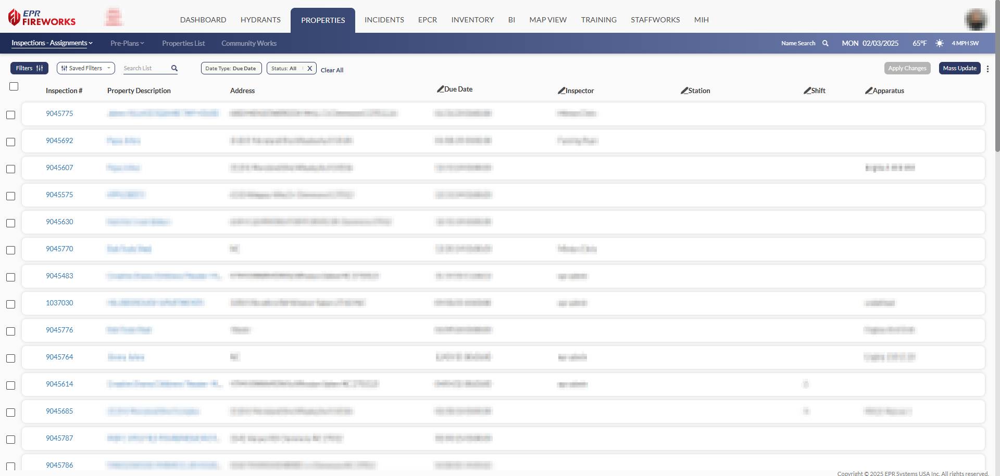
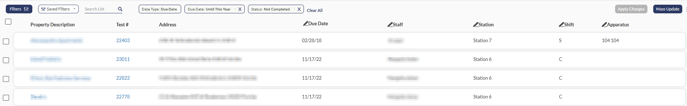
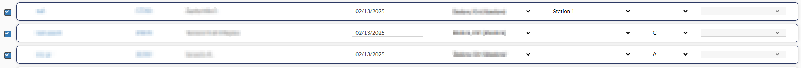
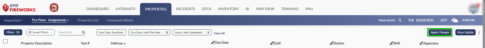
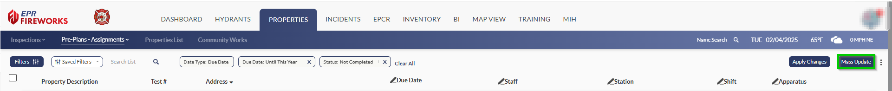

# Assignments: Overview

## Assignments

**Assignments** screens are only in the **Inspection** and **Pre-Plan** modules. These screens allow you to reassign individual inspections and pre-plans, or efficiently reassign multiple assignments in bulk.

The following details of the assignment can be modified directly from the **Assignments** screen:

- Due Date
- Inspector
- Station
- Shift
- Apparatus

1. Select assignments using the checkboxes on the left side
2. Choose your editing method:
-   Single assignment: Edit directly in the assignment row
-   Multiple assignments: Click the pencil icon next to the column header and select new details
3. Click **Apply Changes** to save.

> [!NOTE]
> To update all assignments at once, use the **Mass Update** button and enter new details in the popup window.
> 

> [!WARNING]
> **Important!** Using **Mass Update** modifies **ALL RECORDS** within the list.