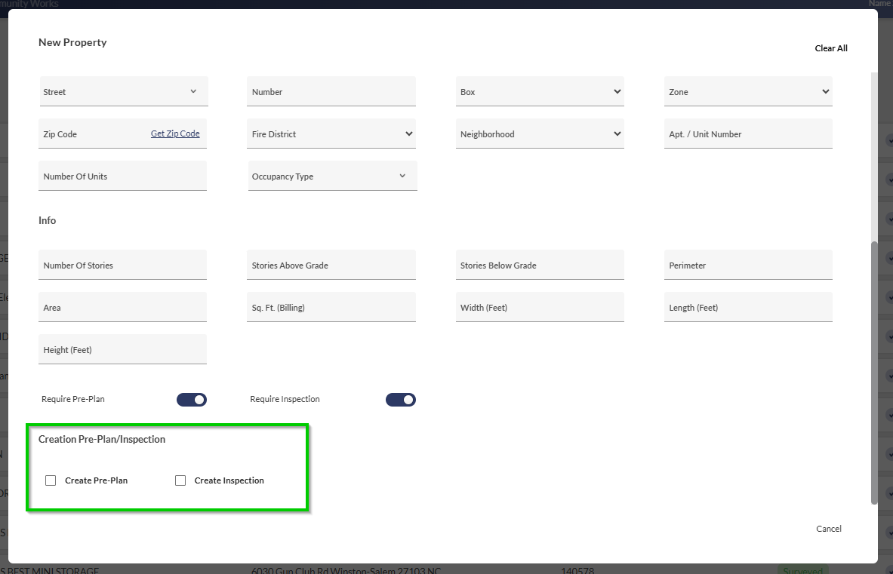
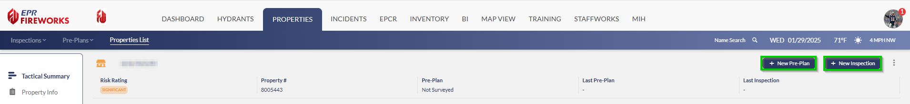
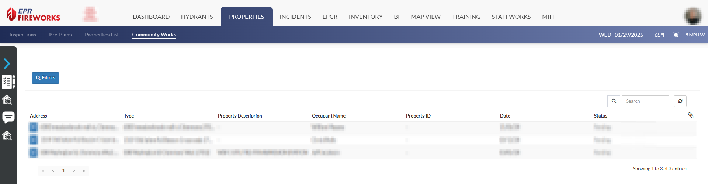

# Creating Inspections and Pre-Plans

- [Overview](#overview)
- [New Property Form](#new-property-form)
- [Existing Properties](#existing-properties)
- [CommunityWorks Website (Inspections Only)](#communityworks-website-inspections-only)

## Overview

There are several ways to create new inspections and pre-plan surveys. This guide will explore the different methods.

- [New Property Form](#ef6bce65-2e1b-425a-a2cd-2e578275c7f9)
- [Existing Properties](#5dc3e9f0-b474-47bc-ab35-b9ad84932efb)
- [CommunityWorks Website (Inspections Only)](#455227b9-59e9-45e1-a750-3ab7013d129e)

## New Property Form

When adding a new property to the system, you can set FireWorks to create a new pre-plan survey and inspection as the property is added.

## Existing Properties

You can add pre-plans and inspections from property pages using the **Create Pre-Plan** and **Create Inspection** icons at the top.

## CommunityWorks Website (Inspections Only)

> [!INFO]
> The following section is for fire departments using **CommunityWorks**:

Users can submit inspection requests through the CommunityWorks website. Approve these requests in the **CommunityWorks** interface of the **Properties** Module.

For further information on working with CommunityWorks, see the [CommunityWorks User Guide](../../properties/communityworks-properties-module-web-app-guide.md).