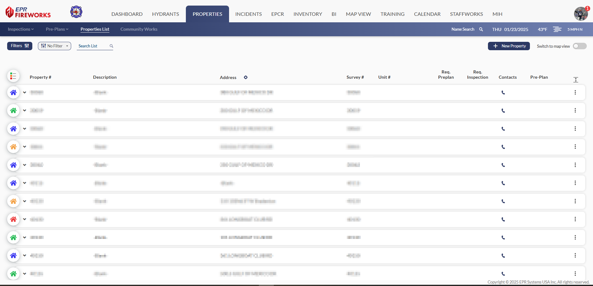
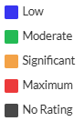
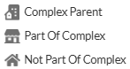
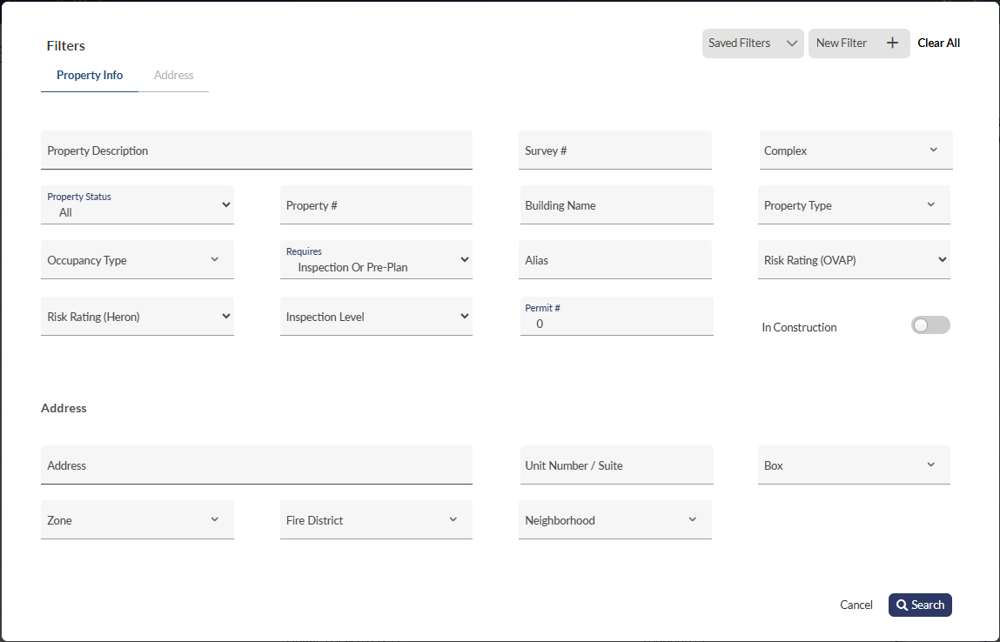
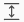
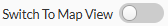

# Properties List Displays

The **Properties** module **List** screens include the following components:

| **Icon Key** | **Name** | **Description** |
| --- | --- | --- |
|  | Risk Rating | This key marks properties according to their risk assessment conducted in pre-plans.    In addition, this key indicates if the property is any of the following:   |
|  | Filters | You can filter properties, inspections and preplans according to property info, address, occupancy type, complex info, assignment criteria and etc.  [Click here to learn more](../getting-started-with-fireworks-properties/properties-module-filters.md).   |
|  | Saved Filters | You can save frequently used filters for quick access. |
|  | Expand | Click   to view the basic details of properties, pre-plans, and investigations. |
|  | Switch to Map View | Allows you to view properties on a map. To learn more about switching to map view, go to [Planning Pre-Plans and Inspections](../getting-started-with-fireworks-properties/switching-to-map-view.md). |