# Properties Module Filters

- [Overview](#overview)
- [Applying Filters](#applying-filters)
- [Saved Filters](#saved-filters)
- [Properties Module Filter Key](#properties-module-filter-key)
-   [Inspections and Pre-Plans](#inspections-and-pre-plans)
  
  -   [Roster Filters](#roster-filters)
  
  -   [Address](#address)
  
  -   [Inspection](#inspection)
-   [Properties List Filters](#properties-list-filters)
  
  -   [Property Info](#property-info)
  
  -   [Address](#address)

## Overview

Filters help you search and group inspections or pre-plans, which can be accomplished through their use. This document explains how to use filters effectively.

The filter types vary between **Inspections**, **Pre-Plans**, and **Properties List**. Use the [key](#366254b0-9cf6-4528-9bf1-8e6b90245bab) below for further reference.

## Applying Filters

To search and filter inspections, pre-plans, and properties, follow the next steps:

1. On the desired page, click **Filters** at the top.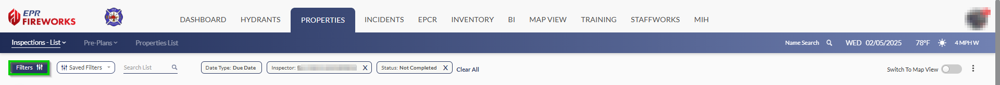
2. Set filters according to the [key](#366254b0-9cf6-4528-9bf1-8e6b90245bab) below.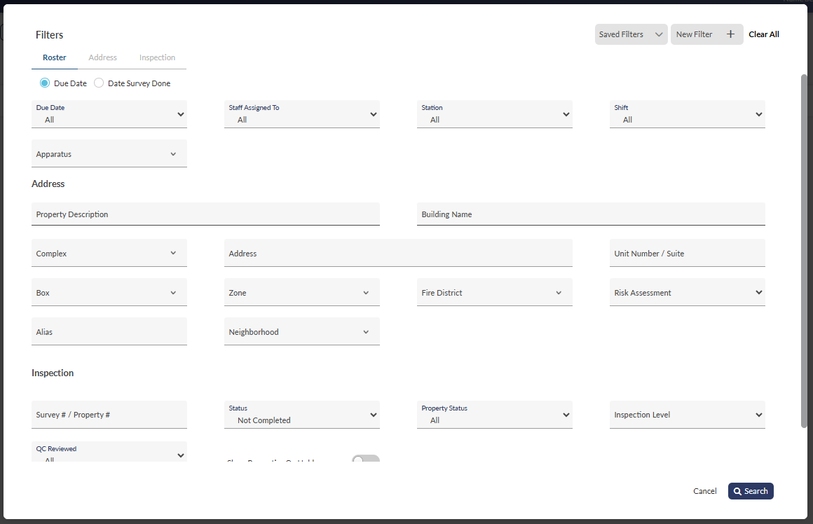
3. When done, click **Search**.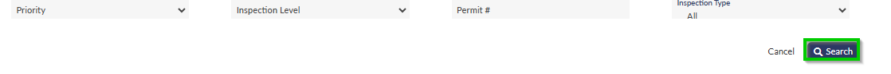

## Saved Filters

You can save frequently used filters and search queries for quick access by following these steps:

1. Set filters and search queries.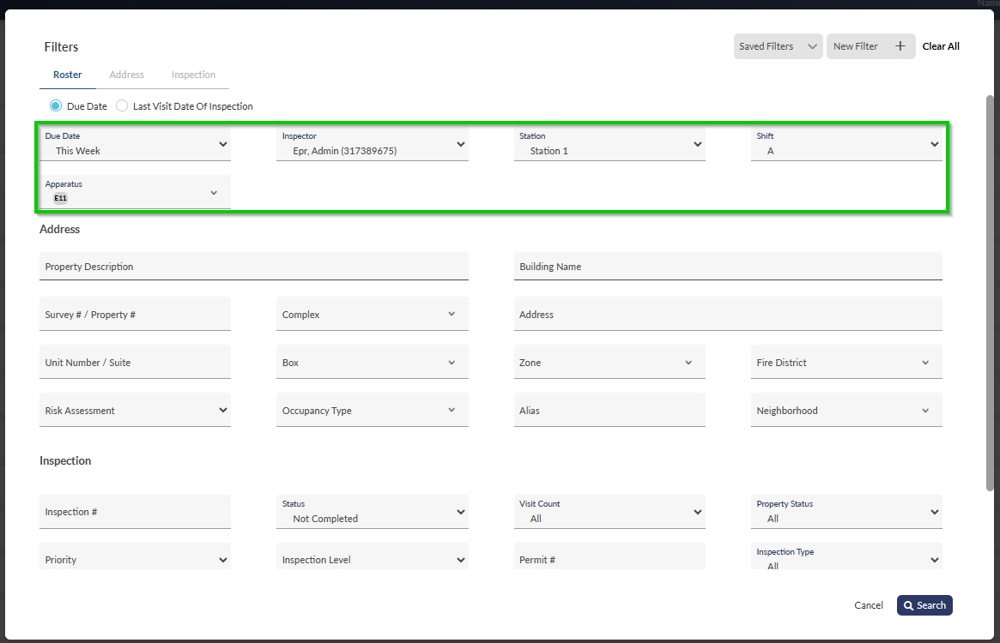
2. Name the filter.
1.   Click **New Filter** at the top of the **Filters** window.
2.   Name the filter, and then click 
   .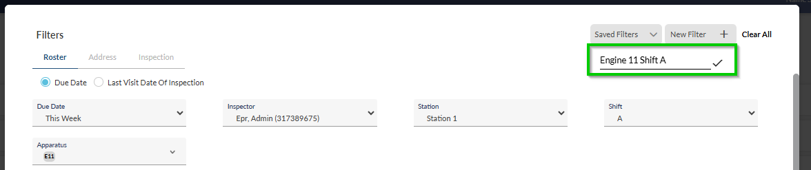
3. (Optional) To set it as the default filter, check the **Default** box, and then click **Save**. Default filters load automatically.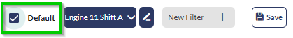

> [!NOTE]
> You can activate **Saved Filters** from the module pages by using the list of **Saved Filters** to the right of the **Filters** button.
> 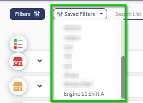
> In addition, you can access saved filters directly from the **Filters** window.
> 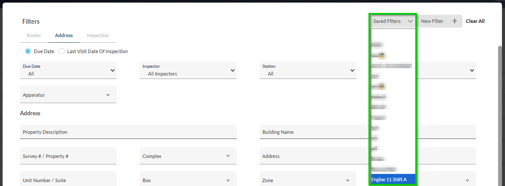

## Properties Module Filter Key

### Inspections and Pre-Plans

The **Inspections** and **Pre-Plan** filters are organized into these categories

- [Roster](#roster): Manage scheduling data by dates, personnel assignments, stations, and apparatus.
- [Address](#insp_add): Locate properties using physical addresses and assigned jurisdictional boundaries
- [Inspection](#insp): Filter inspection records by status, requirements, property conditions, and quality control reviews

#### Roster Filters

The **Roster** filters allow you to efficiently search and organize personnel scheduling information using various parameters including dates, staff assignments, station locations, shifts, and apparatus details.

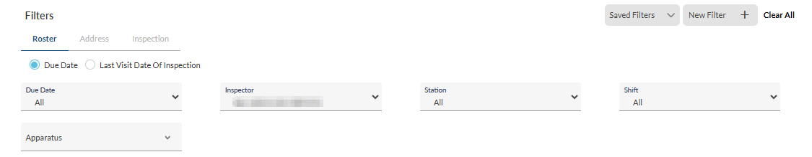

| **Filter** | **Description** | **Options/Comments** |
| --- | --- | --- |
| **Due Date** or **Last Visit Date of Inspection**/**Date Survey Done** | Filter by either the due dates of inspections/pre-plans or the actual dates when surveys or inspections occurred.  **Note**: Keep the filter set to **Due Date** unless required otherwise. | - All - This Week - This Month - Last Month - Next Month - Until End of Month - This Year - Last Year - Next Year - Until This Year - By Date |
| **Inspector** (Inspections)/**Staff Assigned To** (Pre-Plans) | Filter by the staff member assigned to the inspection/pre-plan. Select from the list | n/a |
| **Station** | Filters according to station. Select the station from the list | n/a |
| **Shift** | Filters according to shift. Select the shift from the list. | n/a |
| **Apparatus** | Filters by apparatus. Select the apparatus from the list. | n/a |

#### Address

The **Address** filters provide comprehensive search options to locate specific properties using identifiers like building names, physical addresses, district assignments, and risk classifications.

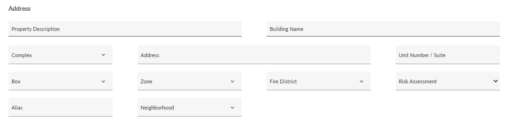

| **Filter** | **Description** |
| --- | --- |
| **Property Description** | Search by the property description |
| **Building Name** | Search by the building name |
| **Complex** | Filter by complex. Select a complex from the list. |
| **Address** | Search by the property’s address. |
| **Unit Number / Suite** | Search by the unit or suite number. |
| **Box** | Filter by box. Select the box from the list. |
| **Zone** | Filter by zone. Select the zone from the list. |
| **Fire District** | Filter by fire district, as defined by your department. Select the fire district from the list. |
| **Risk Assessment** | Filter according to the property’s risk assessment, , as calculated in [Risk Assessment](https://eprsys-team-84.atlassian.net/wiki/spaces/EFQ/pages/75169901/Managing+Properties#risk_assess). |
| **Alias** | Search by the property’s alias. |
| **Neighborhood** | Filter by neighborhood. Select the neighborhood from the list. |

#### Inspection

The **Inspection** filters enable users to refine inspection records based on various criteria including survey numbers, completion status, property conditions, inspection priorities, and quality control reviews.

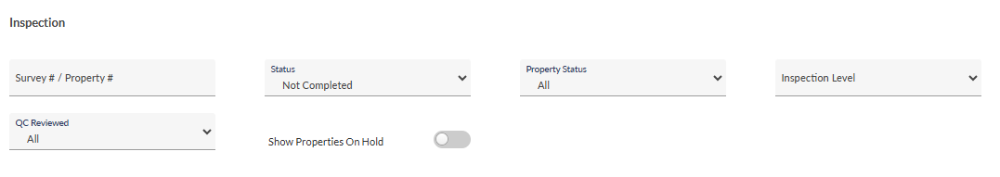

| **Filter** | **Description** | **Options/Comments** |
| --- | --- | --- |
| **Survey # / Property #** | Filter by survey or property number. | n/a |
| **Status** | Filter by inspection status. | - Not Completed (**Default**) - All (Not Incl. Cancelled) - Completed - Canceled - Reopened - Completed - Not QC Approved - Completed - QC Approved - All (Incl. Cancelled) |
| **Property Status** | Filter by property status. | - All (**Default**) - Out of Business - Vacant - To be destructed - Construction - In Normal Use - Destructed - New |
| **Inspection Level** | Filter by inspection level , as defined in [Inspection Info](https://eprsys-team-84.atlassian.net/wiki/spaces/EFQ/pages/78479469/Preparing+for+the+Inspection#inspect_dtls).  **Note**: Inspection levels are used to indicate state-mandated inspection levels or if not required by your state, can be used to mark urgency levels. Check with your department | - 1 - 2 - 3 |
| **QC Reviewed (with "All" visible in dropdown)** | Filter inspection records based on their QC review status. This filter helps track which inspections have undergone QC review. | - All (**Default**) - Yes - No |
| **Show Properties On Hold (appears to be a toggle switch)** | Display properties where the inspection is currently **On Hold**. | n/a |

### Properties List Filters

Property List Filters are organized into these categories:

- [Property Info](#): Search and filter properties using details like descriptions, status, types, and risk ratings
- [Address](#prop_add): Locate properties using physical addresses and assigned jurisdictional boundaries

#### Property Info

The property list **Property** filters enable detailed searching and filtering of property records through multiple parameters including descriptions, status, classifications, risk ratings, and construction state.

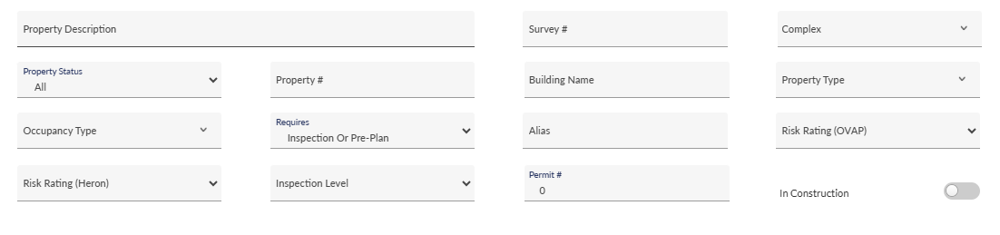

| **Filter** | **Description** | **Options** |
| --- | --- | --- |
| **Property Description** | Search by property description | n/a |
| **Survey #** | Search by survey number | n/a |
| **Complex** | Filter by complex. Select a complex from the list. | n/a |
| **Property Status** | Filter by property status. | - All (**Default**) - Out of Business - Vacant - To be destructed - Construction - In Normal Use - Destructed - New |
| **Property #** | Search by property number | n/a |
| **Building Name** | Search by building name | n/a |
| **Property Type** | Filter by property type. Select the property type from the list. | n/a |
| **Occupancy Type** | Select the occupancy type from the list. | n/a |
| **Requires** | Filter by inspection and pre-plan requirements, as defined in [Inspection Info](https://eprsys-team-84.atlassian.net/wiki/spaces/EFQ/pages/78479469/Preparing+for+the+Inspection#inspect_dtls). | - Inspection Or Pre-Plan (**Default**) - Inspection & Pre-Plan - Only Inspection - Only PrePlan - None - All |
| **Risk Rating (Heron)** | Filter by Heron risk rating, as calculated in [Risk Assessment](https://eprsys-team-84.atlassian.net/wiki/spaces/EFQ/pages/75169901/Managing+Properties#risk_assess). | - Low - Moderate - Significant - Maximum |
| **Inspection Level** | Filter by inspection level, as defined in [Inspection Info](https://eprsys-team-84.atlassian.net/wiki/spaces/EFQ/pages/78479469/Preparing+for+the+Inspection#inspect_dtls). | - 1 - 2 - 3 |
| **Alias** | Search by property alias | n/a |
| **Risk Rating (OVAP)** | Filter by OVAP risk rating, , as calculated in [Risk Assessment](https://eprsys-team-84.atlassian.net/wiki/spaces/EFQ/pages/75169901/Managing+Properties#risk_assess) | - Low - Medium - Significant - Maximum |
| **Permit #** | Search by permit number (Default: 0) | n/a |
| **In Construction** | Display properties under construction | n/a |

#### Address

The property list **Address** filters enable you to pinpoint specific properties using detailed location information including street addresses, unit numbers, and assigned administrative boundaries.

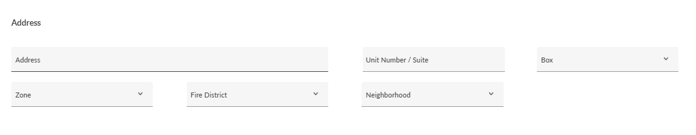

| **Filter** | **Description** |
| --- | --- |
| **Address** | Search by property address |
| **Unit Number / Suite** | Search by the unit or suite number |
| **Zone** | Select zone |
| **Fire District** | Select fire district |
| **Neighborhood** | Select neighborhood |
| **Box** | Select box |