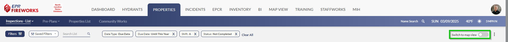
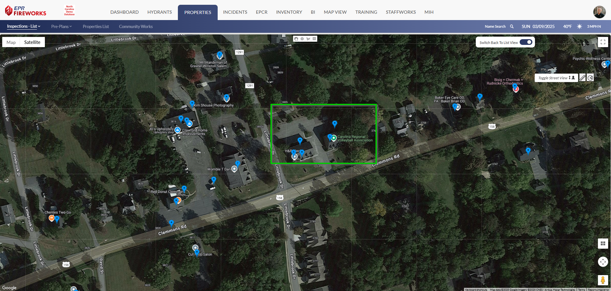
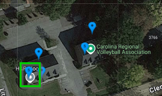
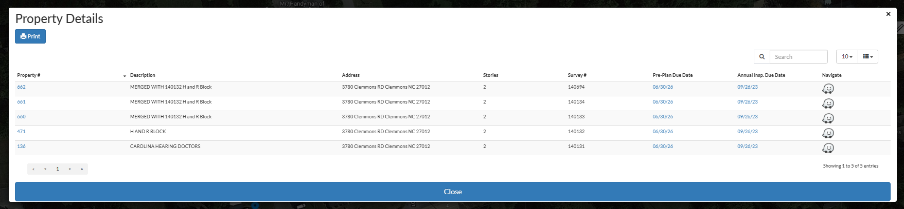
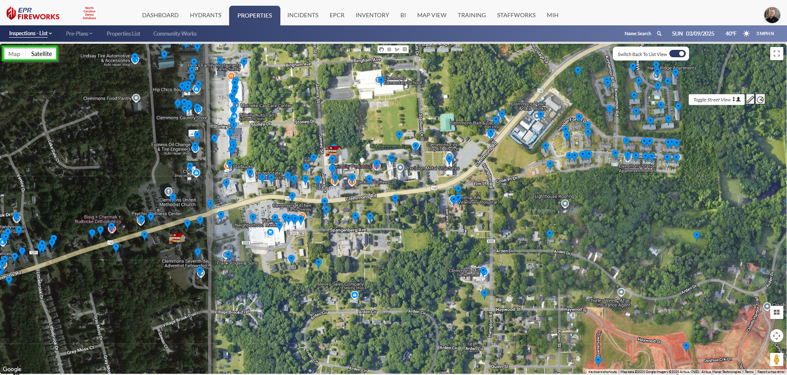
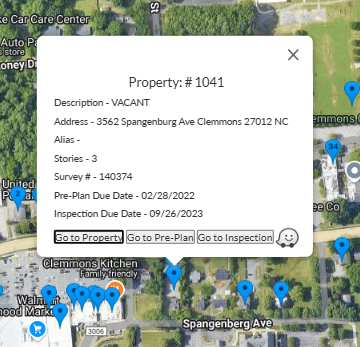

# Switching to Map View

- [Overview](#overview)
- [Switching to Map View](#switching-to-map-view)
- [Property Clusters](#property-clusters)
- [Additional Map Features](#additional-map-features)
- [Returning to List View](#returning-to-list-view)

## Overview

**Map View** displays properties in a geographic interface, allowing you to visualize property locations across your jurisdiction. This view helps you:

- Identify property clusters and distribution patterns.
- Plan efficient inspection routes based on location.
- Visualize coverage areas for planning purposes.

## Switching to Map View

1. Click **Switch to Map View** (Located at the top of the **List** pages).
2. Navigate the map using the following controls:
-   Toggle between **Map** and **Satellite** views using the buttons in the top left.
-   Zoom in and out using the + and - buttons or ctrl+mouse wheel.
-   Pan by clicking and dragging the map.
-   Click the full-screen icon in the top right to expand the map.

## Property Clusters

For areas containing multiple properties, a numerical indicator displays the total count.

Click the cluster indicator to zoom in and view individual property markers in that area.

## Additional Map Features

The map interface includes several helpful features:

- **Toggle Street View**: Click the "Toggle Street View" button in the top right to access Google Street View.
- **Map/Satellite Toggle**: Switch between standard map and satellite imagery using the buttons in the top left.
- **Property Information**: Click on any property marker to view basic details and access full property information.

## Returning to List View

To switch back to the list, click **Switch Back to List View** at the top right of the map.

> [!INFO]
> **Note**: Any filters applied in List View will remain active in Map View, and vice versa.