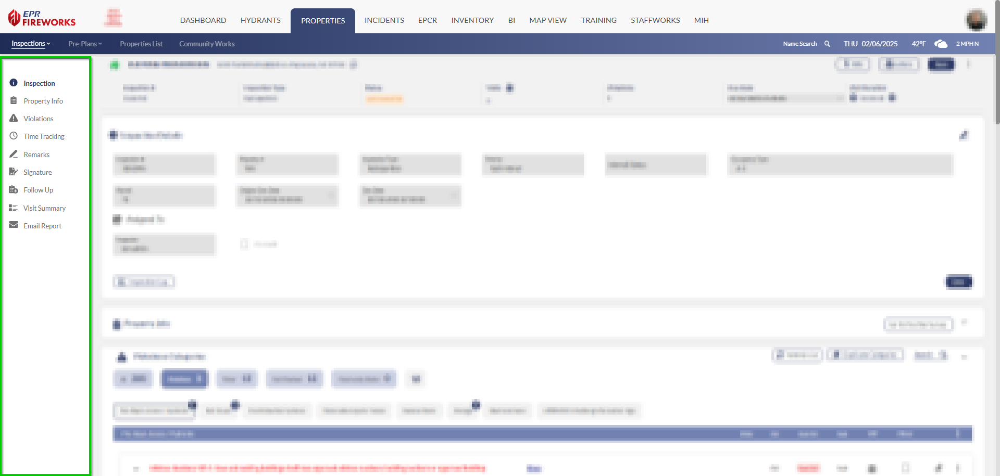
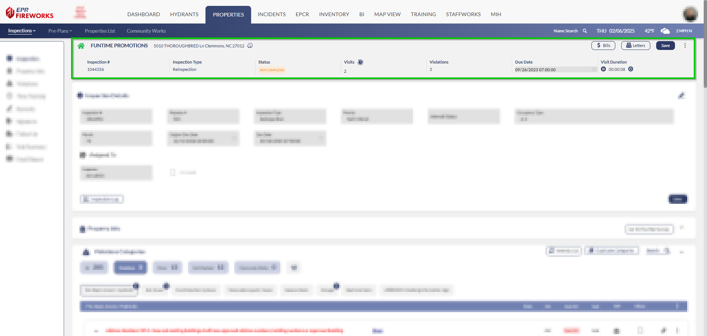
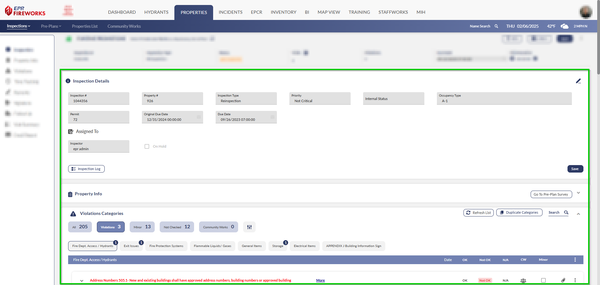

# Getting Around Your Inspection Display

- [Overview](#overview)
- [Quick Access Menu](#quick-access-menu)
- [Key Information Bar](#key-information-bar)
- [Main Workspace](#main-workspace)

## Overview

The inspection interface consolidates all inspection functions into an organized workspace. The layout consists of a navigation menu, status bar, and main workspace to efficiently manage inspection data and documentation. Let's examine each component.

## Quick Access Menu

Everything you need is on the left side:

- Inspection details
- Property info
- Violations list
- Time tracking
- Notes and signatures
- Reports and follow-ups

## Key Information Bar

At the top, you'll see the essential details at a glance:

- Your inspection number
- Type of inspection
- Status
- Important dates
- Number of visits and violations

## Main Workspace

This is where you'll do most of your work. Here you can:

- Review property details
- Check inspection dates
- See who's assigned
- Track violations
- Add notes and photos
- Complete your inspection checklist