# Initiating Inspections

- [Overview](#overview)
- [Documenting Violations](#documenting-violations)
- [Recording Time](#recording-time)
-   [Time Tracking](#time-tracking)
-   [Visit Summary](#visit-summary)
- [Conclusion](#conclusion)

## Overview

This document describes how to perform the inspection using the FireWorks web application. The inspection runs as follows:

1. [Documenting Violations](#doc_viol)
2. [Recording Time](#track_time)
3. [Conclusion](#conc)

## Documenting Violations

Documenting violations is central to the inspection process. Violations are according to how each department chooses to operate using an inspection list.

To record violations, follow these steps:

1. Select the first category for inspection.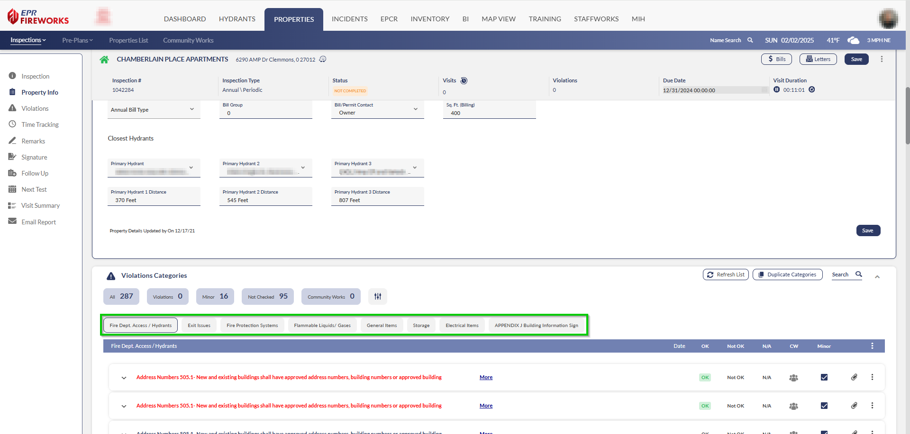
2. Mark the violations **OK**, **Not OK**, or **n/a** according to the application of the defined violations.  
**Note**: Violations in red are mandatory to complete.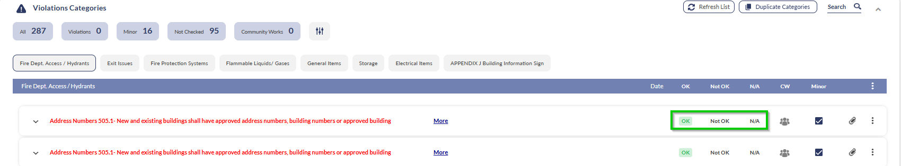
  
**For departments with ‘Minor Violations’ enabled**: Violations that are deemed by the authority having jurisdiction as minor, do not generate a reinspection.
3. If you marked a violation as **Not OK**, expand the violation and complete the following fields:
1.   **Remarks**: Add remarks concerning the state of the violation. These remarks will appear on the final report.
2.   **Internal Remarks**: You can add internal remarks (optional) about the violation. These remarks will not appear on the report but will be kept in the inspection for future use.
3.   **Compliance**: This field is completed automatically according to the violation preset. If needed, add additional compliance information.
4.   **Location**: Enter the violation’s location.
5.   **Sub-Location**: If the violation’s location is hard to find, add a sub-location for further clarity.
6.   **Due Date**: The violation’s due date, as calculated by the system.
7.   If this is a reinspection, verify the following fields:
  
  -   **Correction Date**: The date when the violation was corrected. This field updates automatically during reinspection when a violation status changes to OK.
  
  -   **Corrected By**: The staff member who approved the correction. This field populates automatically during reinspection when a violation status changes to OK..
  
  -   **Actual Cost**: Add the final cost of the correction.
8.   If a citation was issued, select **Citation Issued** and complete the **Citation #** and **Citation Remarks** fields.
9.   Using the attachments icon, add pictures or documents regarding the violation.**Note**: Photos taken with the camera icon save directly to FireWorks cloud storage, not to your device. This feature works only in **Online** mode. If performing an inspection in **Offline** mode, you can add photos later when you reconnect to internet service, provided the images were saved to your device.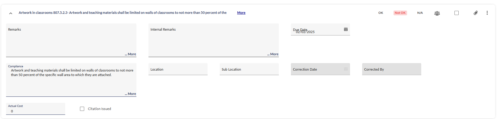

> [!NOTE]
> If needed, you can duplicate violations and violation categories, as follows:
> - To duplicate an individual violation, click the three-dots to the right of the violation, and then select **Duplicate**.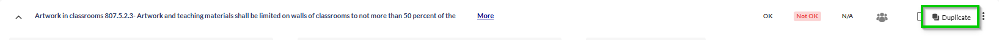
> - To duplicate an entire category, click **Duplicate Category** at the top of the **Violations** section.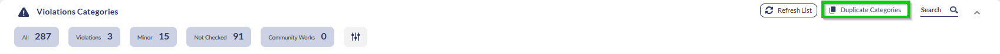

## Recording Time

After documenting violations, record your time using these methods:

### Time Tracking

Time Tracking offers a comprehensive overview of your inspection activities, including travel time, the duration for primary and assistant inspectors, and other time categories—ensure that you complete all fields according to your department's requirements.

Follow these steps to record your activity time:

1. Scroll to the **Time Tracking** section, and then click **Add**.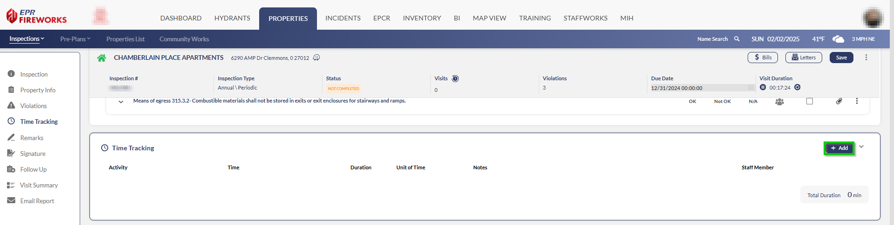
2. Complete all fields:
-   **Activity**: Select your activity type.
-   **Time Field**: Enter the activity date and time.
-   **Unit of Time**: Choose hr, min, or sec.
-   **Duration**: Enter the activity length based on selected time unit.
-   **Notes**: Enter activity-related comments (optional).
-   **Staff Member**: Select who performed the activity.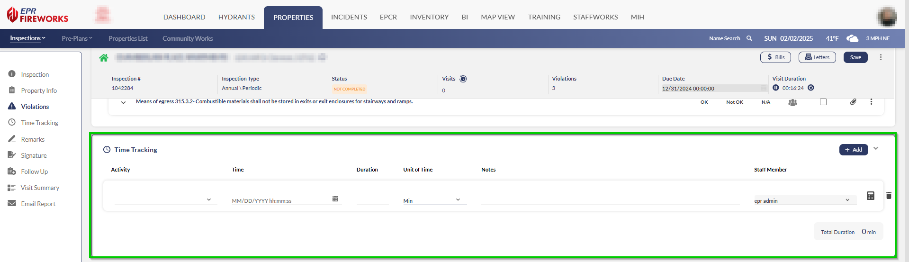

> [!NOTE]
> If you're tracking the current visit, click the calculator icon next to the **Staff Member** field for the exact duration.

### Visit Summary

The **Visit Summary** field records the total time spent on your inspection visit.

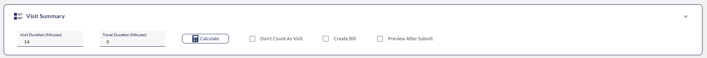

Complete the **Visit Summary** section as follows

1. Click the calculator icon next to the **Travel Time** field to calculate the exact visit duration.  
**Note**: To manually add time (in minutes), enter the number of minutes in the **Visit Duration** field.
2. In the **Travel Time** field, manually add the travel time in minutes.

> [!NOTE]
> **Additional Actions**:
> - To add the visit and travel time to the bill, select **Create Bill**.
> - To preview the report in a PDF file after submitting the inspection, select **Preview after Submit**.

## Conclusion

End the inspection following the next steps:

1. Complete the remarks sections as follows:
1.   In the **Remarks** field, add final remarks for this report. These remarks will appear in the report.
2.   In the **Internal Remarks** field, add comments for future inspections, as described in [Pre-inspection research](https://eprsys-team-84.atlassian.net/wiki/spaces/EFQ/pages/78479469/Before+the+Inspection#pre_ins).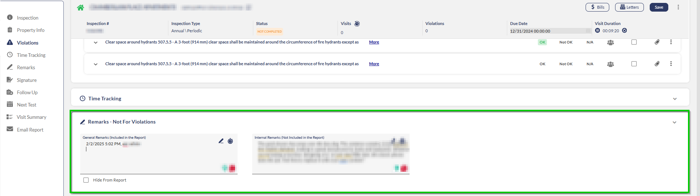
2. In the **Signatures** section, add signatures. Select the signer’s name from the dropdown list, and then have the signer sign the document.  
**Note**: If the signer is not within the dropdown list, manually type their name.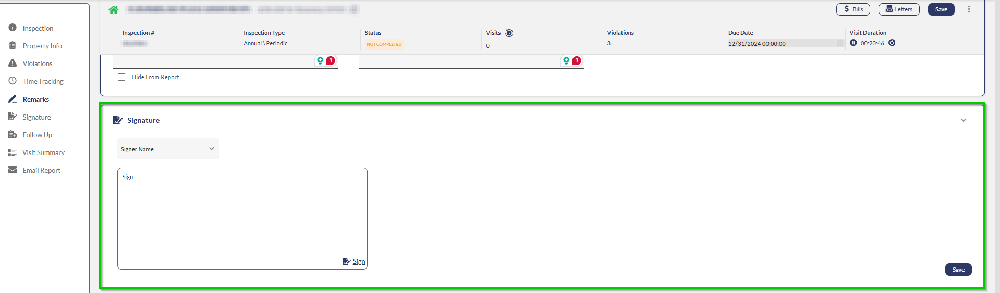
3. Verify follow-up inspection details in the **Follow-Up Visit Due Date** section. In most cases, the next inspection date will be calculated automatically.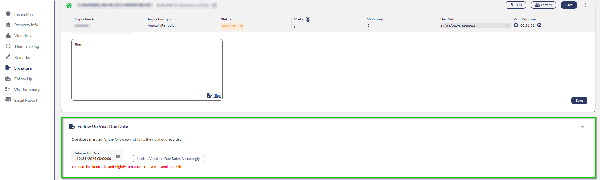
  
**Note**: If violations need to be fixed or are overdue, click **Update Violation Due Dates Accordingly**.
4. Configure email distribution if needed:
1.   Mark the **Email Report** checkbox.
2.   Add required email addresses and mailing lists.  
  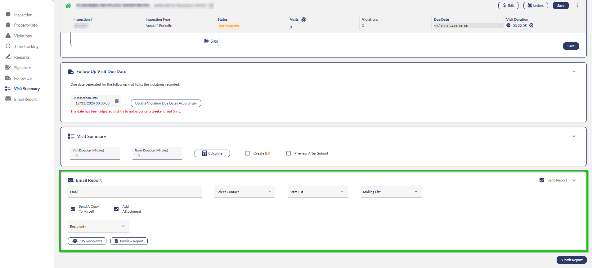
5. (Optional) In the **Custom Fields** section, complete the fields according to your fire department’s requirements.
6. When finished, carefully review the report, and then click **Submit Report**.