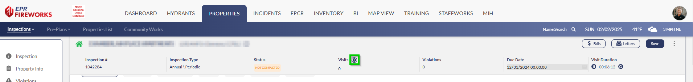
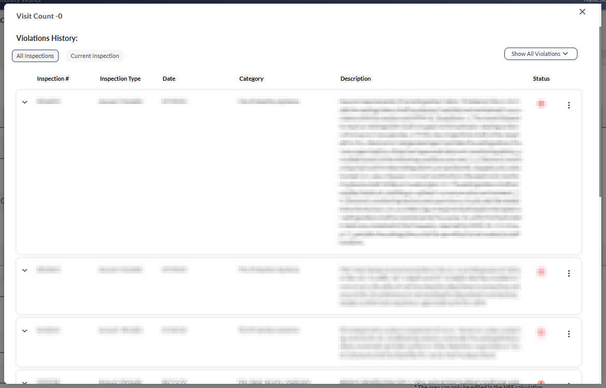
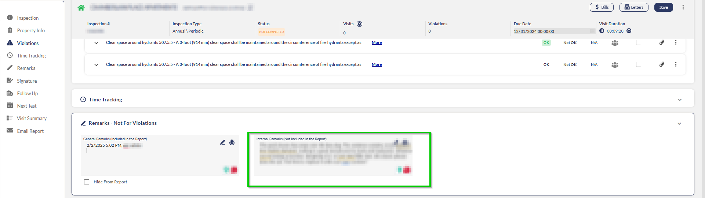
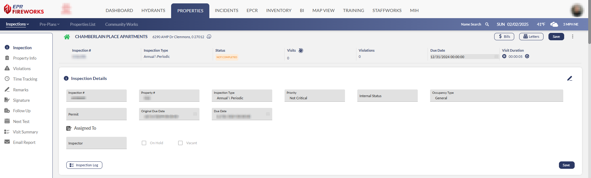
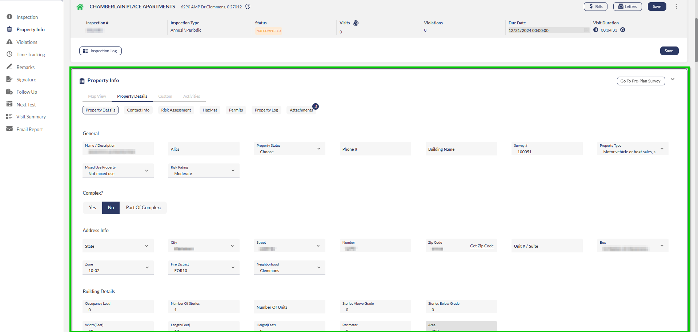
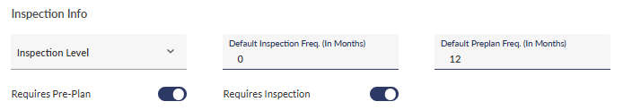

# Preparing for the Inspection

- [Overview](#overview)
- [Reviewing Property History](#reviewing-property-history)
- [Ensuring Accuracy: Inspection Details](#ensuring-accuracy-inspection-details)
- [Property Info](#property-info)
- [Next Steps](#next-steps)

## Overview

A successful inspection requires two key components: understanding the property's history and verifying inspection details for accuracy. This guide will walk you through how to review historical information and ensure accurate inspection data using FireWorks.

## Reviewing Property History

Before conducting your inspection, review the property's historical information to identify patterns, recurring issues, and insights from previous inspections:

1. Check the property's inspection history:
1.   Click the time icon next to the **Visits** field at the top of the page.
2.   Review past violations and patterns of compliance/non-compliance. Check for patterns of recurring violations that require attention.
2. Read internal remarks from previous inspections:
1.   Scroll to the **Remarks** section.
2.   Review notes left by previous inspectors.

## Ensuring Accuracy: Inspection Details

Accurate property and inspection information is essential for effective inspections. Review the I**nspection Details** section to verify all information about your current inspection before proceeding, as follows:

- **Inspection #**: Fixed serial number. Changes automatically when regenerated the upcoming year/period + cycle, not when rescheduled for a re-inspection.
- **Property #**: Fixed property number. Will appear in all inspections associated with the property.  
**Note**: This number appears on the fixed header throughout the inspection.
- **Priority**: The priority of this inspection. If the priority is set to **Critical** it will appear at the top of the inspections list, regardless of the filters.
- **Inspection Type**: The type of inspection assigned to the property when the inspection was created.  
**Note**: If this is a reinspection, the inspection type will automatically change to **Reinspection**.
- **Internal Status**: The current inspection status, as determined by the inspector who conducted the previous assessment.
- **Occupancy Type**: The property’s occupancy type, according to your fire department’s presets
- **Original Due Date**: The due date of the initial inspection.
- **Due Date**: Current due date
- **Assigned To**: The staff member assigned to the assignment
- **On Hold/Vacant**: If the inspection is on hold or the property is vacant, mark the appropriate checkbox.
- **Inspection Logs**: Tracks all modifications made to the inspection.  

## Property Info

The **Property Info** section shows and allows editing of property data. Any changes will update throughout the system, including in preplans, inspections, and property records.

Under **Property Details > Inspection Info**, verify these critical fields:

- **Inspection Level**: Used to indicate state-mandated inspection levels or, if not required by your state, can be used to mark urgency levels.
- **Default Inspection Frequency**: Specifies how often regular inspections should occur (in months), excluding reinspections (for this occupancy only).
- **Default Preplan Frequency**: Sets the timing between preplan checks (in months) for this occupancy only.
- **Requires Preplan**: Indicates whether the property needs pre-plan surveys.
- **Requires Inspection**: Specifies if the property needs inspections.  

> [!WARNING]
> **Important**: If either the Pre-plan or Inspection requirement fields are incorrectly set to **Off**, your department may be held liable in the event of an incident at this occupancy and other occupancies involved.

## Next Steps

Once you've completed your preparation and verified all information for accuracy, you're ready to proceed with the inspection. Refer to [Initiating Inspections](../inspections/initiating-inspections.md) for detailed steps on conducting the inspection using FireWorks.