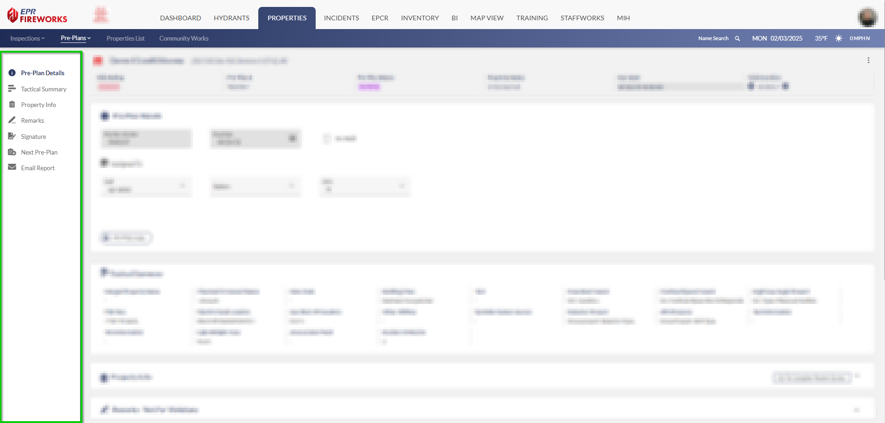
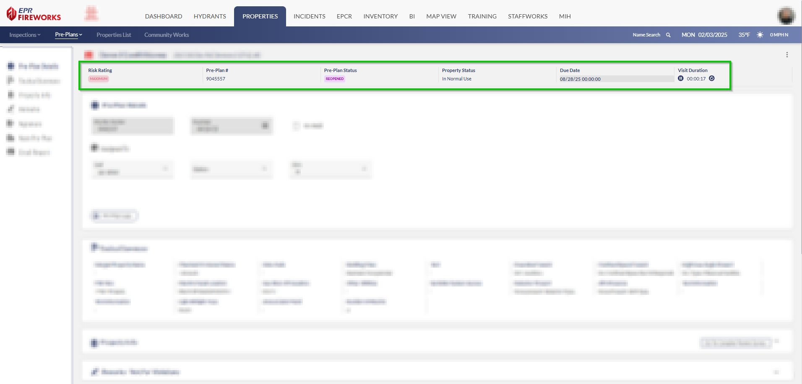
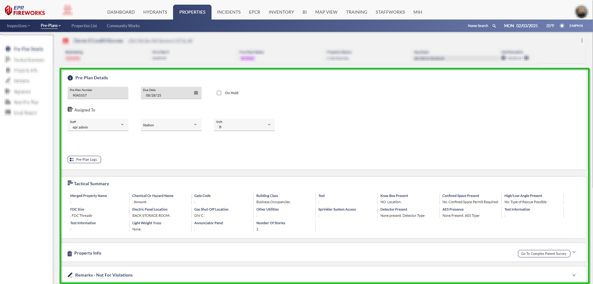

# Getting Around Your Pre-Plans Display

- [Quick Access Menu](#quick-access-menu)
- [Key Information Bar](#key-information-bar)
- [Main Workspace](#main-workspace)

The pre-plan interface consolidates all inspection functions into an organized workspace. The layout consists of a navigation menu, status bar, and main workspace to efficiently manage pre-plans. Let's examine each component.

## Quick Access Menu

Everything you need is on the left side:

- Pre-Plan details
- Tactical Summary
- Property info
- Remarks
- Signatures
- Reports and follow-ups

## Key Information Bar

At the top, you'll see the essential details at a glance:

- Risk Rating
- Your pre-plan number
- Pre-Plan Status
- Property Status
- Due Dates
- Visit Duration

## Main Workspace

This is where you'll do most of your work. Here you can:

- Review property details
- Check pre-plan dates
- See who's assigned
- Add markers
- Complete your pre-plan checklist