# Initiating Pre-Plans

- [Overview](#overview)
- [Adding Markers](#adding-markers)
-   [Adding Icons](#adding-icons)
-   [Using Rulers](#using-rulers)
  
  -   [Measuring Needed Fire Flow (NFF)](#measuring-needed-fire-flow-nff)
  
  -   [Measuring Polygons](#measuring-polygons)
-   [Adding Pictures of the Property](#adding-pictures-of-the-property)
- [Conclusion](#conclusion)
- [Additional Actions](#additional-actions)

## Overview

This document describes how to perform pre-plans using EPR FireWorks.

## Adding Markers

After verifying the property info, mark the property for fire safety. Markers include icons, pictures of the property, and rulers for measuring the property, NFF, and additional polygons.

To add markers, follow the next steps:

1. Navigate to **Property Info > Map View**.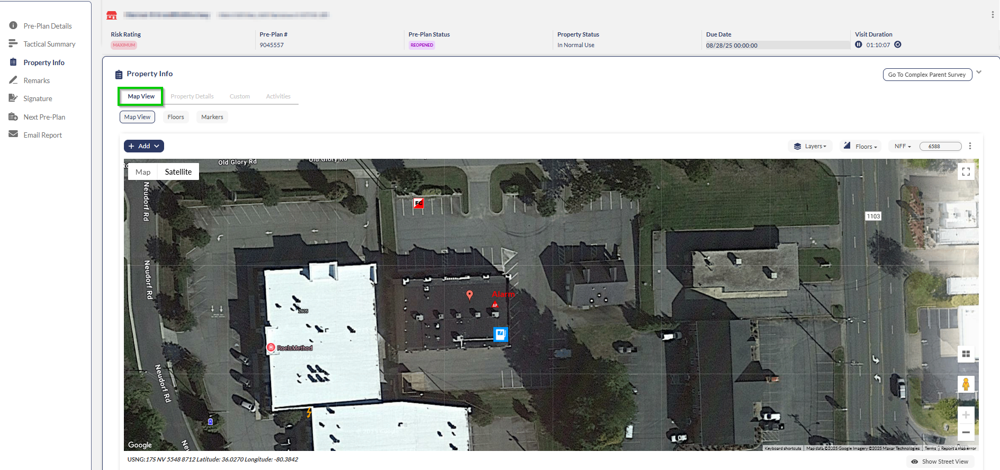
2. Click **Add**.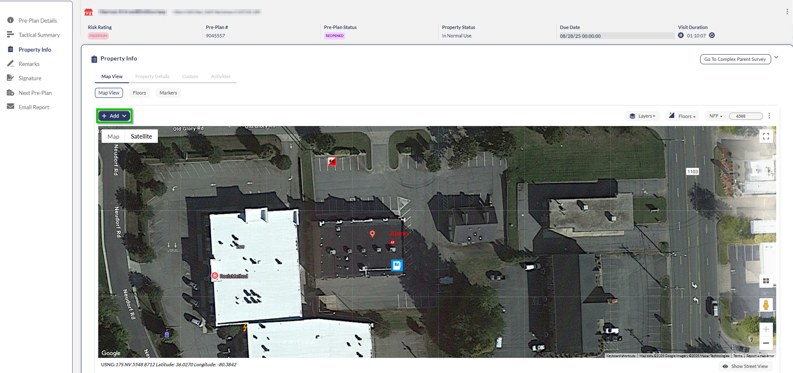
3. Select your desired marker category from the dropdown menu.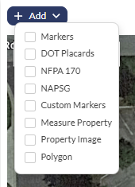

> [!NOTE]
> **Note**: You can add markers directly from the property and inspection pages. We recommend adding markers using the pre-plan screen as part of completing the report.

### Adding Icons

1. Select a marker category from the dropdown list.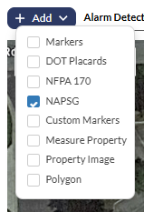
2. Select the desired icon from the list on the right.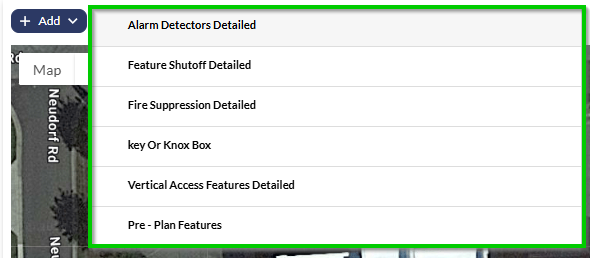
3. Position the marker on the map using your cursor.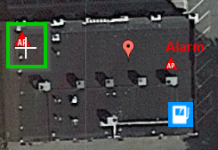
4. Set icon properties:
-   Size
-   Description
-   Wording on Icon (optional)
-   Color of Wording
-   Floor number
-   Add files using **+**.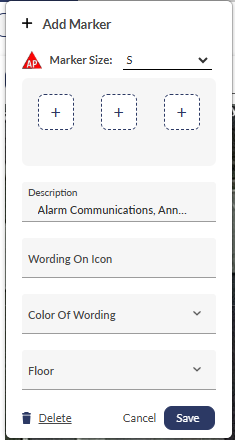
5. When done, click **Save**.

### Using Rulers

Map View includes options to measure NFF and Polygons.

#### Measuring Needed Fire Flow (NFF)

1. Select **Measure Property** from the **Add** dropdown.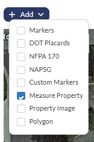
2. Mark property boundaries. Click to create boundary points (shown as red squares).  
**Note**: Double-click any red square to restart if needed.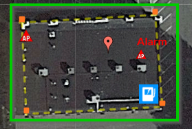
3. Click **NFF** in the top right corner.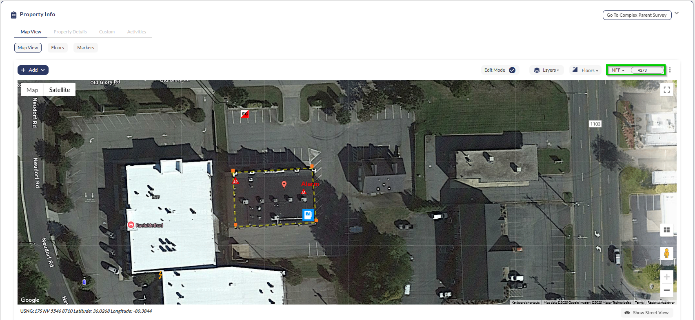
4. Select the involvement level.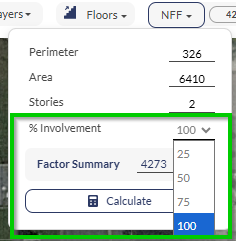
5. Click **Calculate**.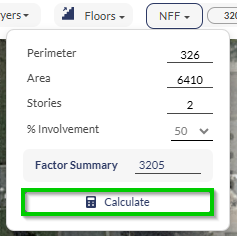
Results appear under **Factor Summary** and next to the **NFF** icon.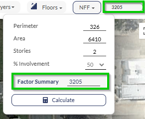

#### Measuring Polygons

To measure a separate polygon, follow the next steps:

1. Select **Polygon** from the **Add** dropdown.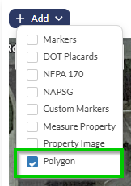
2. Draw the polygon on the map using the cursor.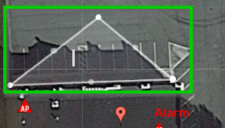
3. Set polygon details:
-   Description
-   Wording on text
-   Color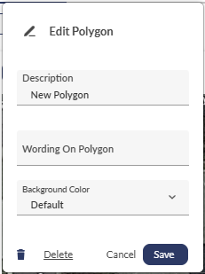
4. Click **Save**.

### Adding Pictures of the Property

Use the **Property Image** option in the markers list to add images of the property to the map, as follows:

1. Select **Property Image** from the **Add** dropdown.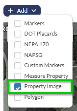
2. Click the desired image location on the map.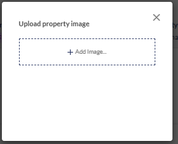
3. Upload image from device storage.

> [!INFO]
> **Note**: Property images must be pre-stored on your device. Direct camera uploads are not supported.

## Conclusion

End the pre-plan survey as follows:

1. In the **Remarks - Not for Violations** section, add **Internal Remarks**.  
To add a timestamp, click the watch icon on the right.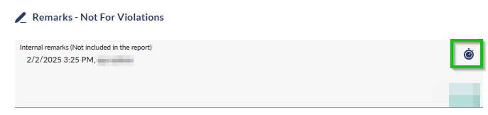
2. In the **Signatures** section, add the client’s signature. Select the signer’s name from the dropdown list, and then have the signer sign the document.
3. In the **Next Pre-Plan** section, set a date and duration for the next pre-plan. In most cases, the next pre-plan date will be calculated automatically.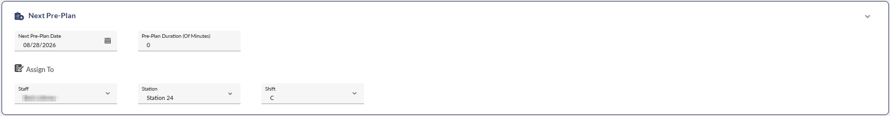
4. In the **Email Report** section, configure email distribution if needed. Add required email addresses and mailing lists.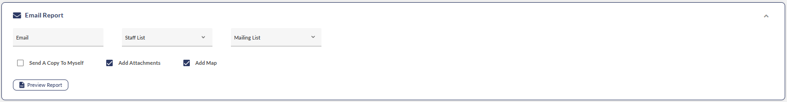
5. When finished, carefully review the report, and then click **Submit**.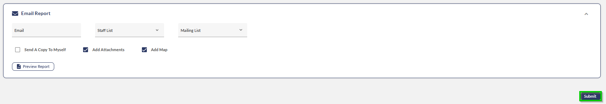

## Additional Actions

Access the following additional actions through the three-dots menu at the top of the page:

- **Attachments**: You can add attachments from your device storage, pictures from your camera, and links.
- **Email Report**: Skip to the **Email Report** section at the bottom of the page.
- **Cancel Pre-Plan**: Cancel the pre-plan.

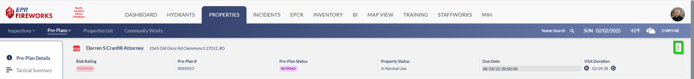