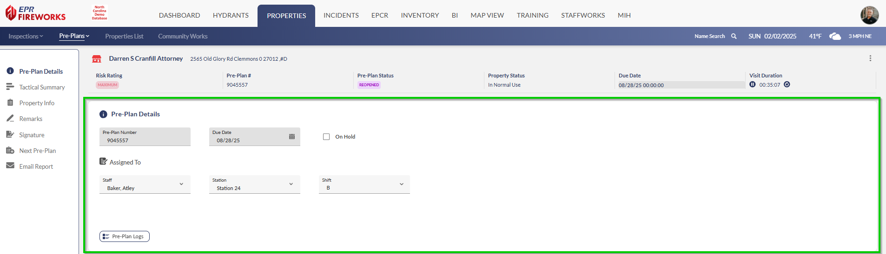
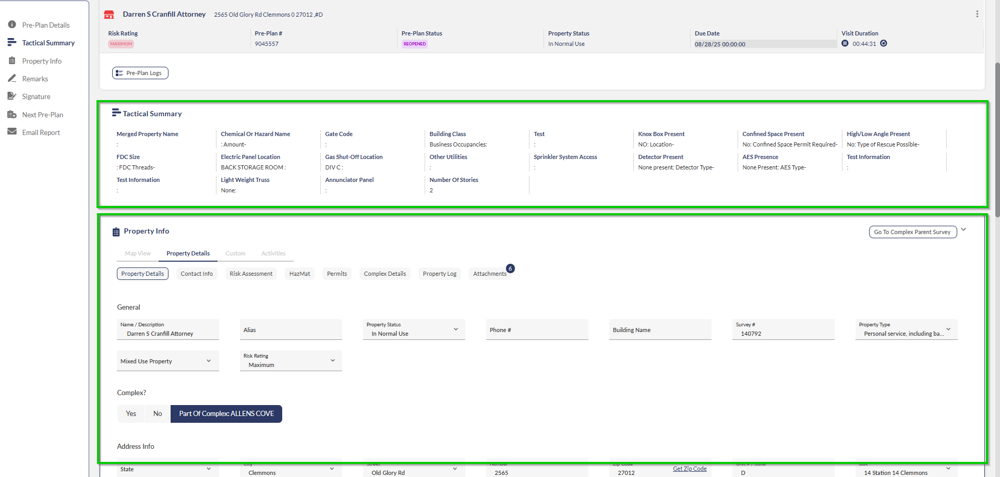

# Preparing for the Pre-Plan

- [Overview](#overview)
- [Reviewing Pre-Plan Details](#reviewing-pre-plan-details)
- [Verifying Tactical Summary and Property Info](#verifying-tactical-summary-and-property-info)
- [Next Steps](#next-steps)

## Overview

This document guides you through preparing for pre-plan surveys in the FireWorks web application. You'll learn how to verify pre-plan details, check property information, and review tactical summaries—all critical preparation steps before adding markers and submitting your pre-plan.

For subsequent phases, please refer to the [Initiating Pre-Plans](../pre-plans/initiating-pre-plans.md) document.

> [!NOTE]
> If your department requires you to add additional information, such as pre-plan alerts or other information on the property, navigate to **Property Info > Custom**, and then complete the required fields

## Reviewing Pre-Plan Details

The pre-plan details page includes critical information that should be verified before proceeding:

- **Pre-Plan Number**: This is a fixed identifier and cannot be changed
- **Due Date**: The deadline for completing this pre-plan (fixed)
- **Assignee Information**: Check that the staff, station, and shift assignments are correct (these can be modified if needed).

## Verifying Tactical Summary and Property Info

The Tactical Summary and Property Info sections display data from the property page and can be edited during the pre-plan process. Note that any changes you make will update both pages as well as the inspection page.

Key elements to verify:

- **Property Info > Activities**: View all previous pre-plans, permits, and inspections. Note any recurring issues or changes since the last pre-plan.
- **Property Details** > **Inspection Info > Requires Pre-Plan**: This field specifies whether the property requires a pre-plan.

> [!WARNING]
> **Important**! If either the Preplan or Inspection requirement fields are incorrectly set to **Off**, your department may be held liable in the event of an incident of this and all related occupancies.

## Next Steps

Once you've completed your preparation and verified all information for accuracy, you're ready to proceed with the pre-plan survey. Refer to [Initiating Pre-Plans](../pre-plans/initiating-pre-plans.md) for detailed steps on adding markers and submitting your pre-plan using FireWorks.