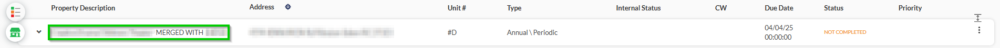
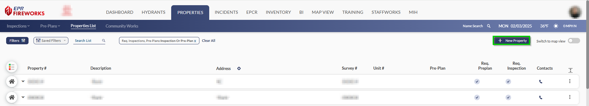
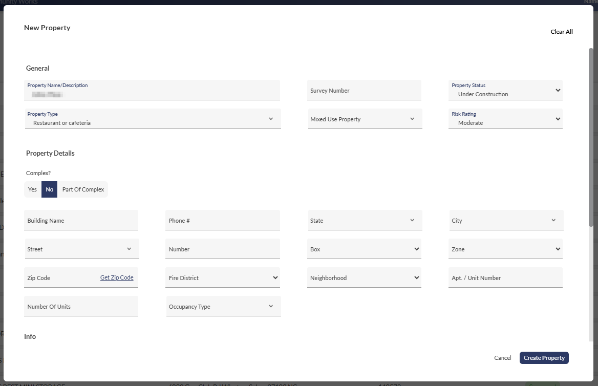
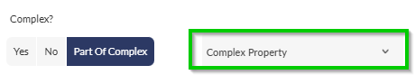
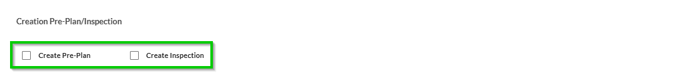
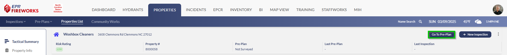
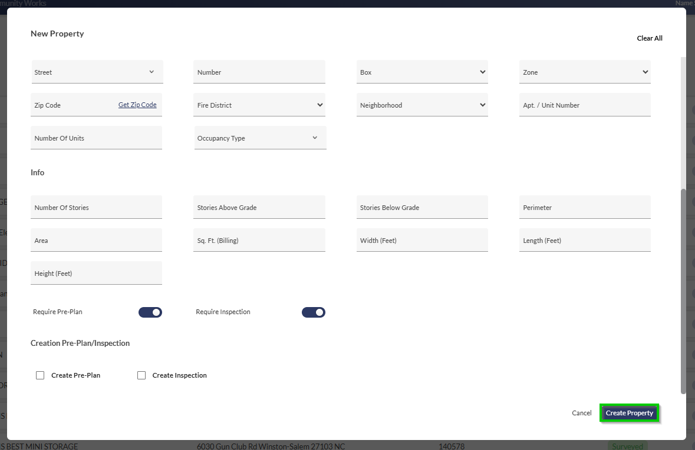
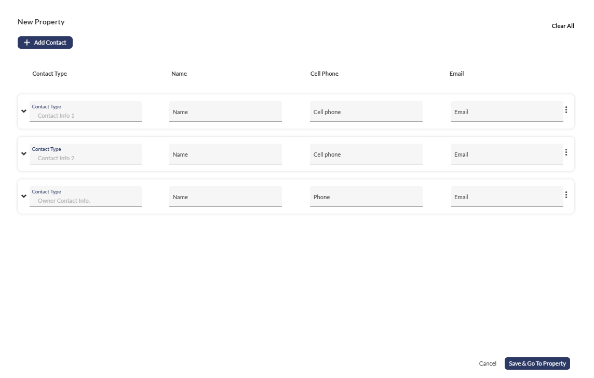

# Adding Properties

- [Overview](#overview)
- [New Properties](#new-properties)
-   [Creating the Property](#creating-the-property)
-   [Adding Contacts](#adding-contacts)

## Overview

This document describes how to add properties from the **Properties List** screen.

> [!NOTE]
> You can add properties using the CommunityWorks web portal. Properties added through CommunityWorks need to be merged with properties from the **Properties List**.
> 
> [Learn more about merging properties.](https://eprsys-team-84.atlassian.net/wiki/spaces/~63ad569e347fae534683cb84/pages/10256417/CommunityWorks+FireWorks#prop_vald)

## New Properties

This procedure describes how to add new properties to the system.

### Creating the Property

1. In the **Properties List**, click **New Property**.
2. Complete the fields according to the information you gathered on the property:
-   **General**: General fields are mandatory. The other sections can be completed later on through the property page.
  
  -   Property Name/Description
  
  -   Property Type
  
  -   Survey Number
  
  -   Mixed Use Property
  
  -   Property Status
  
  -   Risk Rating
-   **Property Details**: Location (address and department zoning).
  
  -   Complex:  
    Specify if this property operates as an independent complex or belongs to a larger complex development.  
    **Note**: If your answer is **Part of Complex**, select the **Complex Property** from the list on the right.
  
  -   Building Name
  
  -   Phone #
  
  -   State
  
  -   City
  
  -   Street
  
  -   Number
  
  -   Box
  
  -   Zone
  
  -   Zip Code
  
  -   Fire District
  
  -   Neighborhood
  
  -   Apt. / Unit Number
  
  -   Number Of Units
  
  -   Occupancy Type
-   **Info**: Structure specifications.
  
  -   Number Of Stories
  
  -   Stories Above Grade
  
  -   Stories Below Grade
  
  -   Perimeter
  
  -   Area
  
  -   Sq. Ft. (Billing)
  
  -   Width (Feet)
  
  -   Length (Feet)
  
  -   Height (Feet)
3. Set the **Require Pre-Plan** and **Require Inspection** according to the property’s specific requirements.  
**Important**! If either the pre-plan or Inspection requirement fields are incorrectly set to **Off**, your department may be held liable in the event of an incident of this and related occupancies.
4. (Optional) Create a pre-plan and/or an inspection for this property using the **Create Pre-Plan** and **Create Inspection** checkboxes.
**Note**: Access newly-created pre-plans via the **Go to Pre-Plan** button on the property page. Inspections appear in the **Inspections** list.
5. When done, click **Create Property**.

### Adding Contacts

Before navigating to the new property page, FireWorks allows you to add new contacts as part of creating the property.

To add new contacts, complete the following fields:

- Contact Type
- Name
- Cell phone
- Email
- Address
- City
- State
- Zip code
- Phone
- Ext.
- Unit #
When done, click **Save & Go To Property**.

> [!INFO]
> **Note**: This section is not mandatory and can be completed later.