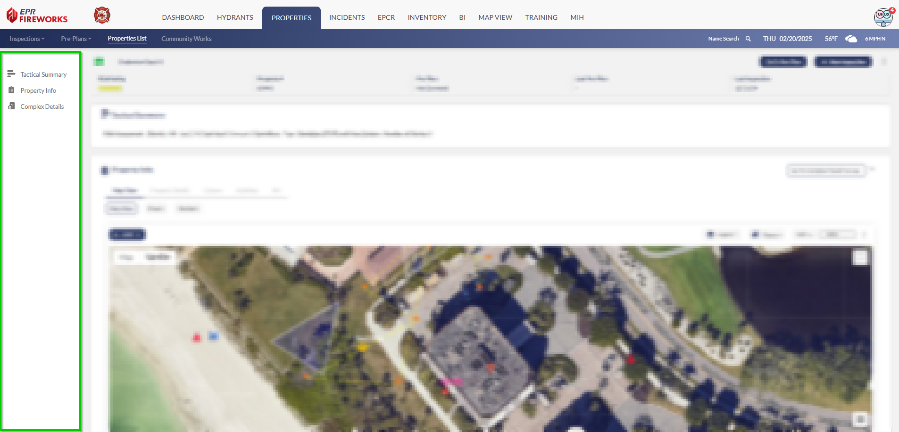
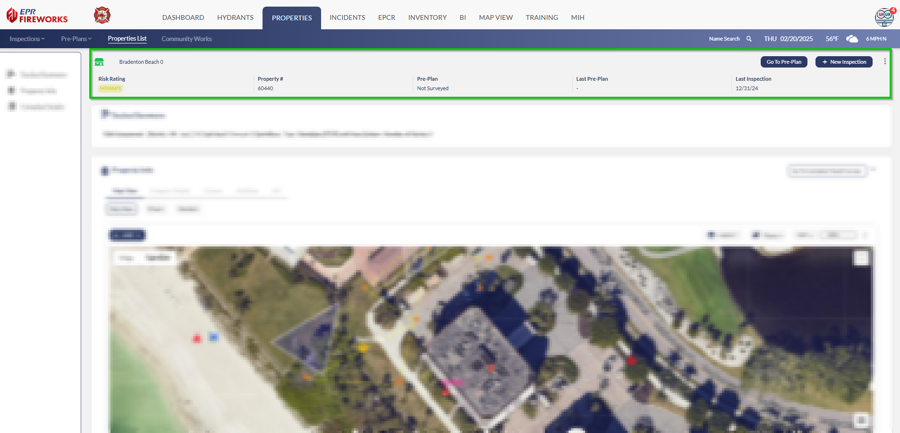
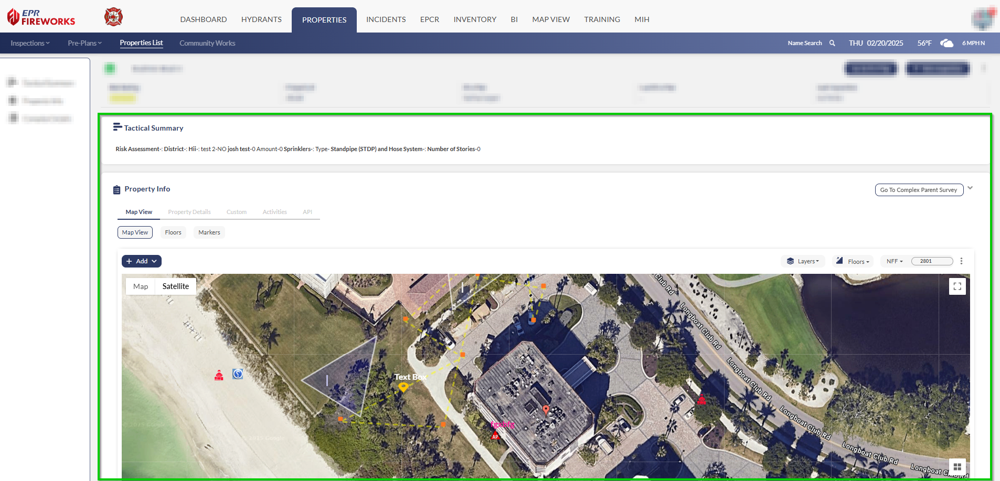

# Getting Around Your Property Page Display

- [Overview](#overview)
- [Quick Access Menu](#quick-access-menu)
- [Key Information Bar](#key-information-bar)
- [Main Workspace](#main-workspace)

## Overview

The property page interface consolidates all property details into an organized workspace. The layout consists of a navigation menu, status bar, and main workspace to manage property data and documentation efficiently. Let's examine each component.

## Quick Access Menu

Everything you need is on the left side:

- Tactical Summary
- Property Info
- Complex Details (where applicable)

## Key Information Bar

At the top, you'll see the essential details at a glance:

- Your inspection number
- Type of inspection
- Status
- Important dates
- Number of visits and violations

## Main Workspace

This is where you'll do most of your work. Here you can:

- View Tactical Summary
- Review property details