# Managing Properties

- [Overview](#overview)
- [Tactical Summary](#tactical-summary)
- [Property Info](#property-info)
-   [Map View](#map-view)
-   [Property Details](#property-details)
  
  -   [Contact Info](#contact-info)
  
  -   [Risk Assessment](#risk-assessment)
  
  -   [HazMat](#hazmat)
  
  -   [Permits](#permits)
  
  -   [Property Log](#property-log)

## Overview

This document describes how to manage property pages.

## Tactical Summary

The **Tactical Summary** section provides a basic overview of pertinent details about the property in a single location. These details can be modified to suit your department's needs.

## Property Info

### Map View

**Map View** allows you to view the property using Google Maps and add markers to create a clearer picture.

> [!NOTE]
> We highly recommend completing this section when initiating a pre-plan of the property.
> [Learn more about adding markers in the Pre-Plan user guide](../../properties/pre-plans/initiating-pre-plans.md)

### Property Details

**Property Details** include all the information concerning the building, contacts, permits, and possible risks associated with the property (HazMat and risk assessment).

The information in the main **Property Details** section is separated into the following categories:

- **General**: Includes fields such as Name/Description, Mixed Use Property, Risk Rating, Alias, Property Status, Phone #, Building Name, Survey #, and Property Type.
- **Complex Info**: Indicates if the property is a complex of its own, part of a complex, or not part of a complex (for standalone buildings).
- **Address Info**: Includes fields such as State, City, Street, Number, Zip Code, Unit #/Suite, Box, Zone, Fire District, and Neighborhood.
- **Building Details**: Includes fields such as Occupancy Load, Number Of Stories, Number Of Units, Stories Above Grade, Stories Below Grade, Width(Feet), Length(Feet), Height(Feet), Perimeter, Area (automated using NFF calculation), Construct Completed Date, Alteration Completed Date, and In Construction status.
- **Inspection info**: Includes information about inspections and pre-plans. Read more in [Preparing for the Inspection](https://eprsys-team-84.atlassian.net/wiki/spaces/~63ad569e347fae534683cb84/pages/78479469/Preparing+for+the+Inspection#inspection_info).
- **Billing Info**: Includes annual billing details.
- **Closest Hydrants**: Includes the addresses of the nearest hydrants and their distance from the property.

#### Contact Info

Add and modify contacts in this section, including contacts created during property setup. Each contact should include the following details:

- Contact Type
- Name
- Cell phone
- Email
- Address
- City
- State
- Zip code
- Phone
- Ext.
- Unit #
- Title Contact Person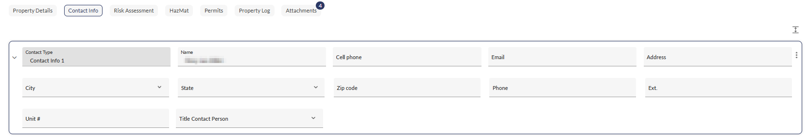

> [!INFO]
> **Note**:
> - Use the **Expand** icon (
> ) to view the full contact details.
> - Contact information provided here will be used when signing inspections and pre-plans.

#### Risk Assessment

This section enables you to calculate the risk rating and heron rating and score according to the following categories and sub-categories:

- **Building**: Exposure Separation, Type Of Construction, Height, Access, Building Size  

 **Pro Tip**: Click 
next to the **Height** column to automatically import the number of stories from the **Property Details** section. This saves time and ensures consistency in your data.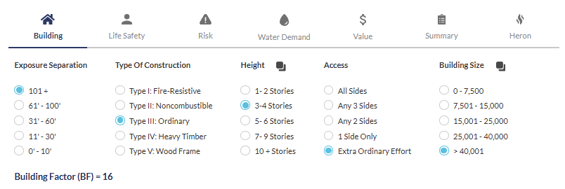
- **Life Safety**: Occupant load, Occupant Mobility, Warning Alarm, Exiting System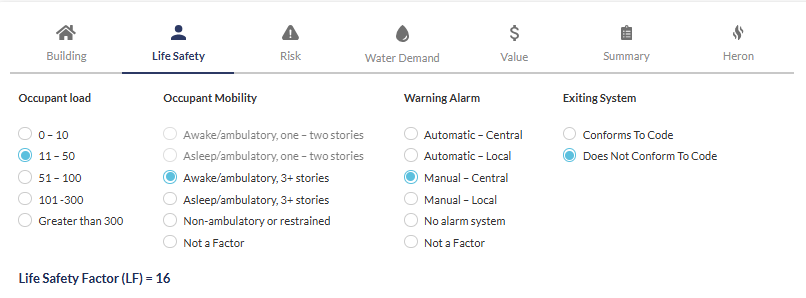
- **Risk**: Probability and consequence factors, as follows:
-   **Probability**: Regulatory Oversight, Human Activity, Experience
-   **Consequence**: Capacity to Control, Hazard Index, Fire Load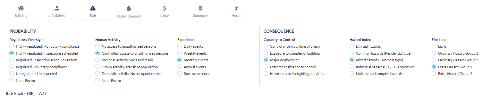
- **Water Demand**: Fire Flow (GPM), Fire Sprinklers, Fire Flow Available (Optional), Water Flow Sufficient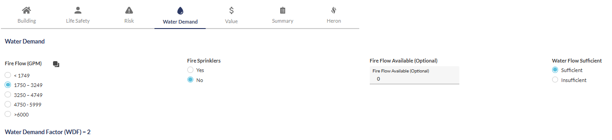
- **Value**: Property Value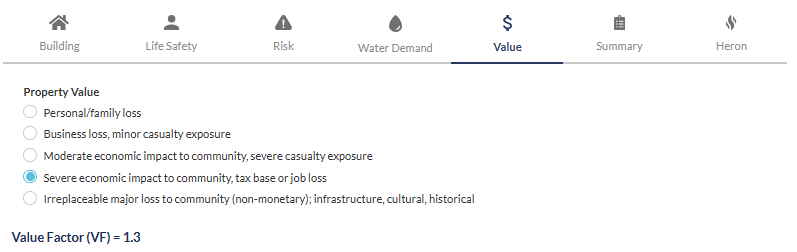
- **Heron**: Consequence to the Community, Probability or Likelihood of Incident, Impact Against Operational Forces - Critical Tasking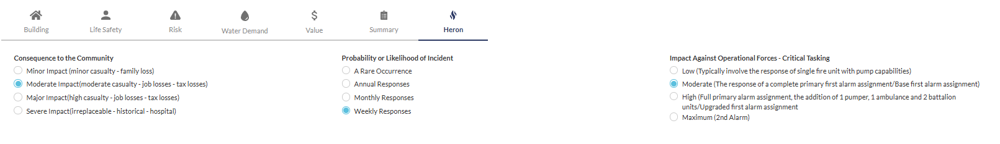

Under **Summary,** you will find the **Factor Summary** and **OVAP (O**ccupancy **V**ulnerability **A**ssessment **P**rofile) scores and **Risk Rating** based on the categories above (excluding **Heron**).

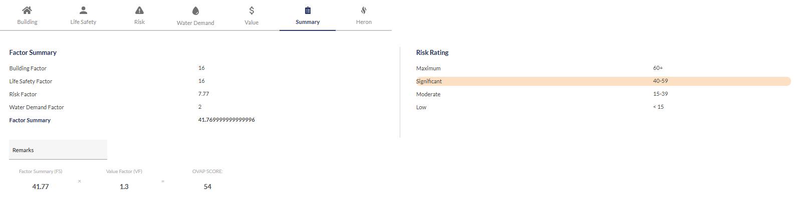

The Heron score and risk rating appear below alongside an additional OVAP score and calculation display.

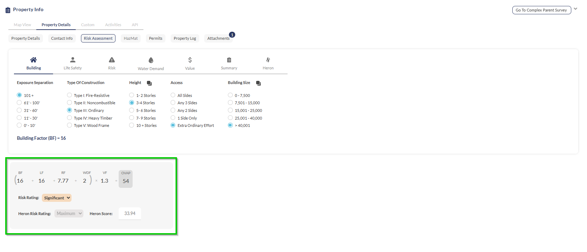

#### HazMat

Add and modify hazardous materials in the property.  
To add HazMats, follow these steps:

1. Click **Add**.
2. Complete the following fields:
1.   In the **Name** field, select the HazMat from the list. The **UN Number** and **CAS Registration** fields will populate automatically.
2.   In the **NOAA** field, add NOAA data.
3.   In the **Dot Classification** field, select the **DOT Classification** from the list.
4.   (Optional) Add notes concerning the HazMat.

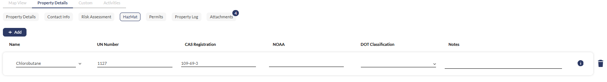

#### Permits

Manage permits issued for the property. When adding a new permit, complete the following fields:

1. Permit type
2. Issued Date
3. Starting and Expiration dates
4. Quantity
5. Status
6. Applicant info
7. (Optional) Notes

#### Property Log

The **Property Log** tracks all modifications made to the property information.

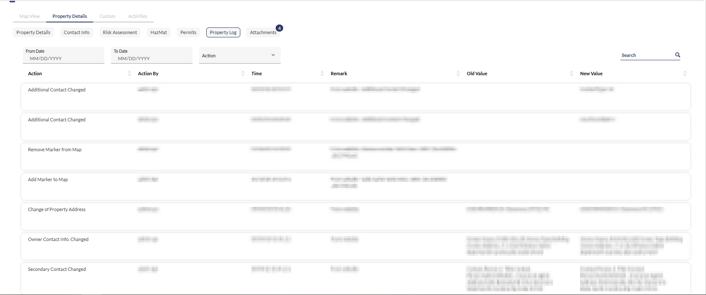